# Diagrams

Every structural claim this repository makes, as a picture — rendered by GitHub itself, with
no build step and no JavaScript.

> **Polish edition:** [`DIAGRAMS.pl.md`](DIAGRAMS.pl.md)

These are **Mermaid** rather than the hand-drawn SVG in [`../site/index.html`](../site/index.html).
The two sets are different tools for different jobs, and neither replaces the other:

| | Inline SVG on the published page | Mermaid, here |
| --- | --- | --- |
| Where it renders | The one published page only | Anywhere GitHub renders Markdown |
| What it is for | A designed narrative for a first-time visitor | A reference a maintainer reads next to the code |
| In a pull request | A diff of coordinates | A diff of the diagram's meaning |

Mermaid is **not** embedded in `site/index.html`, and that is a decision rather than an
omission: it would need `mermaid.js`, which means either a CDN — refused by
[`pages.yml`](../.github/workflows/pages.yml)'s guard, and contrary to the page promising in
its own footer that it fetches nothing — or a megabyte of vendored script, contrary to the
page being one file served exactly as committed.

## Each diagram exists three times, and a check keeps the three identical

- **inline here**, because that is the only form GitHub renders;
- **inline in [`DIAGRAMS.pl.md`](DIAGRAMS.pl.md)**, with its labels in Polish, because a
  Polish document whose every picture is captioned in English is a translation that stopped
  at the prose;
- **as standalone `.mmd` files** in [`diagrams/`](diagrams/) — `<id>-<slug>.mmd` and
  `<id>-<slug>.pl.mmd` — because a diagram nobody can open on its own is a diagram nobody
  reuses, in a slide, an issue, a review comment, or an `mmdc` render into the LaTeX
  editions.

The pairing rule is the section id: `### A1.` owns `diagrams/a1-*.mmd` in this document and
`diagrams/a1-*.pl.mmd` in the Polish one.

```bash
npm run lint:diagrams    # verifies every triple, exactly what CI runs
```

## How to read these

A few conventions hold across every diagram below.

- **A dashed box does not exist.** Nothing is deployed: `flyio/*.fly.toml` describes four Fly
  apps that have never been applied, and `web/content/` is derived rather than committed.
  Dashed edges are optional paths — a step the reader may skip, or a server that may be
  absent.
- **An amber dashed arrow is drawn because it must not exist.** Those are the rules this
  architecture is built to hold: the browser reaching past its own origin, the kernel
  referencing the service, a language model in the reader's loop. They are in the picture so
  that the absence is visible rather than merely unmentioned.
- **Names are the real ones.** Route paths, class names, column names, endpoint names and
  workflow filenames are copied from the code, in both language editions, so a diagram can be
  grepped. Where a diagram and the code disagree, the code is right and the diagram is a bug.
- **The `.mmd` sources carry their reasoning in `%%` comments.** GitHub does not render them,
  which is the point: the picture stays clean and the argument travels with the file. Open the
  file in [`diagrams/`](diagrams/) to read it.
- **Counts are avoided.** A tally decays silently and nothing can check it
  ([`../AGENTS.md`](../AGENTS.md)); where a number matters it is named with the file that
  produces it.

---

## Part A — Context and architecture

### A1. System context — who talks to what

The outermost view. The one edge that is **not** drawn is the point of the picture: the
browser has no arrow to the API or to `authservice`. Everything dashed is described and not
deployed.

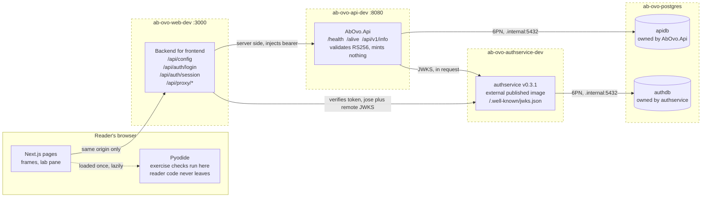
```mermaid
%% ab-ovo system topology.
%% ONE DIAGRAM PER FILE. ASCII ONLY: no em dashes, no arrows as glyphs, no diacritics.
%% The unrendered fallback is typeset verbatim, and a multi-byte character with no mapping
%% is a build error rather than a wrong glyph.
%% NOTE ON THE COMMENT STYLE BELOW: every comment line carries text after its %% marker.
%% Mermaid strips a comment with a regex that requires at least one character after the
%% marker, so a bare %% spacer line SURVIVES stripping, is concatenated with the next
%% line, and the diagram fails to parse on line 1. Use a genuinely blank line to space
%% comment blocks, never a bare marker.

%% WHAT THIS DRAWS. The dashed boxes are Fly apps that DO NOT EXIST YET: nothing is
%% deployed. flyio/*.fly.toml describes them and has never been applied. What runs today
%% is src/AbOvo.AppHost, which is DEVELOPMENT ONLY and is not the production topology (P1).

%% The one edge that is not drawn is the point of the picture: the browser has no arrow to
%% the API or to authservice. It talks to the web app's own origin and to nothing else
%% (FRONTEND-BFF.md section 1), which is why this estate needs no CORS on the frontend's
%% account, and why needing one would mean the rule had already been broken.

flowchart LR
  subgraph browser["Reader's browser"]
    UI["Next.js pages<br/>frames, lab pane"]
    PYO["Pyodide<br/>exercise checks run here<br/>reader code never leaves"]
  end

  subgraph web["ab-ovo-web-dev :3000"]
    BFF["Backend for frontend<br/>/api/config<br/>/api/auth/login<br/>/api/auth/session<br/>/api/proxy/*"]
  end

  subgraph api["ab-ovo-api-dev :8080"]
    SVC["AbOvo.Api<br/>/health  /alive  /api/v1/info<br/>validates RS256, mints nothing"]
  end

  subgraph auth["ab-ovo-authservice-dev"]
    AS["authservice v0.3.1<br/>external published image<br/>/.well-known/jwks.json"]
  end

  subgraph pg["ab-ovo-postgres"]
    APIDB[("apidb<br/>owned by AbOvo.Api")]
    AUTHDB[("authdb<br/>owned by authservice")]
  end

  UI -->|"same origin only"| BFF
  UI -.->|"loaded once, lazily"| PYO

  BFF -->|"server side, injects bearer"| SVC
  BFF -->|"verifies token, jose plus remote JWKS"| AS

  SVC -->|"JWKS, in request"| AS
  SVC -->|"6PN, .internal:5432"| APIDB
  AS -->|"6PN, .internal:5432"| AUTHDB

  classDef notdeployed stroke-dasharray: 5 5;
  class web,api,auth,pg notdeployed;
```

### A2. Solution layout — the projects, and what may reference what

The arrows are project references, and the absent ones are the rule.
`AbOvo.ServiceDefaults` is the shared kernel (P2) and nothing leaves it; the two amber arrows
are references that
[`../tests/AbOvo.Api.Tests/ArchitectureTests.cs`](../tests/AbOvo.Api.Tests/ArchitectureTests.cs)
refuses.

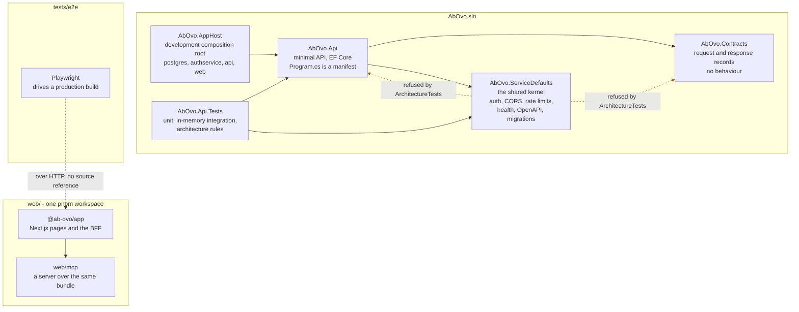
```mermaid
%% The solution layout: four .NET projects, one pnpm workspace, and what may reference what.
%% ONE DIAGRAM PER FILE. ASCII ONLY. See a1-system-context.mmd for why no comment line here
%% is a bare %% marker.

%% THE ARROWS ARE PROJECT REFERENCES, AND THE ABSENT ONES ARE THE POINT. The shared kernel
%% (AbOvo.ServiceDefaults) has no arrow leaving it, because P2 makes it plumbing only and
%% tests/AbOvo.Api.Tests/ArchitectureTests.cs refuses a reference from it to AbOvo.Api or
%% AbOvo.Contracts. A .Core library that began as shared plumbing and ended as a shared
%% domain has already been paid for twice in this estate.

%% AbOvo.AppHost IS DEVELOPMENT ONLY (P1). It composes the system on a laptop; it is not
%% the deployed topology, which is flyio/*.fly.toml and has never been applied.

flowchart TD
  subgraph dotnet["AbOvo.sln"]
    APPHOST["AbOvo.AppHost<br/>development composition root<br/>postgres, authservice, api, web"]
    API["AbOvo.Api<br/>minimal API, EF Core<br/>Program.cs is a manifest"]
    CONTRACTS["AbOvo.Contracts<br/>request and response records<br/>no behaviour"]
    KERNEL["AbOvo.ServiceDefaults<br/>the shared kernel<br/>auth, CORS, rate limits,<br/>health, OpenAPI, migrations"]
    TESTS["AbOvo.Api.Tests<br/>unit, in-memory integration,<br/>architecture rules"]
  end

  subgraph node["web/ - one pnpm workspace"]
    APP["@ab-ovo/app<br/>Next.js pages and the BFF"]
    MCP["web/mcp<br/>a server over the same bundle"]
  end

  subgraph accept["tests/e2e"]
    E2E["Playwright<br/>drives a production build"]
  end

  APPHOST --> API
  API --> CONTRACTS
  API --> KERNEL
  TESTS --> API
  TESTS --> KERNEL
  APP --> MCP
  E2E -.->|"over HTTP, no source reference"| APP

  KERNEL -.->|"refused by ArchitectureTests"| API
  KERNEL -.->|"refused by ArchitectureTests"| CONTRACTS

  linkStyle 7,8 stroke:#b45309,stroke-dasharray: 4 4;
```

### A3. One origin — every request the browser is allowed to make

The reader's browser talks to the web app's own origin and to nothing else
(FRONTEND-BFF.md §1). The bearer never reaches the document: `/api/auth/login` takes
credentials and returns a status, and `/api/proxy` injects the token server-side from an
HttpOnly cookie.

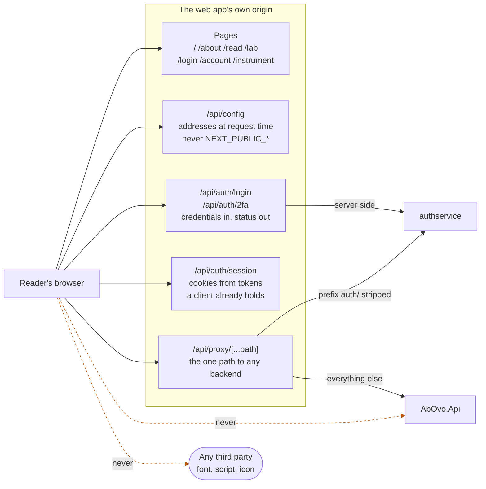
```mermaid
%% One origin: every request the browser makes, and the two it is not allowed to make.
%% ONE DIAGRAM PER FILE. ASCII ONLY.

%% THE TWO DASHED ARROWS ARE DRAWN BECAUSE THEY MUST NOT EXIST. FRONTEND-BFF.md section 1:
%% the browser talks to the web app's own origin and to nothing else -- not the API, not
%% authservice, not a CDN, not a font. That is why this estate configures no CORS on the
%% frontend's account, and why needing one would mean the rule had already been broken.

%% THE BEARER NEVER REACHES THE DOCUMENT. /api/auth/login takes credentials and returns a
%% status; the tokens are minted into the Next.js process and set as HttpOnly cookies
%% (ADR-0018). /api/proxy strips an inbound Authorization header and injects the bearer it
%% reads from the cookie, server side.

flowchart LR
  BROWSER["Reader's browser"]

  subgraph origin["The web app's own origin"]
    PAGES["Pages<br/>/ /about /read /lab<br/>/login /account /instrument"]
    CONFIG["/api/config<br/>addresses at request time<br/>never NEXT_PUBLIC_*"]
    LOGIN["/api/auth/login<br/>/api/auth/2fa<br/>credentials in, status out"]
    SESSION["/api/auth/session<br/>cookies from tokens<br/>a client already holds"]
    PROXY["/api/proxy/[...path]<br/>the one path to any backend"]
  end

  APISVC["AbOvo.Api"]
  AUTHSVC["authservice"]
  CDN(["Any third party<br/>font, script, icon"])

  BROWSER --> PAGES
  BROWSER --> CONFIG
  BROWSER --> LOGIN
  BROWSER --> SESSION
  BROWSER --> PROXY

  PROXY -->|"prefix auth/ stripped"| AUTHSVC
  PROXY -->|"everything else"| APISVC
  LOGIN -->|"server side"| AUTHSVC

  BROWSER -.->|"never"| APISVC
  BROWSER -.->|"never"| CDN

  linkStyle 8,9 stroke:#b45309,stroke-dasharray: 4 4;
```

### A4. The content pipeline — from the book's repository to a frame

Nothing in this chain is authored here. The repository owns the schema and the presentation;
it does not own, parse or edit the book's files, and it never parses LaTeX (P11,
[ADR-0008](adr/0008-content-is-a-versioned-bundle.md)). The pin is a revision rather than a
release, which is a deviation with an exit condition
([ADR-0038](adr/0038-the-bundle-is-compiled-at-a-pinned-revision.md)).

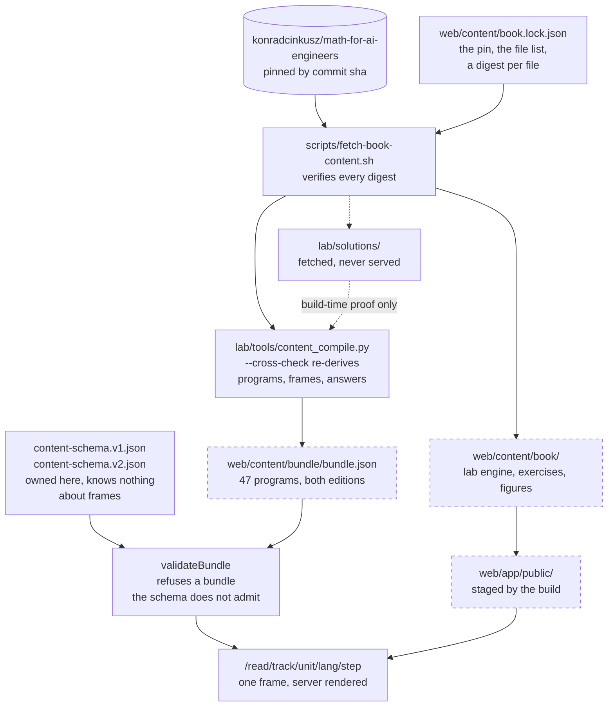
```mermaid
%% The content pipeline: from the book's repository to a frame on the reader's screen.
%% ONE DIAGRAM PER FILE. ASCII ONLY.

%% NOTHING IN THIS CHAIN IS AUTHORED HERE. This repository owns the schema and the
%% presentation; it does not own, parse or edit the book's files, and it never parses LaTeX
%% (P11, ADR-0008). web/content/ is derived and gitignored.

%% THE PIN IS A REVISION, NOT A RELEASE, AND THAT IS A DEVIATION WITH AN EXIT CONDITION
%% (ADR-0038): no release of the book carries a compiled bundle yet, so the bundle is
%% compiled here from the book's own compiler at a pinned commit. The exit is the first
%% release that carries one.

%% THE SOLUTIONS BRANCH IS FETCHED AND NEVER SERVED (ADR-0012). It exists so the build can
%% prove the exercises solvable; an acceptance test asserts in both directions that it does
%% not reach public/.

flowchart TD
  BOOK[("konradcinkusz/math-for-ai-engineers<br/>pinned by commit sha")]
  LOCK["web/content/book.lock.json<br/>the pin, the file list,<br/>a digest per file"]
  FETCH["scripts/fetch-book-content.sh<br/>verifies every digest"]
  ENGINE["web/content/book/<br/>lab engine, exercises, figures"]
  COMPILE["lab/tools/content_compile.py<br/>--cross-check re-derives<br/>programs, frames, answers"]
  BUNDLE["web/content/bundle/bundle.json<br/>47 programs, both editions"]
  SCHEMA["content-schema.v1.json<br/>content-schema.v2.json<br/>owned here, knows nothing<br/>about frames"]
  VALIDATE["validateBundle<br/>refuses a bundle<br/>the schema does not admit"]
  PUBLIC["web/app/public/<br/>staged by the build"]
  FRAME["/read/track/unit/lang/step<br/>one frame, server rendered"]
  SOLUTIONS["lab/solutions/<br/>fetched, never served"]

  BOOK --> FETCH
  LOCK --> FETCH
  FETCH --> ENGINE
  FETCH --> COMPILE
  COMPILE --> BUNDLE
  SCHEMA --> VALIDATE
  BUNDLE --> VALIDATE
  VALIDATE --> FRAME
  ENGINE --> PUBLIC
  PUBLIC --> FRAME
  FETCH -.-> SOLUTIONS
  SOLUTIONS -.->|"build-time proof only"| COMPILE

  classDef derived stroke-dasharray: 5 5;
  class ENGINE,BUNDLE,PUBLIC derived;
```

### A5. What is stored, and what the schema cannot answer

Three tables, each held by mechanical rules rather than by a promise. Two are keyed by a
reader — where they are, and which edition they chose
([ADR-0048](adr/0048-one-language-control-remembered-and-english-by-default.md)) — and share
one guard. The absent column on the third — a reader on an outcome row — is the design, and
it is what makes a per-reader score unbuildable
([ADR-0009](adr/0009-the-instrument-measures-the-book.md),
[ADR-0020](adr/0020-no-aggregate-touches-the-progress-store.md)).

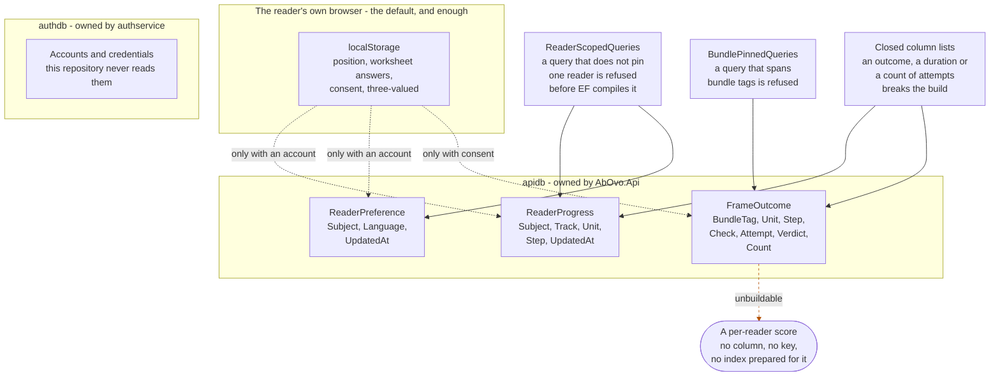
```mermaid
%% What is stored, and what the schema is designed to be unable to answer.
%% ONE DIAGRAM PER FILE. ASCII ONLY.

%% THREE TABLES, AND EACH IS HELD BY MECHANICAL RULES RATHER THAN BY A PROMISE.
%% ReaderProgress says WHERE a reader is and never how they did; ReaderPreference says which
%% EDITION they chose and nothing else (ADR-0048); FrameOutcome counts a verdict against a
%% frame and carries no identifier and no timestamp (ADR-0009, ADR-0020, ADR-0023).

%% THE TWO READER-SCOPED TABLES SHARE ONE GUARD. "How many readers chose Polish" is a
%% preference rather than a measurement, and it is still a fact arrived at by counting
%% readers -- so ReaderScopedQueries refuses it on the same terms as "how far has each
%% reader got".

%% THE ABSENT COLUMN IS THE DESIGN. An outcome has no reader, so nothing can find the rows
%% that were yours -- which is why deleting an account cannot retract a contribution
%% already folded into a rate, and why the deletion screen says so (ADR-0021).

%% NOTHING A READER WRITES ON A FRAME IS STORED ANYWHERE BUT THEIR OWN BROWSER (ADR-0039).
%% The worksheet, the pad and the canvas are local; so is consent (ADR-0022) and so is
%% position until an account synchronises it.

flowchart TD
  subgraph browser["The reader's own browser - the default, and enough"]
    LOCAL["localStorage<br/>position, worksheet answers,<br/>consent, three-valued"]
  end

  subgraph apidb["apidb - owned by AbOvo.Api"]
    RP["ReaderProgress<br/>Subject, Track, Unit,<br/>Step, UpdatedAt"]
    RPF["ReaderPreference<br/>Subject, Language,<br/>UpdatedAt"]
    FO["FrameOutcome<br/>BundleTag, Unit, Step,<br/>Check, Attempt, Verdict,<br/>Count"]
  end

  subgraph authdb["authdb - owned by authservice"]
    ACC["Accounts and credentials<br/>this repository never reads them"]
  end

  RULE1["ReaderScopedQueries<br/>a query that does not pin<br/>one reader is refused<br/>before EF compiles it"]
  RULE2["BundlePinnedQueries<br/>a query that spans<br/>bundle tags is refused"]
  RULE3["Closed column lists<br/>an outcome, a duration or<br/>a count of attempts<br/>breaks the build"]

  LOCAL -.->|"only with an account"| RP
  LOCAL -.->|"only with an account"| RPF
  LOCAL -.->|"only with consent"| FO

  RULE1 --> RP
  RULE1 --> RPF
  RULE3 --> RP
  RULE2 --> FO
  RULE3 --> FO

  NOPE(["A per-reader score<br/>no column, no key,<br/>no index prepared for it"])
  FO -.->|"unbuildable"| NOPE

  linkStyle 8 stroke:#b45309,stroke-dasharray: 4 4;
```

---

## Part B — The reader loop

### B1. The reader loop

Every box in this diagram runs with no account and no backend. That is the product's first
requirement, not an optimisation. The two dotted edges leaving the loop are the only places a
server appears, and neither is on the path.

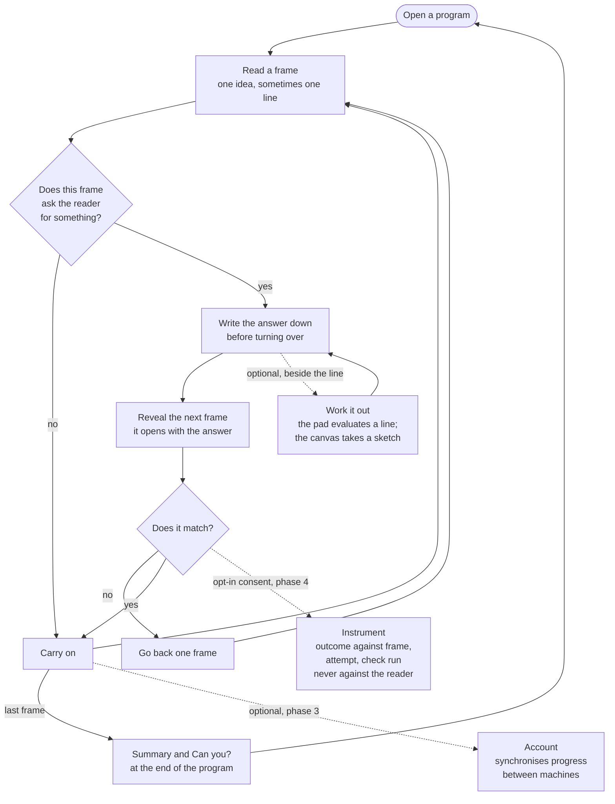
```mermaid
%% The ab-ovo reader loop.
%% ONE DIAGRAM PER FILE. ASCII ONLY. See ab-ovo-system.mmd for why no comment line here is
%% a bare %% marker.

%% EVERY BOX IN THIS DIAGRAM RUNS WITH NO ACCOUNT AND NO BACKEND. That is the product's
%% first requirement, not an optimisation: frames are served with the site as a versioned
%% bundle (ADR-0008, ADR-0038) and everything the reader writes stays in their browser
%% (ADR-0039).

%% THE WORK BRANCH USED TO BE PYTHON AND IS NOT ANY MORE (ADR-0040). It asked a reader of a
%% mathematics book to write code, reached one program of forty-seven, and cost 6.4 MB and
%% two seconds of boot on every visit. What replaced it is a worksheet: a line to answer on,
%% a pad that evaluates arithmetic (ADR-0042) and a canvas (ADR-0043). None of them is a
%% language and all three are optional.

%% The two dotted edges leaving the loop are the only places a server appears, and neither
%% is on the path: an account synchronises progress between machines and buys nothing else,
%% and an outcome is contributed only if the reader opted in. Both can be absent and the
%% loop is unchanged.

%% WHAT IS NOT DRAWN, deliberately: no grading step. The next frame opens with the answer
%% and the reader compares. The machine may say "matches the book" where the book's whole
%% answer is one number, which is 85 frames of 1036, and it never says anything else --
%% never "wrong" (ADR-0039). Nothing scores the comparison and no language model is called
%% (ADR-0010). The comparison IS the teaching.

flowchart TD
  START(["Open a program"])
  READ["Read a frame<br/>one idea, sometimes one line"]
  ASKS{"Does this frame<br/>ask the reader<br/>for something?"}
  WORK["Work it out<br/>the pad evaluates a line;<br/>the canvas takes a sketch"]
  COMMIT["Write the answer down<br/>before turning over"]
  REVEAL["Reveal the next frame<br/>it opens with the answer"]
  COMPARE{"Does it match?"}
  BACK["Go back one frame"]
  NEXT["Carry on"]
  SUMMARY["Summary and Can you?<br/>at the end of the program"]
  SYNC["Account<br/>synchronises progress<br/>between machines"]
  INST["Instrument<br/>outcome against frame,<br/>attempt, check run<br/>never against the reader"]

  START --> READ
  READ --> ASKS
  ASKS -->|"no"| NEXT
  ASKS -->|"yes"| COMMIT
  COMMIT --> REVEAL
  WORK --> COMMIT
  COMMIT -.->|"optional, beside the line"| WORK
  REVEAL --> COMPARE
  COMPARE -->|"no"| BACK
  BACK --> READ
  COMPARE -->|"yes"| NEXT
  NEXT --> READ
  NEXT -->|"last frame"| SUMMARY
  SUMMARY --> START

  NEXT -.->|"optional, phase 3"| SYNC
  COMPARE -.->|"opt-in consent, phase 4"| INST
```

### B2. One frame, and why the answer is absent

The product's whole mechanism, as a sequence. The reveal is a **navigation**, so the answer to
the frame you are on is rendered by the request for the *next* one and by nothing before it. A
reader who opens the inspector finds it nowhere, and prefetching is off so it is not on the
wire either.

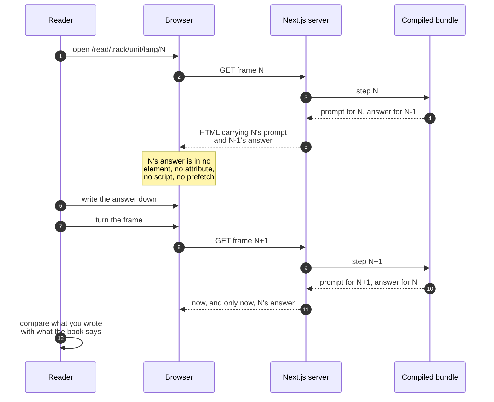
```mermaid
%% One frame, and why the answer is absent from the page rather than hidden on it.
%% ONE DIAGRAM PER FILE. ASCII ONLY.

%% THIS IS THE PRODUCT'S WHOLE MECHANISM. A Stroud frame asks for something BEFORE it tells
%% you anything, and the next frame opens with the answer you were supposed to have written.
%% A reader who skims gets nothing, and paper has no way to notice.

%% THE REVEAL IS A NAVIGATION, NOT A TOGGLE. The frame is a Server Component with no client
%% boundary around it, so the answer to frame N is rendered by the REQUEST for frame N+1 and
%% by nothing before it. A reader who opens the inspector finds it nowhere; prefetching is
%% off, so it is not on the wire either. Both halves are asserted, and both were watched
%% failing before they were believed.

%% WHY NOT A DISCLOSURE WIDGET. Anything that renders the answer into the document and hides
%% it with CSS or JavaScript is a hint the browser already has. The structural version costs
%% a navigation and cannot be defeated.

sequenceDiagram
  autonumber
  participant R as Reader
  participant B as Browser
  participant S as Next.js server
  participant C as Compiled bundle

  R->>B: open /read/track/unit/lang/N
  B->>S: GET frame N
  S->>C: step N
  C-->>S: prompt for N, answer for N-1
  S-->>B: HTML carrying N's prompt<br/>and N-1's answer
  Note over B: N's answer is in no<br/>element, no attribute,<br/>no script, no prefetch
  R->>B: write the answer down
  R->>B: turn the frame
  B->>S: GET frame N+1
  S->>C: step N+1
  C-->>S: prompt for N+1, answer for N
  S-->>B: now, and only now, N's answer
  R->>R: compare what you wrote<br/>with what the book says
```

### B3. The worksheet — a line, a pad, a canvas

What a frame offers a reader who has to work something out, after
[ADR-0040](adr/0040-the-python-lab-leaves-the-reader-loop.md) took Python out of the loop. All
three are optional and all three are local.

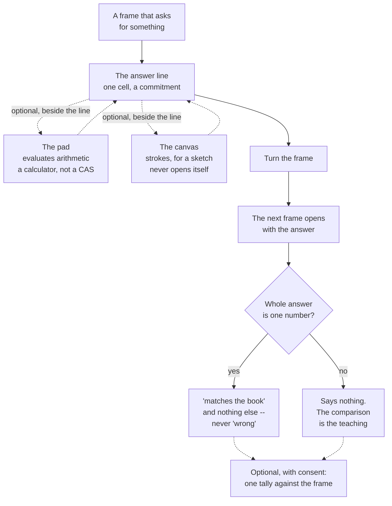
```mermaid
%% The worksheet: what a frame offers a reader who has to work something out.
%% ONE DIAGRAM PER FILE. ASCII ONLY.

%% THIS REPLACED THE PYTHON LAB IN THE READER LOOP (ADR-0040). Measured across the book's
%% answers, effectively none of them is a Python one-liner, and asking a reader of a
%% mathematics book to write code to answer a frame reached one program of forty-seven.

%% ALL THREE ARE OPTIONAL AND ALL THREE ARE LOCAL. Nothing here is sent anywhere, nothing is
%% graded, and no language model is called (ADR-0010, ADR-0039). The pad is a calculator and
%% deliberately not a computer algebra system (ADR-0042); the canvas is strokes and never
%% opens itself (ADR-0043).

%% A BLANK FAILS THE ANSWER RATHER THAN SKIPPING IT (ADR-0045): a worksheet answer is one
%% cell, and an empty cell is a reader who did not commit.

flowchart TD
  FRAME["A frame that asks<br/>for something"]
  LINE["The answer line<br/>one cell, a commitment"]
  PAD["The pad<br/>evaluates arithmetic<br/>a calculator, not a CAS"]
  CANVAS["The canvas<br/>strokes, for a sketch<br/>never opens itself"]
  COMMIT["Turn the frame"]
  REVEAL["The next frame opens<br/>with the answer"]
  MATCH{"Whole answer<br/>is one number?"}
  SAYS["'matches the book'<br/>and nothing else --<br/>never 'wrong'"]
  QUIET["Says nothing.<br/>The comparison<br/>is the teaching"]
  TALLY["Optional, with consent:<br/>one tally against the frame"]

  FRAME --> LINE
  LINE -.->|"optional, beside the line"| PAD
  LINE -.->|"optional, beside the line"| CANVAS
  PAD -.-> LINE
  CANVAS -.-> LINE
  LINE --> COMMIT
  COMMIT --> REVEAL
  REVEAL --> MATCH
  MATCH -->|"yes"| SAYS
  MATCH -->|"no"| QUIET
  SAYS -.-> TALLY
  QUIET -.-> TALLY
```

### B4. Where the reader is — position, and never progress

The reading surface shows position and never progress
([ADR-0041](adr/0041-the-reading-surface-shows-position-and-never-progress.md)). An account
buys exactly one thing: the same place on a second machine. Furthest frame wins
([ADR-0019](adr/0019-furthest-frame-wins.md)) — a reconciliation that moved a reader backwards
would lose reading they did.

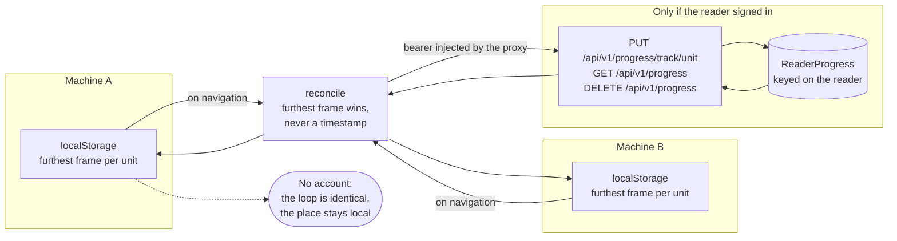
```mermaid
%% Where the reader is: position, which is not progress, and which machine holds it.
%% ONE DIAGRAM PER FILE. ASCII ONLY.

%% THE READING SURFACE SHOWS POSITION AND NEVER PROGRESS (ADR-0041). A percentage over a
%% book of 47 programs is a number about the reader, and this product does not make those.
%% The place row says which frame of which section, and its frame number is a jumper.

%% LOCAL FIRST, AND THE LOCAL COPY HOLDS NOTHING WORTH SCORING (ADR-0017). An account buys
%% one thing: the same place on a second machine. Everything else about the loop is
%% unchanged whether the reader has one or not.

%% FURTHEST FRAME WINS (ADR-0019). Two machines that disagree are not a conflict to resolve
%% with a timestamp: the reader has read up to the furthest of the two, and a reconciliation
%% that moved them backwards would lose reading they did.

flowchart LR
  subgraph m1["Machine A"]
    LA["localStorage<br/>furthest frame per unit"]
  end

  subgraph m2["Machine B"]
    LB["localStorage<br/>furthest frame per unit"]
  end

  subgraph server["Only if the reader signed in"]
    API["PUT /api/v1/progress/track/unit<br/>GET /api/v1/progress<br/>DELETE /api/v1/progress"]
    RP[("ReaderProgress<br/>keyed on the reader")]
  end

  RECON["reconcile<br/>furthest frame wins,<br/>never a timestamp"]

  LA -->|"on navigation"| RECON
  LB -->|"on navigation"| RECON
  RECON -->|"bearer injected by the proxy"| API
  API --> RP
  RP --> API
  API --> RECON
  RECON --> LA
  RECON --> LB

  NOACC(["No account:<br/>the loop is identical,<br/>the place stays local"])
  LA -.-> NOACC
```

### B5. Sign-in — a password, a second factor, a session the document never holds

The form posts *credentials* to this app's own BFF, so the tokens are never in the document at
all ([ADR-0018](adr/0018-password-sign-in-happens-server-side.md)). The challenge is an
HttpOnly cookie scoped like a session cookie and useless as one
([ADR-0029](adr/0029-the-two-factor-challenge-is-a-cookie-and-the-code-is-the-only-thing-the-reader-supplies.md)).

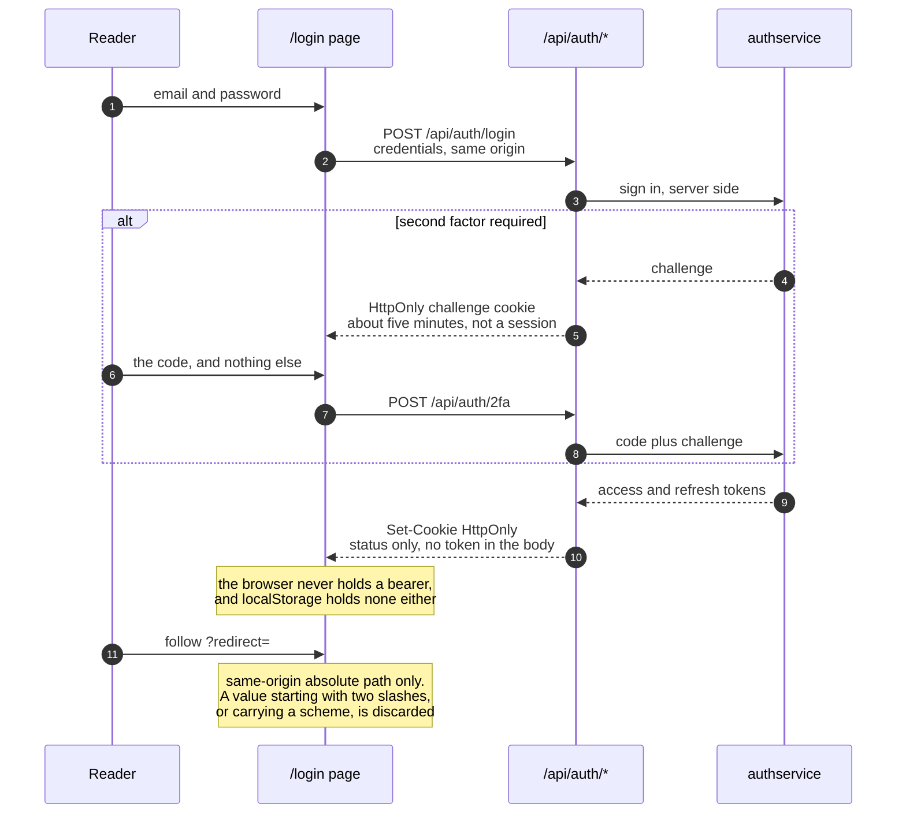
```mermaid
%% Sign-in: a password, a second factor, and a session the document never holds.
%% ONE DIAGRAM PER FILE. ASCII ONLY.

%% THE TOKENS ARE NEVER IN THE DOCUMENT (ADR-0018). The form posts CREDENTIALS to this
%% app's own BFF, which talks to authservice server side and sets HttpOnly cookies. The
%% alternative -- posting to the identity service and handing a token back to the page --
%% puts a bearer in a place document.cookie and every script on the page can read.

%% THE CHALLENGE IS A COOKIE AND THE CODE IS THE ONLY THING THE READER SUPPLIES (ADR-0029).
%% It is scoped like a session cookie and useless as one: it cannot authenticate a request,
%% it expires in about five minutes, and sign-out clears it. A hidden form field would be a
%% credential that survives form restore and screenshots.

%% THE REDIRECT PARAMETER IS ACCEPTED ONLY AS A SAME-ORIGIN ABSOLUTE PATH. A value starting
%% with // or carrying a scheme is discarded: an attacker chooses that string, and a sign-in
%% page that forwards to it is a phishing redirector with this site's name on it.

%% NO IDENTITY SERVICE CONFIGURED IS A SUPPORTED CONFIGURATION, NOT A BROKEN ONE (P8). The
%% page says so plainly rather than offering a button that cannot work.

sequenceDiagram
  autonumber
  participant R as Reader
  participant P as /login page
  participant BFF as /api/auth/*
  participant AS as authservice

  R->>P: email and password
  P->>BFF: POST /api/auth/login<br/>credentials, same origin
  BFF->>AS: sign in, server side

  alt second factor required
    AS-->>BFF: challenge
    BFF-->>P: HttpOnly challenge cookie<br/>about five minutes, not a session
    R->>P: the code, and nothing else
    P->>BFF: POST /api/auth/2fa
    BFF->>AS: code plus challenge
  end

  AS-->>BFF: access and refresh tokens
  BFF-->>P: Set-Cookie HttpOnly<br/>status only, no token in the body
  Note over P: the browser never holds a bearer,<br/>and localStorage holds none either

  R->>P: follow ?redirect=
  Note over P: same-origin absolute path only.<br/>A value starting with two slashes,<br/>or carrying a scheme, is discarded
```

### B6. Deletion — what goes, what stays, what nothing can reach

Everything this service holds for the reader goes first — their place and their chosen
edition, both under the same subject — and the screen says what no deletion can reach
([ADR-0021](adr/0021-deletion-removes-the-progress-first-and-says-what-it-cannot-reach.md),
[ADR-0048](adr/0048-one-language-control-remembered-and-english-by-default.md)). A screen
that implied otherwise would be claiming a capability the schema was designed not to have.

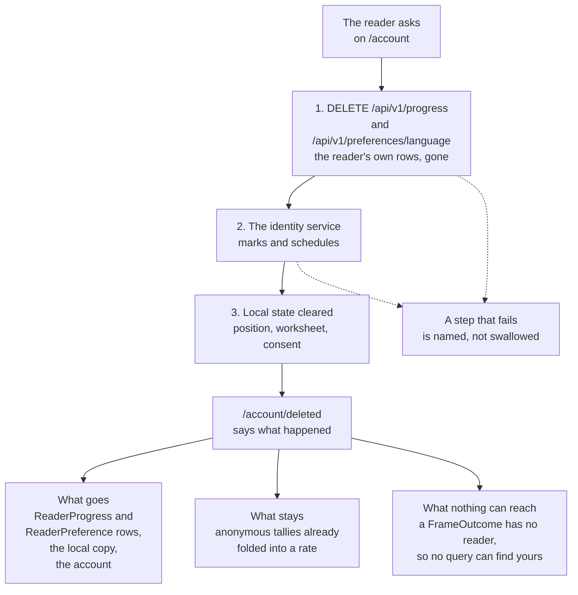
```mermaid
%% Deletion: what goes, what stays, and what no deletion can reach.
%% ONE DIAGRAM PER FILE. ASCII ONLY.

%% EVERY READER-SCOPED ROW GOES FIRST, AND THE SCREEN SAYS WHAT IT CANNOT REACH (ADR-0021).
%% The order is about the SUBJECT: once the identity service has marked the account, nobody
%% can sign in as that subject again, so anything still filed under it in apidb is
%% unreachable by any reader for ever. That is true of the chosen edition (ADR-0048) exactly
%% as it is of the place, which is why both go before the account rather than after.

%% AND BECAUSE AN OUTCOME CARRIES NO READER, nothing can find the rows that were yours -- so
%% a contribution already folded into a rate cannot be retracted. That is the cost of the
%% architectural absence that makes a per-reader score unbuildable, and the reader is told it
%% rather than left to assume the opposite.

%% THE IDENTITY SERVICE MARKS AND SCHEDULES RATHER THAN ERASES. This repository does not own
%% authdb and does not claim on its behalf; the screen says what the identity service does,
%% in its own terms.

%% A SCREEN THAT IMPLIED OTHERWISE WOULD BE CLAIMING A CAPABILITY THE SCHEMA WAS DESIGNED
%% NOT TO HAVE.

flowchart TD
  ASK["The reader asks<br/>on /account"]
  P1["1. DELETE /api/v1/progress<br/>and /api/v1/preferences/language<br/>the reader's own rows, gone"]
  P2["2. The identity service<br/>marks and schedules"]
  P3["3. Local state cleared<br/>position, worksheet, consent"]
  DONE["/account/deleted<br/>says what happened"]

  GONE["What goes<br/>ReaderProgress and<br/>ReaderPreference rows,<br/>the local copy,<br/>the account"]
  STAYS["What stays<br/>anonymous tallies already<br/>folded into a rate"]
  CANNOT["What nothing can reach<br/>a FrameOutcome has no reader,<br/>so no query can find yours"]

  ASK --> P1 --> P2 --> P3 --> DONE
  DONE --> GONE
  DONE --> STAYS
  DONE --> CANNOT

  PROBLEM["A step that fails<br/>is named, not swallowed"]
  P2 -.-> PROBLEM
  P1 -.-> PROBLEM
```

---

## Part C — The instrument

### C1. From a run to a tally

The instrument's write path. A tally is a count against a frame, not a record of a run
([ADR-0023](adr/0023-a-tally-is-a-count-against-a-frame-not-a-record-of-a-run.md)): no
identifier, and no timestamp either. The endpoint takes no token, so a reader with no account
contributes on the same terms as one who signed in.


```mermaid
%% From something a reader did to a row in the ledger: the instrument's write path.
%% ONE DIAGRAM PER FILE. ASCII ONLY.

%% A TALLY IS A COUNT AGAINST A FRAME, NOT A RECORD OF A RUN (ADR-0023). The row carries a
%% bundle tag, a unit, a step, a check, an attempt number and a verdict -- and one other
%% column, Count. There is no identifier and no timestamp: a few dozen rows whose times ran
%% consecutively over one program reconstruct a session without naming anybody.

%% THE ENDPOINT TAKES NO TOKEN. A reader with no account contributes on the same terms as
%% one who signed in, and the service could not tell them apart if it wanted to. An
%% instrument that required a token would measure the book as experienced by account
%% holders and call it the book.

%% THE ATTEMPT NUMBER IS THE BROWSER'S OWN COUNT AND THE SERVICE CANNOT VERIFY IT
%% (ADR-0023 section 3). That is the second reason to read 'first time' as narrower than
%% its name.

flowchart LR
  READER["The reader<br/>answers a frame,<br/>or runs a lab check"]
  CONSENT{"Consent given?<br/>three-valued,<br/>local, versioned"}
  NOTHING(["Nothing is sent.<br/>This is the default"])
  REPORT["report.ts<br/>verdicts for one run"]
  POST["POST /api/v1/outcomes<br/>no token, rate limited"]
  ROW[("FrameOutcome<br/>BundleTag, Unit, Step,<br/>Check, Attempt, Verdict<br/>+ Count")]
  RATE["GET /api/v1/admin/rates/track/unit<br/>a rate and its interval,<br/>one value over one cell"]
  VIEW["/instrument/track/unit<br/>the author's view"]

  READER --> CONSENT
  CONSENT -->|"not yet, or no"| NOTHING
  CONSENT -->|"yes"| REPORT
  REPORT --> POST
  POST --> ROW
  ROW --> RATE
  RATE --> VIEW

  NOID(["No reader identifier.<br/>No timestamp.<br/>Both absent on purpose"])
  ROW -.-> NOID
```

### C2. The teaching score, and the measure that cannot be pushed on

One weighted blend with two measures inside it. The one an author can raise by giving the
frame's answer away carries the smaller share; the one that cannot be raised that way carries
the larger. Model the giveaway and the blend falls — which is a test, not an intention.

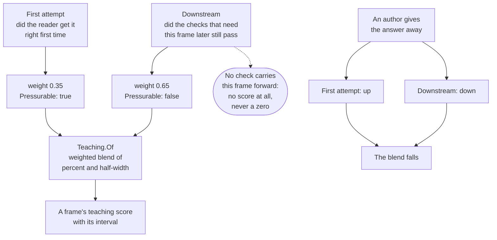
```mermaid
%% The teaching score: one weighted blend, and why one half of it cannot be pushed on.
%% ONE DIAGRAM PER FILE. ASCII ONLY.

%% THE WEIGHTS ARE IN THE CODE AND SO IS THE REASONING: src/AbOvo.Api/Instrument/Weights.cs
%% carries a Because string on each measure, and Teaching.cs blends them. The pressurable
%% measure carries the smaller share, deliberately.

%% MODEL THE GIVEAWAY AND THE BLEND FALLS. Give a frame's answer away and first-attempt
%% correctness rises immediately; the checks that rest on this frame AND on a later one
%% cannot rise the same way, because the reader has to still have the frame when they
%% arrive. That is a test rather than an intention, and it was watched failing with the
%% weights swapped.

%% THE DOWNSTREAM MEASURE IS THE BOOK'S OWN STRUCTURE, not an edge this product invented: a
%% check's docstring names the frames it rests on, so a check appearing under several frames
%% needs all of them at once.

%% A FRAME NO CHECK CARRIES FORWARD GETS NO SCORE AT ALL, NEVER A ZERO. A zero reads as
%% 'readers could not use this frame later', which is the opposite of 'nobody has asked',
%% and would sort it to the top of a list somebody acts on.

flowchart TD
  FA["First attempt<br/>did the reader get it<br/>right first time"]
  DS["Downstream<br/>did the checks that need<br/>this frame later still pass"]
  W1["weight 0.35<br/>Pressurable: true"]
  W2["weight 0.65<br/>Pressurable: false"]
  BLEND["Teaching.Of<br/>weighted blend of<br/>percent and half-width"]
  SCORE["A frame's teaching score<br/>with its interval"]
  GIVEAWAY["An author gives<br/>the answer away"]
  UP["First attempt: up"]
  DOWN["Downstream: down"]
  NET["The blend falls"]
  NONE(["No check carries<br/>this frame forward:<br/>no score at all,<br/>never a zero"])

  FA --> W1 --> BLEND
  DS --> W2 --> BLEND
  BLEND --> SCORE
  GIVEAWAY --> UP --> NET
  GIVEAWAY --> DOWN --> NET
  DS -.-> NONE
```

### C3. The ranking, and the number printed beside it

Sorting selects for whichever estimate the noise pushed furthest, so the screen says how far
the top row is expected to overshoot before it says anything else. Against every row whose
interval is not disjoint from the row below it, it says *early, not wrong*, in those words.

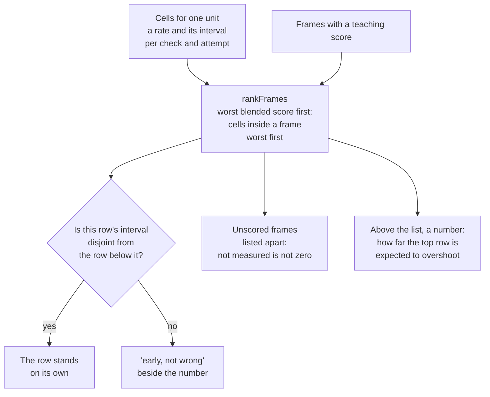
```mermaid
%% The one screen that ranks anything, and the number it prints beside the ranking.
%% ONE DIAGRAM PER FILE. ASCII ONLY.

%% SORTING SELECTS FOR WHICHEVER ESTIMATE THE NOISE PUSHED FURTHEST. The extreme of m
%% equally-good cells sits beyond the truth by the expected maximum of m standard normals.
%% That is the book's own arithmetic, from Program P27, and it needs an error function .NET
%% does not have -- which is why src/AbOvo.Api/Instrument/Normal.cs implements one, with
%% Math.Sqrt as the control in the same probe.

%% EARLY, NOT WRONG, IN THOSE WORDS. Against every row whose interval is not disjoint from
%% the row below it, the screen says so, because an author who reads an early list as a
%% verdict rewrites a frame that was fine and leaves one that is not. On thin data that is
%% every row, which is correct and is what an early list is.

%% THE WORD IS ON THE ROW RATHER THAN IN A LEGEND. Two instruments reach this screen -- a
%% lab check asks whether the reader's code satisfied an assertion, a worksheet answer asks
%% whether the number they wrote before the reveal is the number the book prints -- and they
%% do not measure the same thing.

flowchart TD
  CELLS["Cells for one unit<br/>a rate and its interval<br/>per check and attempt"]
  FRAMES["Frames with a teaching score"]
  SORT["rankFrames<br/>worst blended score first;<br/>cells inside a frame<br/>worst first"]
  PAIR{"Is this row's interval<br/>disjoint from<br/>the row below it?"}
  QUIET["The row stands<br/>on its own"]
  EARLY["'early, not wrong'<br/>beside the number"]
  UNSCORED["Unscored frames<br/>listed apart:<br/>not measured is not zero"]
  HEAD["Above the list, a number:<br/>how far the top row is<br/>expected to overshoot"]

  CELLS --> SORT
  FRAMES --> SORT
  SORT --> PAIR
  PAIR -->|"yes"| QUIET
  PAIR -->|"no"| EARLY
  SORT --> UNSCORED
  SORT --> HEAD
```

### C4. Two queries the persistence layer refuses

Mirror images, and not the same rule with a different column on it: one refuses a query that
spans **readers** — over either of the two tables keyed by one — the other a query that spans
**texts** ([ADR-0024](adr/0024-a-rate-and-its-interval-are-one-value-over-one-cell.md)). Both
refuse before EF compiles the query.

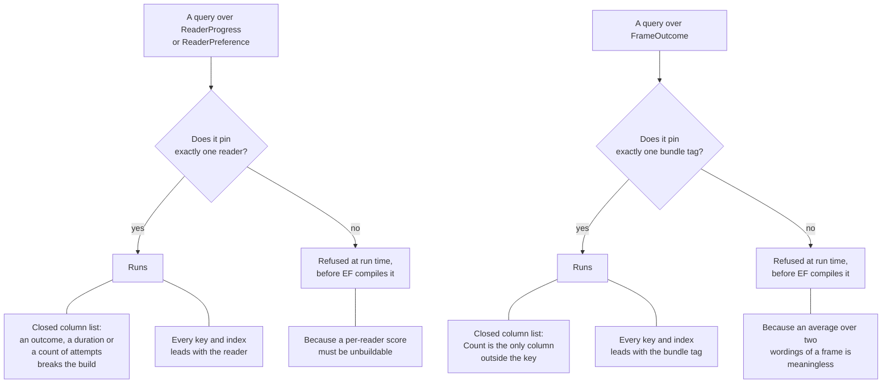
```mermaid
%% Two queries the persistence layer refuses, and the different reason each one has.
%% ONE DIAGRAM PER FILE. ASCII ONLY.

%% THEY ARE MIRROR IMAGES AND NOT THE SAME RULE WITH A DIFFERENT COLUMN ON IT.
%% ReaderScopedQueries refuses a query that spans READERS -- over either of the two tables
%% keyed by one -- because a per-reader score is being made unbuildable (ADR-0009, ADR-0020,
%% ADR-0048). BundlePinnedQueries refuses a query that
%% spans TEXTS, because an average over two wordings of a frame is meaningless rather than
%% forbidden (ADR-0024) -- it would make the ledger lie about a frame somebody has already
%% fixed.

%% EACH WAS WATCHED REFUSING SOMETHING BEFORE IT WAS BELIEVED, and one of them refused
%% something nobody planted: three of the outcome store's own tests read it without pinning
%% a tag.

%% THE REFUSAL HAPPENS BEFORE EF COMPILES THE QUERY, which is what makes it a rule rather
%% than a review comment.

flowchart TD
  Q1["A query over ReaderProgress<br/>or ReaderPreference"]
  G1{"Does it pin<br/>exactly one reader?"}
  R1["Runs"]
  X1["Refused at run time,<br/>before EF compiles it"]

  Q2["A query over FrameOutcome"]
  G2{"Does it pin<br/>exactly one bundle tag?"}
  R2["Runs"]
  X2["Refused at run time,<br/>before EF compiles it"]

  Q1 --> G1
  G1 -->|"yes"| R1
  G1 -->|"no"| X1
  Q2 --> G2
  G2 -->|"yes"| R2
  G2 -->|"no"| X2

  W1["Because a per-reader score<br/>must be unbuildable"]
  W2["Because an average over two<br/>wordings of a frame is<br/>meaningless"]
  X1 --- W1
  X2 --- W2

  K1["Closed column list:<br/>an outcome, a duration or<br/>a count of attempts<br/>breaks the build"]
  K2["Closed column list:<br/>Count is the only column<br/>outside the key"]
  I1["Every key and index<br/>leads with the reader"]
  I2["Every key and index<br/>leads with the bundle tag"]
  R1 --- K1
  R1 --- I1
  R2 --- K2
  R2 --- I2
```

### C5. What is deliberately not in the loop

No language model, anywhere ([ADR-0010](adr/0010-no-language-model-in-the-loop.md)). Nothing
grades the comparison. Every amber arrow is an anti-goal stated as a claim about the code, and
each is false the moment somebody ships the thing it denies.

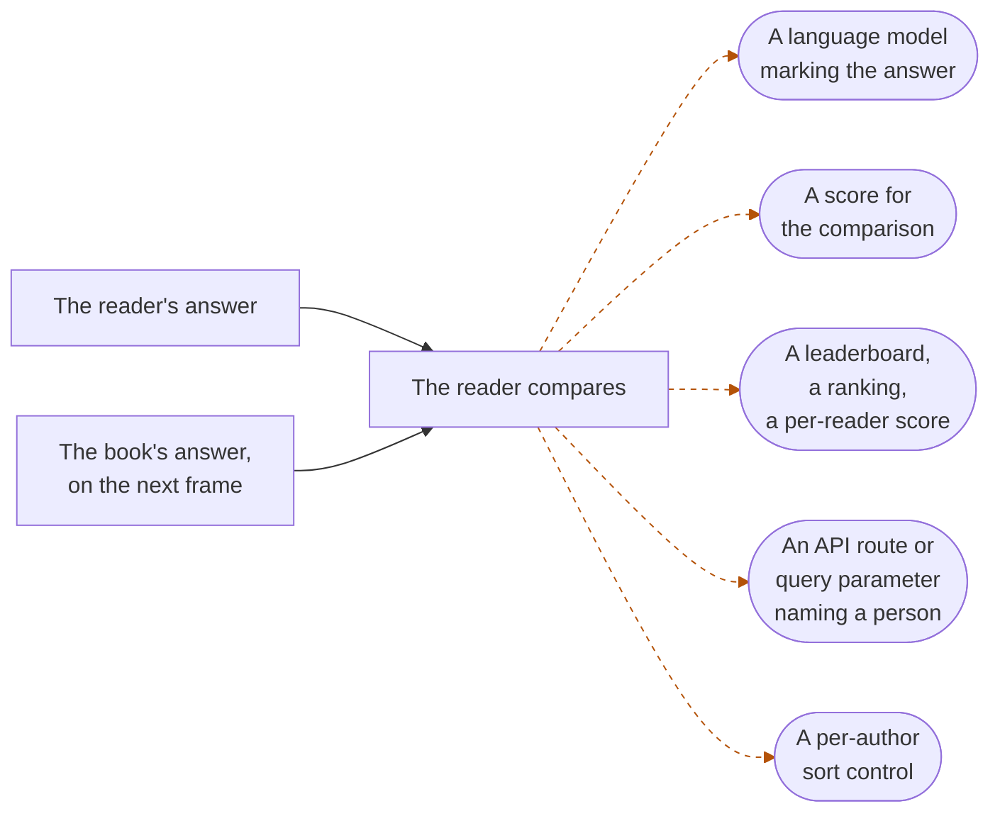
```mermaid
%% What is deliberately not in the loop: no language model, no grader, no per-reader view.
%% ONE DIAGRAM PER FILE. ASCII ONLY.

%% NO LANGUAGE MODEL IS CALLED, ANYWHERE (ADR-0010). Not to mark an answer, not to explain a
%% frame, not to generate a hint. A book of programmed learning works because the frame
%% before yours prepared you for this one; a generated paraphrase is a different book, and a
%% marker that is sometimes wrong in an unfalsifiable way is worse than one that says
%% nothing.

%% NOTHING GRADES THE COMPARISON. The next frame opens with the answer and the reader
%% compares. Where the book's whole answer is one number the machine may say 'matches the
%% book', and it never says anything else -- never 'wrong' (ADR-0039).

%% THE ANTI-GOALS ARE CLAIMS ABOUT THE CODE, NOT INTENTIONS. Each one is false the moment
%% somebody ships the thing it denies, which is what makes them worth writing down.

flowchart LR
  ANSWER["The reader's answer"]
  BOOK["The book's answer,<br/>on the next frame"]
  READER["The reader compares"]

  ANSWER --> READER
  BOOK --> READER

  LLM(["A language model<br/>marking the answer"])
  GRADE(["A score for<br/>the comparison"])
  LEADER(["A leaderboard,<br/>a ranking,<br/>a per-reader score"])
  ROUTE(["An API route or<br/>query parameter<br/>naming a person"])
  SORT(["A per-author<br/>sort control"])

  READER -.-> LLM
  READER -.-> GRADE
  READER -.-> LEADER
  READER -.-> ROUTE
  READER -.-> SORT

  linkStyle 2,3,4,5,6 stroke:#b45309,stroke-dasharray: 4 4;
```

---

## Part D — Build and delivery

### D1. The CI gates

What a change passes before it can merge. Drawn from
[`../.github/workflows/`](../.github/workflows/) rather than from the lint configurations,
because a check does not exist merely because a config file does.

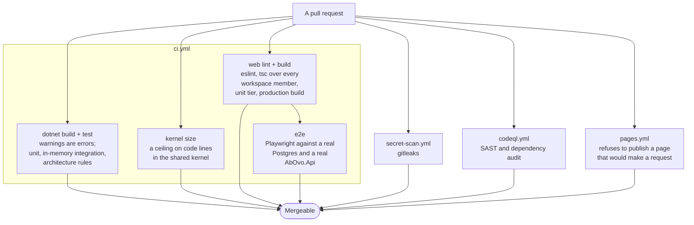
```mermaid
%% The gates a change passes before it can merge, and what each one refuses.
%% ONE DIAGRAM PER FILE. ASCII ONLY.

%% A CHECK DOES NOT EXIST BECAUSE A CONFIG FILE EXISTS. A lint configuration in the tree
%% proves nothing about whether any job runs it; .github/workflows/ is the answer, and this
%% diagram is drawn from those files.

%% THE ACCEPTANCE JOB FAILS WHEN THE SUITE IS ABSENT RATHER THAN SKIPPING
%% (E2E-ACCEPTANCE-TESTING.md section 2). A green run that tested nothing is the failure the
%% suite exists to prevent, which is why a red guard is never 'fixed' by making it
%% conditional.

%% THE BOOK IS FETCHED BEFORE THE UNIT TIER, IN EVERY JOB THAT NEEDS IT. web/content/ is
%% derived rather than committed, and the tests that assert against all 47 programs would
%% otherwise skip silently -- a green tick over an assertion nobody made.

flowchart TD
  PR["A pull request"]

  subgraph ci["ci.yml"]
    DOTNET["dotnet build + test<br/>warnings are errors;<br/>unit, in-memory integration,<br/>architecture rules"]
    KERNEL["kernel size<br/>a ceiling on code lines<br/>in the shared kernel"]
    WEB["web lint + build<br/>eslint, tsc over every<br/>workspace member,<br/>unit tier, production build"]
    E2E["e2e<br/>Playwright against a real<br/>Postgres and a real<br/>AbOvo.Api"]
  end

  SCAN["secret-scan.yml<br/>gitleaks"]
  CODEQL["codeql.yml<br/>SAST and dependency audit"]
  PAGES["pages.yml<br/>refuses to publish a page<br/>that would make a request"]

  MERGE(["Mergeable"])

  PR --> DOTNET
  PR --> KERNEL
  PR --> WEB
  PR --> SCAN
  PR --> CODEQL
  PR --> PAGES
  WEB --> E2E

  DOTNET --> MERGE
  KERNEL --> MERGE
  WEB --> MERGE
  E2E --> MERGE
  SCAN --> MERGE
  CODEQL --> MERGE
  PAGES --> MERGE
```

### D2. The deployed topology that does not exist

Four Fly apps described by [`../flyio/`](../flyio/) and never applied. The stateful app has no
public listener (P7) and will not get one. Reasoning about what is deployed from
`src/AbOvo.AppHost/AppHost.cs` reads the wrong file.

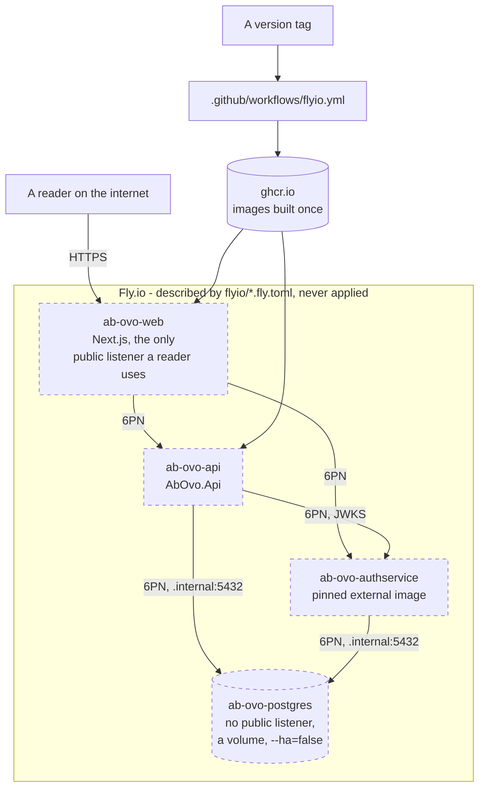
```mermaid
%% The deployed topology, which does not exist: four Fly apps described and never applied.
%% ONE DIAGRAM PER FILE. ASCII ONLY.

%% NOTHING IS DEPLOYED. No Fly app exists, no image has been published, no secret has been
%% set. Every box below is dashed for that reason, and it is the first thing AGENTS.md asks
%% a contributor not to write a sentence against.

%% THE STATEFUL APP HAS NO PUBLIC LISTENER (P7) and will not get one. Postgres is reached
%% over Fly's private network, from a laptop through a tunnel when it has to be reached at
%% all.

%% BUILD ONCE, DEPLOY MANY (P12). The image carries no address: the web app reads them at
%% run time from /api/config, which is why there is one image rather than one per
%% environment.

%% THE APPHOST IS NOT THIS PICTURE. It gives authservice a host port and a plain-HTTP
%% issuer, which a deployed instance must not have. Reasoning about what is deployed from
%% src/AbOvo.AppHost/AppHost.cs reads the wrong file.

flowchart TD
  READER["A reader on the internet"]

  subgraph fly["Fly.io - described by flyio/*.fly.toml, never applied"]
    WEB["ab-ovo-web<br/>Next.js, the only<br/>public listener a reader uses"]
    API["ab-ovo-api<br/>AbOvo.Api"]
    AUTH["ab-ovo-authservice<br/>pinned external image"]
    PG[("ab-ovo-postgres<br/>no public listener,<br/>a volume, --ha=false")]
  end

  GHCR[("ghcr.io<br/>images built once")]
  TAG["A version tag"]
  DEPLOY[".github/workflows/flyio.yml"]

  READER -->|"HTTPS"| WEB
  WEB -->|"6PN"| API
  WEB -->|"6PN"| AUTH
  API -->|"6PN, JWKS"| AUTH
  API -->|"6PN, .internal:5432"| PG
  AUTH -->|"6PN, .internal:5432"| PG

  TAG --> DEPLOY
  DEPLOY --> GHCR
  GHCR --> WEB
  GHCR --> API

  classDef notdeployed stroke-dasharray: 5 5;
  class WEB,API,AUTH,PG notdeployed;
```

### D3. How this documentation is checked and built

The checks run on every pull request; the build runs when somebody asks for it. See
[`how-to/build-the-documentation.md`](how-to/build-the-documentation.md) for the commands.

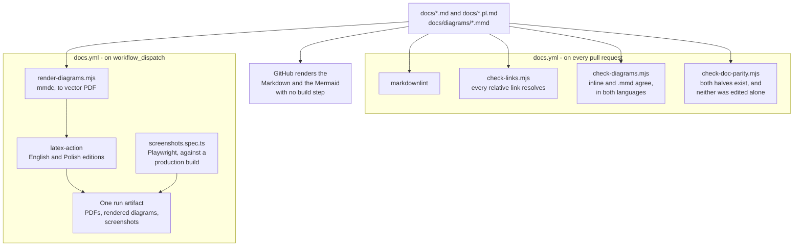
```mermaid
%% How this documentation is checked and how it is built.
%% ONE DIAGRAM PER FILE. ASCII ONLY.

%% THE CHECKS RUN ON EVERY PULL REQUEST; THE BUILD RUNS WHEN SOMEBODY ASKS. A document with
%% no release cadence should not pretend to have one, so the PDF job is workflow_dispatch
%% and nothing else -- while the lint job, which can tell a contributor their link is broken
%% before a reviewer does, runs on the pull request that broke it.

%% EVERY DIAGRAM LIVES TWICE ON PURPOSE: inline in docs/DIAGRAMS.md and docs/DIAGRAMS.pl.md,
%% which is the only form GitHub renders, and as a standalone .mmd, which is the form that
%% renders to PDF and can be opened on its own. Two copies of anything is a drift surface,
%% so a check keeps them byte-identical rather than a convention asking people to remember.

%% NOTHING GENERATED IS COMMITTED except the screenshots, and those are committed for one
%% reason: a document on GitHub cannot render an image that is only a build artifact.

flowchart TD
  SRC["docs/*.md and docs/*.pl.md<br/>docs/diagrams/*.mmd"]

  subgraph lint["docs.yml - on every pull request"]
    MD["markdownlint"]
    LINKS["check-links.mjs<br/>every relative link resolves"]
    DIAG["check-diagrams.mjs<br/>inline and .mmd agree,<br/>in both languages"]
    PARITY["check-doc-parity.mjs<br/>both halves exist, and<br/>neither was edited alone"]
  end

  subgraph build["docs.yml - on workflow_dispatch"]
    RENDER["render-diagrams.mjs<br/>mmdc, to vector PDF"]
    TEX["latex-action<br/>English and Polish editions"]
    SHOTS["screenshots.spec.ts<br/>Playwright, against a<br/>production build"]
    ART["One run artifact<br/>PDFs, rendered diagrams,<br/>screenshots"]
  end

  GH["GitHub renders the<br/>Markdown and the Mermaid<br/>with no build step"]

  SRC --> MD
  SRC --> LINKS
  SRC --> DIAG
  SRC --> PARITY
  SRC --> GH
  SRC --> RENDER
  RENDER --> TEX
  TEX --> ART
  SHOTS --> ART
```
