# Diagramy

Każde strukturalne twierdzenie tego repozytorium jako obrazek — renderowany przez sam GitHub,
bez kroku builda i bez JavaScriptu.

> **Edycja angielska:** [`DIAGRAMS.md`](DIAGRAMS.md)

To jest **Mermaid**, a nie rysowany ręcznie SVG z [`../site/index.html`](../site/index.html).
Te dwa zbiory to różne narzędzia do różnych zadań i żadne nie zastępuje drugiego:

| | SVG w opublikowanej stronie | Mermaid, tutaj |
| --- | --- | --- |
| Gdzie się renderuje | Tylko na tej jednej opublikowanej stronie | Wszędzie, gdzie GitHub renderuje Markdown |
| Do czego służy | Zaprojektowana narracja dla pierwszego gościa | Materiał, który opiekun czyta obok kodu |
| W pull requeście | Diff współrzędnych | Diff znaczenia diagramu |

Mermaida **nie ma** w `site/index.html` i jest to decyzja, a nie przeoczenie: potrzebowałby
`mermaid.js`, czyli albo CDN — odrzucanego przez strażnika w
[`pages.yml`](../.github/workflows/pages.yml) i sprzecznego z obietnicą, którą strona składa
we własnej stopce, że niczego nie pobiera — albo megabajta wgranego skryptu, sprzecznego z
tym, że strona jest jednym plikiem serwowanym dokładnie tak, jak go zacommitowano.

## Każdy diagram istnieje trzy razy, a sprawdzenie trzyma te trzy kopie identyczne

- **w treści tego dokumentu**, bo tylko tę formę renderuje GitHub;
- **w treści [`DIAGRAMS.md`](DIAGRAMS.md)**, z etykietami po angielsku, bo dokument, którego
  każdy obrazek jest podpisany w drugim języku, to tłumaczenie, które zatrzymało się na
  prozie;
- **jako samodzielne pliki `.mmd`** w [`diagrams/`](diagrams/) — `<id>-<slug>.mmd` i
  `<id>-<slug>.pl.mmd` — bo diagram, którego nie da się otworzyć osobno, to diagram, którego
  nikt nie użyje ponownie: w slajdzie, w zgłoszeniu, w komentarzu z przeglądu albo w
  renderze `mmdc` do edycji LaTeX-owych.

Regułą łączenia jest identyfikator sekcji: `### A1.` posiada `diagrams/a1-*.pl.mmd` w tym
dokumencie i `diagrams/a1-*.mmd` w angielskim.

```bash
npm run lint:diagrams    # sprawdza każdą trójkę, dokładnie to, co uruchamia CI
```

## Jak je czytać

Kilka konwencji obowiązuje we wszystkich diagramach poniżej.

- **Przerywane pole nie istnieje.** Nic nie jest wdrożone: `flyio/*.fly.toml` opisuje cztery
  aplikacje Fly, których nigdy nie zastosowano, a `web/content/` jest wyprowadzone, a nie
  commitowane. Przerywane krawędzie to ścieżki opcjonalne — krok, który czytelnik może
  pominąć, albo serwer, którego może nie być.
- **Bursztynowa przerywana strzałka jest narysowana dlatego, że nie wolno jej istnieć.** To są
  reguły, które ta architektura ma trzymać: przeglądarka sięgająca poza własny origin, jądro
  referujące serwis, model językowy w pętli czytelnika. Są na obrazku po to, by ich
  nieobecność była widoczna, a nie jedynie niewspomniana.
- **Nazwy są prawdziwe.** Ścieżki tras, nazwy klas, nazwy kolumn, nazwy endpointów i nazwy
  plików workflow są przepisane z kodu, w obu edycjach językowych, żeby diagram dało się
  grepnąć. Gdy diagram i kod się nie zgadzają, rację ma kod, a diagram jest błędem.
- **Źródła `.mmd` niosą swoje uzasadnienie w komentarzach `%%`.** GitHub ich nie renderuje i o
  to chodzi: obrazek zostaje czysty, a argument podróżuje razem z plikiem. Otwórz plik w
  [`diagrams/`](diagrams/), żeby go przeczytać.
- **Unikamy liczebników.** Zestawienie cicho się dezaktualizuje i nic nie potrafi go sprawdzić
  ([`../AGENTS.md`](../AGENTS.md)); tam, gdzie liczba ma znaczenie, jest nazwana razem z
  plikiem, który ją produkuje.

---

## Część A — Kontekst i architektura

### A1. Kontekst systemu — kto z kim rozmawia

Widok najbardziej zewnętrzny. Krawędź, której **nie** narysowano, jest sednem obrazka:
przeglądarka nie ma strzałki do API ani do `authservice`. Wszystko przerywane jest opisane i
niewdrożone.

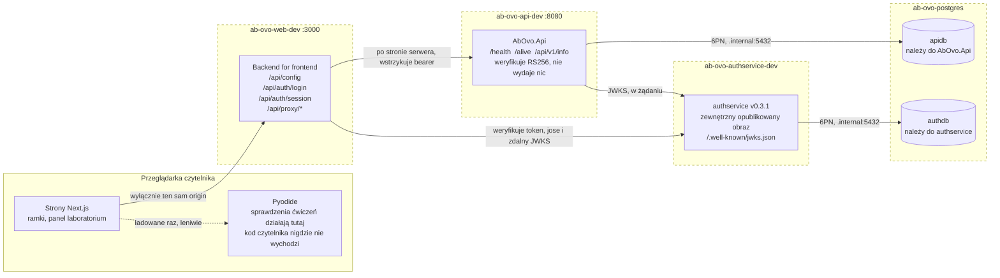
```mermaid
%% Topologia systemu ab-ovo.
%% JEDEN DIAGRAM NA PLIK. UTF-8, z polskimi znakami: reguła "tylko ASCII" obowiązuje w
%% edycji angielskiej, bo tamten plik trafia dosłownie do angielskiego papieru. Polska
%% edycja jest składana z babel [polish] i inputenc [utf8], więc diakrytyki są tam poprawne,
%% a tekst bez nich byłby po prostu złą polszczyzną.
%% UWAGA O STYLU KOMENTARZY: każdy wiersz komentarza niesie tekst po znaczniku %%. Mermaid
%% usuwa komentarz wyrażeniem, które wymaga co najmniej jednego znaku po znaczniku, więc
%% samotny %% PRZETRWA usuwanie, sklei się z następnym wierszem i diagram nie sparsuje się
%% w wierszu 1. Do odstępów używaj pustego wiersza, nigdy samotnego znacznika.

%% CO TO RYSUJE. Przerywane ramki to aplikacje Fly, KTÓRE NIE ISTNIEJĄ: nic nie jest
%% wdrożone. flyio/*.fly.toml je opisuje i nigdy nie został zastosowany. Dziś działa
%% src/AbOvo.AppHost, który jest WYŁĄCZNIE ŚRODOWISKIEM DEWELOPERSKIM i nie jest topologią
%% produkcyjną (P1).

%% Jedyna krawędź, której tu nie ma, jest sednem obrazka: przeglądarka nie ma strzałki do
%% API ani do authservice. Rozmawia z własnym originem aplikacji webowej i z niczym więcej
%% (FRONTEND-BFF.md sekcja 1) - dlatego ten majątek nie potrzebuje CORS po stronie
%% frontendu, i dlatego potrzeba CORS oznaczałaby, że reguła została już złamana.

flowchart LR
  subgraph browser["Przeglądarka czytelnika"]
    UI["Strony Next.js<br/>ramki, panel laboratorium"]
    PYO["Pyodide<br/>sprawdzenia ćwiczeń działają tutaj<br/>kod czytelnika nigdzie nie wychodzi"]
  end

  subgraph web["ab-ovo-web-dev :3000"]
    BFF["Backend for frontend<br/>/api/config<br/>/api/auth/login<br/>/api/auth/session<br/>/api/proxy/*"]
  end

  subgraph api["ab-ovo-api-dev :8080"]
    SVC["AbOvo.Api<br/>/health  /alive  /api/v1/info<br/>weryfikuje RS256, nie wydaje nic"]
  end

  subgraph auth["ab-ovo-authservice-dev"]
    AS["authservice v0.3.1<br/>zewnętrzny opublikowany obraz<br/>/.well-known/jwks.json"]
  end

  subgraph pg["ab-ovo-postgres"]
    APIDB[("apidb<br/>należy do AbOvo.Api")]
    AUTHDB[("authdb<br/>należy do authservice")]
  end

  UI -->|"wyłącznie ten sam origin"| BFF
  UI -.->|"ładowane raz, leniwie"| PYO

  BFF -->|"po stronie serwera, wstrzykuje bearer"| SVC
  BFF -->|"weryfikuje token, jose i zdalny JWKS"| AS

  SVC -->|"JWKS, w żądaniu"| AS
  SVC -->|"6PN, .internal:5432"| APIDB
  AS -->|"6PN, .internal:5432"| AUTHDB

  classDef notdeployed stroke-dasharray: 5 5;
  class web,api,auth,pg notdeployed;
```

### A2. Układ rozwiązania — projekty i to, co wolno referować

Strzałki to referencje między projektami, a sednem są te nieobecne. `AbOvo.ServiceDefaults`
jest wspólnym jądrem (P2) i nic z niego nie wychodzi; dwie bursztynowe strzałki to referencje,
których odmawia
[`../tests/AbOvo.Api.Tests/ArchitectureTests.cs`](../tests/AbOvo.Api.Tests/ArchitectureTests.cs).

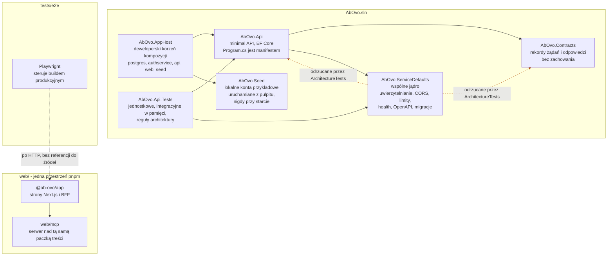
```mermaid
%% Układ rozwiązania: projekty .NET, jedna przestrzeń pnpm i to, co wolno referować.
%% JEDEN DIAGRAM NA PLIK. UTF-8. Dlaczego nie ASCII: patrz a1-system-context.pl.mmd.

%% STRZAŁKI TO REFERENCJE MIĘDZY PROJEKTAMI, A SEDNEM SĄ TE NIEOBECNE. Ze wspólnego jądra
%% (AbOvo.ServiceDefaults) nie wychodzi żadna strzałka, bo P2 czyni je wyłącznie
%% instalacją, a tests/AbOvo.Api.Tests/ArchitectureTests.cs odmawia referencji z niego do
%% AbOvo.Api i AbOvo.Contracts. Biblioteka .Core, która zaczęła jako wspólna instalacja,
%% a skończyła jako wspólna domena, została w tym majątku opłacona już dwa razy.

%% AbOvo.AppHost JEST WYŁĄCZNIE DEWELOPERSKI (P1). Składa system na laptopie; nie jest
%% wdrożoną topologią, którą opisuje flyio/*.fly.toml i której nigdy nie zastosowano.

flowchart TD
  subgraph dotnet["AbOvo.sln"]
    APPHOST["AbOvo.AppHost<br/>deweloperski korzeń kompozycji<br/>postgres, authservice, api, web, seed"]
    API["AbOvo.Api<br/>minimal API, EF Core<br/>Program.cs jest manifestem"]
    CONTRACTS["AbOvo.Contracts<br/>rekordy żądań i odpowiedzi<br/>bez zachowania"]
    KERNEL["AbOvo.ServiceDefaults<br/>wspólne jądro<br/>uwierzytelnianie, CORS, limity,<br/>health, OpenAPI, migracje"]
    TESTS["AbOvo.Api.Tests<br/>jednostkowe, integracyjne w pamięci,<br/>reguły architektury"]
    SEED["AbOvo.Seed<br/>lokalne konta przykładowe<br/>uruchamiane z pulpitu,<br/>nigdy przy starcie"]
  end

  subgraph node["web/ - jedna przestrzeń pnpm"]
    APP["@ab-ovo/app<br/>strony Next.js i BFF"]
    MCP["web/mcp<br/>serwer nad tą samą paczką treści"]
  end

  subgraph accept["tests/e2e"]
    E2E["Playwright<br/>steruje buildem produkcyjnym"]
  end

  APPHOST --> API
  APPHOST --> SEED
  API --> CONTRACTS
  API --> KERNEL
  TESTS --> API
  TESTS --> KERNEL
  APP --> MCP
  E2E -.->|"po HTTP, bez referencji do źródeł"| APP

  KERNEL -.->|"odrzucane przez ArchitectureTests"| API
  KERNEL -.->|"odrzucane przez ArchitectureTests"| CONTRACTS

  linkStyle 8,9 stroke:#b45309,stroke-dasharray: 4 4;
```

### A3. Jeden origin — każde żądanie, które wolno wykonać przeglądarce

Przeglądarka czytelnika rozmawia z własnym originem aplikacji webowej i z niczym więcej
(FRONTEND-BFF.md §1). Bearer nigdy nie trafia do dokumentu: `/api/auth/login` przyjmuje
poświadczenia i zwraca status, a `/api/proxy` wstrzykuje token po stronie serwera z ciasteczka
HttpOnly.

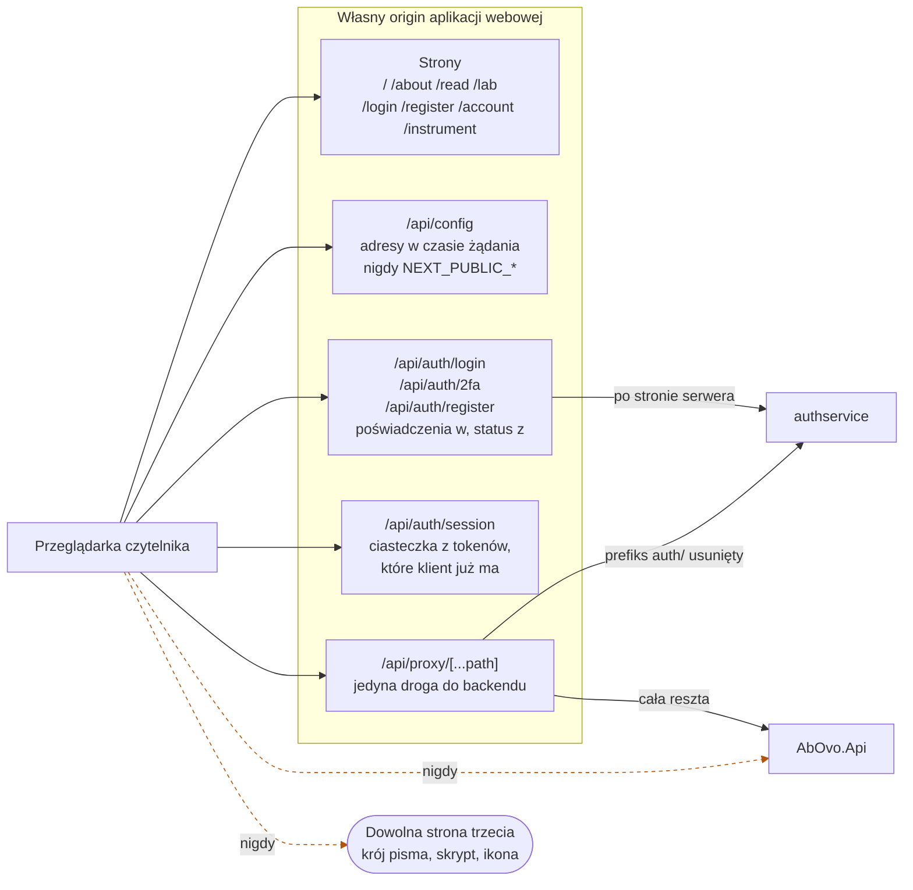
```mermaid
%% Jeden origin: każde żądanie przeglądarki i dwa, których jej nie wolno wykonać.
%% JEDEN DIAGRAM NA PLIK. UTF-8. Dlaczego nie ASCII: patrz a1-system-context.pl.mmd.

%% DWIE PRZERYWANE STRZAŁKI SĄ NARYSOWANE DLATEGO, ŻE NIE WOLNO IM ISTNIEĆ.
%% FRONTEND-BFF.md sekcja 1: przeglądarka rozmawia z własnym originem aplikacji i z niczym
%% więcej - nie z API, nie z authservice, nie z CDN, nie z krojem pisma. Dlatego ten majątek
%% nie konfiguruje CORS po stronie frontendu, a potrzeba takiej konfiguracji oznaczałaby, że
%% reguła została już złamana.

%% BEARER NIGDY NIE TRAFIA DO DOKUMENTU. /api/auth/login przyjmuje poświadczenia i zwraca
%% status; tokeny powstają wewnątrz procesu Next.js i są ustawiane jako ciasteczka HttpOnly
%% (ADR-0018). /api/proxy usuwa przychodzący nagłówek Authorization i wstrzykuje bearer
%% odczytany z ciasteczka, po stronie serwera.

flowchart LR
  BROWSER["Przeglądarka czytelnika"]

  subgraph origin["Własny origin aplikacji webowej"]
    PAGES["Strony<br/>/ /about /read /lab<br/>/login /register /account /instrument"]
    CONFIG["/api/config<br/>adresy w czasie żądania<br/>nigdy NEXT_PUBLIC_*"]
    LOGIN["/api/auth/login<br/>/api/auth/2fa<br/>/api/auth/register<br/>poświadczenia w, status z"]
    SESSION["/api/auth/session<br/>ciasteczka z tokenów,<br/>które klient już ma"]
    PROXY["/api/proxy/[...path]<br/>jedyna droga do backendu"]
  end

  APISVC["AbOvo.Api"]
  AUTHSVC["authservice"]
  CDN(["Dowolna strona trzecia<br/>krój pisma, skrypt, ikona"])

  BROWSER --> PAGES
  BROWSER --> CONFIG
  BROWSER --> LOGIN
  BROWSER --> SESSION
  BROWSER --> PROXY

  PROXY -->|"prefiks auth/ usunięty"| AUTHSVC
  PROXY -->|"cała reszta"| APISVC
  LOGIN -->|"po stronie serwera"| AUTHSVC

  BROWSER -.->|"nigdy"| APISVC
  BROWSER -.->|"nigdy"| CDN

  linkStyle 8,9 stroke:#b45309,stroke-dasharray: 4 4;
```

### A4. Droga treści — z repozytorium książki do ramki

Nic w tym łańcuchu nie powstaje tutaj. Repozytorium posiada schemat i prezentację; nie
posiada, nie parsuje i nie edytuje plików książki, i nigdy nie parsuje LaTeX-a (P11,
[ADR-0008](adr/0008-content-is-a-versioned-bundle.md)). Przypięcie jest rewizją, a nie
wydaniem, co jest odstępstwem z warunkiem wyjścia
([ADR-0038](adr/0038-the-bundle-is-compiled-at-a-pinned-revision.md)).

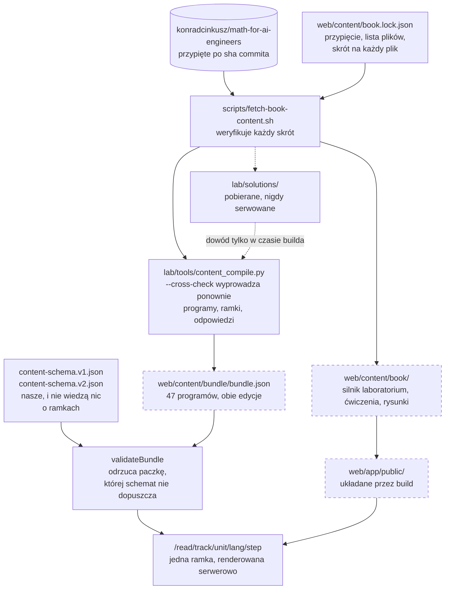
```mermaid
%% Droga treści: z repozytorium książki na ekran czytelnika.
%% JEDEN DIAGRAM NA PLIK. UTF-8. Dlaczego nie ASCII: patrz a1-system-context.pl.mmd.

%% NIC W TYM ŁAŃCUCHU NIE POWSTAJE TUTAJ. To repozytorium posiada schemat i prezentację;
%% nie posiada, nie parsuje i nie edytuje plików książki, i nigdy nie parsuje LaTeX-a
%% (P11, ADR-0008). web/content/ jest wyprowadzone i wyłączone z gita.

%% PRZYPIĘCIE JEST REWIZJĄ, NIE WYDANIEM, I JEST ODSTĘPSTWEM Z WARUNKIEM WYJŚCIA
%% (ADR-0038): żadne wydanie książki nie niesie jeszcze skompilowanej paczki treści, więc
%% paczka jest kompilowana tutaj, kompilatorem samej książki, na przypiętym commicie.
%% Wyjściem jest pierwsze wydanie, które taką paczkę poniesie.

%% GAŁĄŹ Z ROZWIĄZANIAMI JEST POBIERANA I NIGDY NIE SERWOWANA (ADR-0012). Istnieje po to,
%% by build mógł dowieść, że ćwiczenia są rozwiązywalne; test akceptacyjny sprawdza w obie
%% strony, że nie trafia do public/.

flowchart TD
  BOOK[("konradcinkusz/math-for-ai-engineers<br/>przypięte po sha commita")]
  LOCK["web/content/book.lock.json<br/>przypięcie, lista plików,<br/>skrót na każdy plik"]
  FETCH["scripts/fetch-book-content.sh<br/>weryfikuje każdy skrót"]
  ENGINE["web/content/book/<br/>silnik laboratorium, ćwiczenia, rysunki"]
  COMPILE["lab/tools/content_compile.py<br/>--cross-check wyprowadza ponownie<br/>programy, ramki, odpowiedzi"]
  BUNDLE["web/content/bundle/bundle.json<br/>47 programów, obie edycje"]
  SCHEMA["content-schema.v1.json<br/>content-schema.v2.json<br/>nasze, i nie wiedzą nic<br/>o ramkach"]
  VALIDATE["validateBundle<br/>odrzuca paczkę,<br/>której schemat nie dopuszcza"]
  PUBLIC["web/app/public/<br/>układane przez build"]
  FRAME["/read/track/unit/lang/step<br/>jedna ramka, renderowana serwerowo"]
  SOLUTIONS["lab/solutions/<br/>pobierane, nigdy serwowane"]

  BOOK --> FETCH
  LOCK --> FETCH
  FETCH --> ENGINE
  FETCH --> COMPILE
  COMPILE --> BUNDLE
  SCHEMA --> VALIDATE
  BUNDLE --> VALIDATE
  VALIDATE --> FRAME
  ENGINE --> PUBLIC
  PUBLIC --> FRAME
  FETCH -.-> SOLUTIONS
  SOLUTIONS -.->|"dowód tylko w czasie builda"| COMPILE

  classDef derived stroke-dasharray: 5 5;
  class ENGINE,BUNDLE,PUBLIC derived;
```

### A5. Co jest przechowywane i na co schemat nie potrafi odpowiedzieć

Trzy tabele, każdą trzymają mechaniczne reguły, a nie obietnica. Dwie są kluczowane
czytelnikiem — gdzie jest i którą edycję wybrał
([ADR-0052](adr/0052-one-language-control-remembered-and-english-by-default.md)) — i dzielą
jedną straż. Nieobecna kolumna w trzeciej — czytelnik w wierszu wyniku — jest projektem i to
ona czyni ocenę pojedynczego czytelnika nie do zbudowania
([ADR-0009](adr/0009-the-instrument-measures-the-book.md),
[ADR-0020](adr/0020-no-aggregate-touches-the-progress-store.md)).

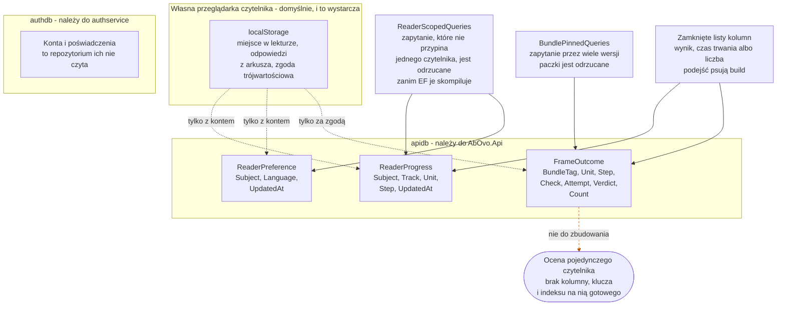
```mermaid
%% Co jest przechowywane i na jakie pytanie schemat celowo nie potrafi odpowiedzieć.
%% JEDEN DIAGRAM NA PLIK. UTF-8. Dlaczego nie ASCII: patrz a1-system-context.pl.mmd.

%% TRZY TABELE, A KAŻDĄ TRZYMAJĄ MECHANICZNE REGUŁY, NIE OBIETNICA. ReaderProgress mówi,
%% GDZIE jest czytelnik, i nigdy jak mu poszło; ReaderPreference mówi, którą EDYCJĘ wybrał, i
%% nic poza tym (ADR-0052); FrameOutcome zlicza werdykt przy ramce i nie niesie ani
%% identyfikatora, ani znacznika czasu (ADR-0009, ADR-0020, ADR-0023).

%% DWIE TABELE ZWIĄZANE Z CZYTELNIKIEM DZIELĄ JEDNĄ STRAŻ. "Ilu czytelników wybrało polski"
%% to preferencja, a nie pomiar, i wciąż jest faktem uzyskanym przez liczenie czytelników -
%% więc ReaderScopedQueries odmawia go na tych samych zasadach co "jak daleko zaszedł każdy
%% czytelnik".

%% NIEOBECNA KOLUMNA JEST PROJEKTEM. Wynik nie niesie czytelnika, więc nic nie potrafi
%% znaleźć wierszy, które były twoje - dlatego usunięcie konta nie cofnie wkładu już
%% wliczonego do wskaźnika, i dlatego ekran usuwania mówi to wprost (ADR-0021).

%% NIC, CO CZYTELNIK PISZE NA RAMCE, NIE JEST PRZECHOWYWANE POZA JEGO PRZEGLĄDARKĄ
%% (ADR-0039). Arkusz, notatnik i płótno są lokalne; taka jest też zgoda (ADR-0022) i takie
%% jest miejsce w lekturze, dopóki konto go nie zsynchronizuje.

flowchart TD
  subgraph browser["Własna przeglądarka czytelnika - domyślnie, i to wystarcza"]
    LOCAL["localStorage<br/>miejsce w lekturze, odpowiedzi<br/>z arkusza, zgoda trójwartościowa"]
  end

  subgraph apidb["apidb - należy do AbOvo.Api"]
    RP["ReaderProgress<br/>Subject, Track, Unit,<br/>Step, UpdatedAt"]
    RPF["ReaderPreference<br/>Subject, Language,<br/>UpdatedAt"]
    FO["FrameOutcome<br/>BundleTag, Unit, Step,<br/>Check, Attempt, Verdict,<br/>Count"]
  end

  subgraph authdb["authdb - należy do authservice"]
    ACC["Konta i poświadczenia<br/>to repozytorium ich nie czyta"]
  end

  RULE1["ReaderScopedQueries<br/>zapytanie, które nie przypina<br/>jednego czytelnika, jest odrzucane<br/>zanim EF je skompiluje"]
  RULE2["BundlePinnedQueries<br/>zapytanie przez wiele wersji<br/>paczki jest odrzucane"]
  RULE3["Zamknięte listy kolumn<br/>wynik, czas trwania albo liczba<br/>podejść psują build"]

  LOCAL -.->|"tylko z kontem"| RP
  LOCAL -.->|"tylko z kontem"| RPF
  LOCAL -.->|"tylko za zgodą"| FO

  RULE1 --> RP
  RULE1 --> RPF
  RULE3 --> RP
  RULE2 --> FO
  RULE3 --> FO

  NOPE(["Ocena pojedynczego czytelnika<br/>brak kolumny, klucza<br/>i indeksu na nią gotowego"])
  FO -.->|"nie do zbudowania"| NOPE

  linkStyle 8 stroke:#b45309,stroke-dasharray: 4 4;
```

---

## Część B — Pętla czytelnika

### B1. Pętla czytelnika

Każde pole tego diagramu działa bez konta, a każda ramka przychodzi z `AbOvo.Api` — to dwa
wymogi, które ten diagram rysował kiedyś jako jeden, dopóki
[ADR-0060](adr/0060-content-is-served-live-by-the-api-and-the-reader-stays-anonymous.md) nie
odwrócił połowy dotyczącej serwera. API jest narysowane ciągłą linią, bo treść nie jest
opcjonalna: gdy API nie działa, nie zostaje podana żadna ramka, a ramka, która nie może się
wczytać, mówi to wprost. Odsłonięcie, które nie może do niego dotrzeć, jeszcze tego nie robi —
zostawia czytelnika na tej samej ramce, bez słowa, co naprawia 380 w
[kolejności](ux/UI-UX.md#the-order). Dwie kropkowane krawędzie wychodzące z pętli są opcjonalne
i żadna nie leży na ścieżce.

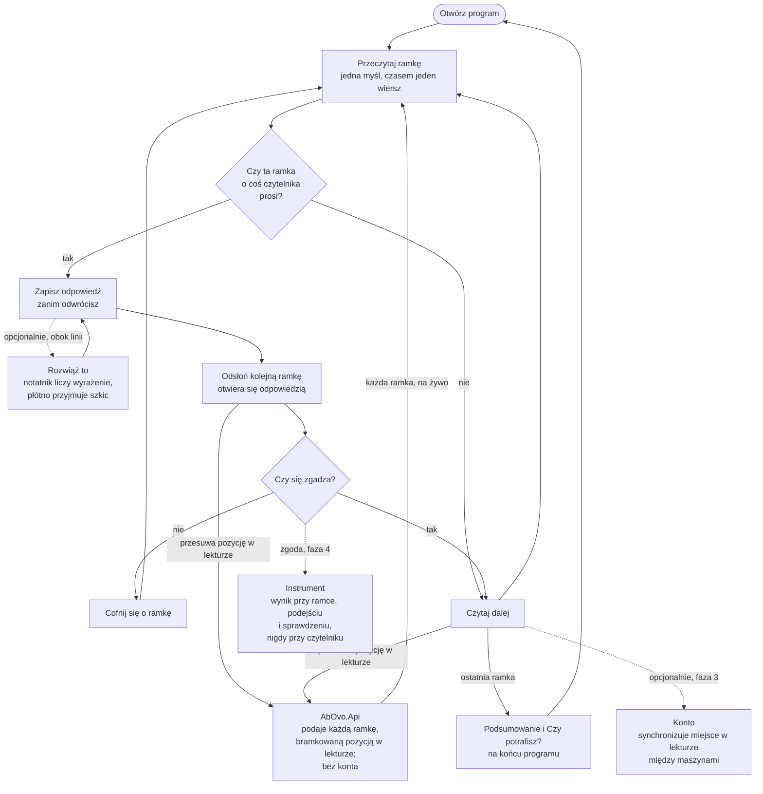
```mermaid
%% Pętla czytelnika ab-ovo.
%% JEDEN DIAGRAM NA PLIK. UTF-8. Dlaczego nie ASCII: patrz a1-system-context.pl.mmd.

%% KAŻDE POLE TEGO DIAGRAMU DZIAŁA BEZ KONTA, A KAŻDA RAMKA PRZYCHODZI Z API. To dwa wymogi
%% i ten plik rysował je kiedyś jako jeden. ADR-0060 utrzymał pierwszy i odwrócił drugi:
%% każda ramka i każde odsłonięcie to żywe, bramkowane wywołanie AbOvo.Api, które podaje
%% skompilowaną paczkę treści książki (ADR-0038) krok po kroku i przesuwa pozycję w lekturze
%% za każdym razem, gdy czytelnik idzie dalej: odsłonięcie na ramce, która o coś prosi, i
%% Dalej na ramce, która nie prosi, to ten sam POST (web/app/src/lib/actions/reveal.ts), więc
%% narysowano obie krawędzie do API. Pozycję anonimowego czytelnika przechowuje
%% nieprzezroczyste ciasteczko, nie token (ADR-0061), a to, co czytelnik napisze na ramce,
%% nadal zostaje w jego przeglądarce (ADR-0039).

%% API JEST NARYSOWANE CIĄGŁĄ LINIĄ, BO NIE JEST OPCJONALNE. Treść to jedyna integracja,
%% wokół której ten produkt się nie degraduje (P8 jej nie obejmuje): gdy API nie działa, nie
%% zostaje podana żadna ramka, a czytelnik słyszy to wprost, zamiast dostać ramkę skądinąd.

%% GAŁĄŹ PRACY BYŁA KIEDYŚ PYTHONEM I JUŻ NIE JEST (ADR-0040). Kazała czytelnikowi książki
%% matematycznej pisać kod, dosięgła jednego programu z czterdziestu siedmiu i kosztowała
%% 6,4 MB oraz dwie sekundy startu przy każdej wizycie. Zastąpił ją arkusz: linia
%% odpowiedzi, notatnik liczący arytmetykę (ADR-0042) i płótno (ADR-0043). Żadne z nich nie
%% jest językiem, wszystkie trzy są opcjonalne i żadne nie potrzebuje API.

%% Dwie kropkowane krawędzie wychodzące z pętli są opcjonalne i żadna nie leży na ścieżce:
%% konto synchronizuje pozycję w lekturze między maszynami i nic poza tym, a wynik trafia
%% gdziekolwiek tylko wtedy, gdy czytelnik się zgodził. Obu może nie być i pętla jest taka
%% sama.

%% CZEGO CELOWO NIE NARYSOWANO: kroku oceniania. Kolejna ramka otwiera się odpowiedzią i
%% czytelnik porównuje. Maszyna może powiedzieć "zgadza się z książką" tam, gdzie cała
%% odpowiedź książki to jedna liczba, i nie mówi nigdy nic innego - nigdy "źle" (ADR-0039).
%% Nic nie ocenia tego porównania i nie jest wołany żaden model językowy (ADR-0010).
%% Porównanie JEST nauczaniem.

flowchart TD
  START(["Otwórz program"])
  READ["Przeczytaj ramkę<br/>jedna myśl, czasem jeden wiersz"]
  ASKS{"Czy ta ramka<br/>o coś czytelnika<br/>prosi?"}
  WORK["Rozwiąż to<br/>notatnik liczy wyrażenie,<br/>płótno przyjmuje szkic"]
  COMMIT["Zapisz odpowiedź<br/>zanim odwrócisz"]
  REVEAL["Odsłoń kolejną ramkę<br/>otwiera się odpowiedzią"]
  COMPARE{"Czy się zgadza?"}
  BACK["Cofnij się o ramkę"]
  NEXT["Czytaj dalej"]
  SUMMARY["Podsumowanie i Czy potrafisz?<br/>na końcu programu"]
  API["AbOvo.Api<br/>podaje każdą ramkę,<br/>bramkowaną pozycją w lekturze;<br/>bez konta"]
  SYNC["Konto<br/>synchronizuje miejsce w lekturze<br/>między maszynami"]
  INST["Instrument<br/>wynik przy ramce, podejściu<br/>i sprawdzeniu,<br/>nigdy przy czytelniku"]

  START --> READ
  READ --> ASKS
  ASKS -->|"nie"| NEXT
  ASKS -->|"tak"| COMMIT
  COMMIT --> REVEAL
  WORK --> COMMIT
  COMMIT -.->|"opcjonalnie, obok linii"| WORK
  REVEAL --> COMPARE
  COMPARE -->|"nie"| BACK
  BACK --> READ
  COMPARE -->|"tak"| NEXT
  NEXT --> READ
  NEXT -->|"ostatnia ramka"| SUMMARY
  SUMMARY --> START

  API -->|"każda ramka, na żywo"| READ
  REVEAL & NEXT -->|"przesuwa pozycję w lekturze"| API

  NEXT -.->|"opcjonalnie, faza 3"| SYNC
  COMPARE -.->|"zgoda, faza 4"| INST
```

### B2. Jedna ramka i dlaczego odpowiedzi nie ma

Cały mechanizm produktu jako sekwencja. Odsłonięcie jest **formularzem**, który przesuwa
pozycję w lekturze w `AbOvo.Api`, a potem prosi o kolejną ramkę, więc odpowiedź na ramkę, na
której stoisz, renderuje żądanie o *kolejną* i nic wcześniej — a API odrzuca to żądanie, dopóki
odsłonięcie się nie odbyło
([ADR-0060](adr/0060-content-is-served-live-by-the-api-and-the-reader-stays-anonymous.md)).
Czytelnik, który otworzy inspektor, nie znajdzie jej nigdzie, a prefetch jest wyłączony, więc
nie ma jej też na łączu.

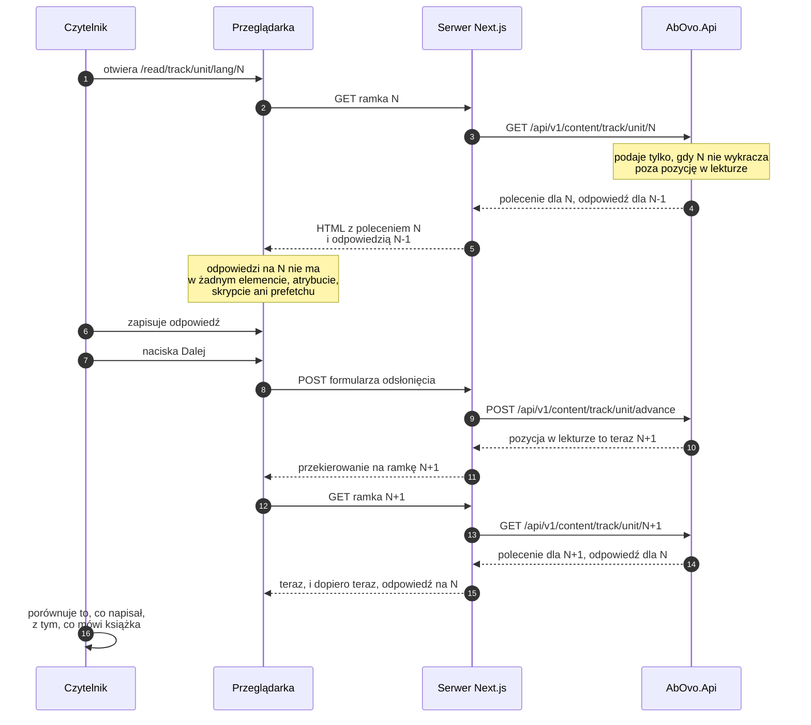
```mermaid
%% Jedna ramka i dlaczego odpowiedzi nie ma na stronie, zamiast być na niej ukrytą.
%% JEDEN DIAGRAM NA PLIK. UTF-8. Dlaczego nie ASCII: patrz a1-system-context.pl.mmd.

%% TO JEST CAŁY MECHANIZM PRODUKTU. Ramka Strouda prosi o coś ZANIM cokolwiek powie, a
%% kolejna ramka otwiera się odpowiedzią, którą miało się już zapisać. Czytelnik, który
%% przelatuje wzrokiem, nie dostaje nic, a papier nie ma jak tego zauważyć.

%% ODSŁONIĘCIE JEST FORMULARZEM, NIE PRZEŁĄCZNIKIEM. Ramka jest komponentem serwerowym bez
%% granicy klienta wokół niej, więc odpowiedź na ramkę N renderuje ŻĄDANIE o ramkę N+1 i nic
%% wcześniej. Czytelnik, który otworzy inspektor, nie znajdzie jej nigdzie; prefetch jest
%% wyłączony, więc nie ma jej także na łączu. Obie połowy są sprawdzane testem i obie
%% widziano, jak czerwienieją, zanim w nie uwierzono.

%% I GRANICY PILNUJE SERWER, OD ADR-0060. Każdy krok przychodzi z AbOvo.Api, które podaje
%% krok N tylko wtedy, gdy N nie wykracza poza pozycję w lekturze, a pozycję przesuwa POST
%% odsłonięcia do .../advance. Samo GET o N+1 przed nim zostaje odrzucone, więc ani prefetch,
%% ani robot, ani udostępniony link nie wyciągnie odpowiedzi za wcześnie. Czytelnika
%% wskazuje jego token albo, bez konta, nieprzezroczyste ciasteczko (ADR-0061).

%% DLACZEGO NIE WIDŻET ROZWIJANY. Cokolwiek renderuje odpowiedź do dokumentu i chowa ją
%% CSS-em albo JavaScriptem, jest podpowiedzią, którą przeglądarka już ma. Wersja
%% strukturalna kosztuje jedną podróż do serwera i nie da się jej obejść.

sequenceDiagram
  autonumber
  participant R as Czytelnik
  participant B as Przeglądarka
  participant S as Serwer Next.js
  participant A as AbOvo.Api

  R->>B: otwiera /read/track/unit/lang/N
  B->>S: GET ramka N
  S->>A: GET /api/v1/content/track/unit/N
  Note over A: podaje tylko, gdy N nie wykracza<br/>poza pozycję w lekturze
  A-->>S: polecenie dla N, odpowiedź dla N-1
  S-->>B: HTML z poleceniem N<br/>i odpowiedzią N-1
  Note over B: odpowiedzi na N nie ma<br/>w żadnym elemencie, atrybucie,<br/>skrypcie ani prefetchu
  R->>B: zapisuje odpowiedź
  R->>B: naciska Dalej
  B->>S: POST formularza odsłonięcia
  S->>A: POST /api/v1/content/track/unit/advance
  A-->>S: pozycja w lekturze to teraz N+1
  S-->>B: przekierowanie na ramkę N+1
  B->>S: GET ramka N+1
  S->>A: GET /api/v1/content/track/unit/N+1
  A-->>S: polecenie dla N+1, odpowiedź dla N
  S-->>B: teraz, i dopiero teraz, odpowiedź na N
  R->>R: porównuje to, co napisał,<br/>z tym, co mówi książka
```

### B3. Arkusz — linia, notatnik, płótno

Co ramka daje czytelnikowi, który musi coś policzyć, po tym jak
[ADR-0040](adr/0040-the-python-lab-leaves-the-reader-loop.md) wyjął Pythona z pętli. Wszystkie
trzy są opcjonalne i wszystkie trzy są lokalne.

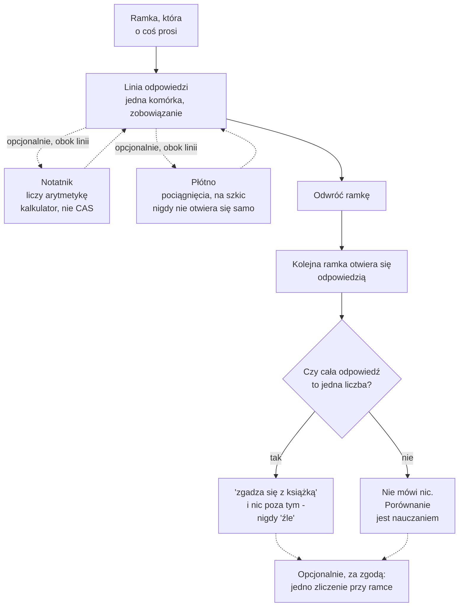
```mermaid
%% Arkusz: co ramka daje czytelnikowi, który musi coś policzyć.
%% JEDEN DIAGRAM NA PLIK. UTF-8. Dlaczego nie ASCII: patrz a1-system-context.pl.mmd.

%% TO ZASTĄPIŁO LABORATORIUM PYTHONA W PĘTLI CZYTELNIKA (ADR-0040). Zmierzone na
%% odpowiedziach książki: praktycznie żadna z nich nie jest jednolinijkowcem w Pythonie,
%% a proszenie czytelnika książki matematycznej o kod dosięgło jednego programu z
%% czterdziestu siedmiu.

%% WSZYSTKIE TRZY SĄ OPCJONALNE I WSZYSTKIE TRZY SĄ LOKALNE. Nic stąd nigdzie nie idzie, nic
%% nie jest oceniane i nie jest wołany żaden model językowy (ADR-0010, ADR-0039). Notatnik
%% jest kalkulatorem i celowo nie systemem algebry komputerowej (ADR-0042); płótno to
%% pociągnięcia i nigdy nie otwiera się samo (ADR-0043).

%% PUSTE POLE JEST BŁĘDNĄ ODPOWIEDZIĄ, NIE POMINIĘTĄ (ADR-0045): odpowiedź z arkusza to
%% jedna komórka, a pusta komórka to czytelnik, który się nie zobowiązał.

flowchart TD
  FRAME["Ramka, która<br/>o coś prosi"]
  LINE["Linia odpowiedzi<br/>jedna komórka, zobowiązanie"]
  PAD["Notatnik<br/>liczy arytmetykę<br/>kalkulator, nie CAS"]
  CANVAS["Płótno<br/>pociągnięcia, na szkic<br/>nigdy nie otwiera się samo"]
  COMMIT["Odwróć ramkę"]
  REVEAL["Kolejna ramka otwiera się<br/>odpowiedzią"]
  MATCH{"Czy cała odpowiedź<br/>to jedna liczba?"}
  SAYS["'zgadza się z książką'<br/>i nic poza tym -<br/>nigdy 'źle'"]
  QUIET["Nie mówi nic.<br/>Porównanie<br/>jest nauczaniem"]
  TALLY["Opcjonalnie, za zgodą:<br/>jedno zliczenie przy ramce"]

  FRAME --> LINE
  LINE -.->|"opcjonalnie, obok linii"| PAD
  LINE -.->|"opcjonalnie, obok linii"| CANVAS
  PAD -.-> LINE
  CANVAS -.-> LINE
  LINE --> COMMIT
  COMMIT --> REVEAL
  REVEAL --> MATCH
  MATCH -->|"tak"| SAYS
  MATCH -->|"nie"| QUIET
  SAYS -.-> TALLY
  QUIET -.-> TALLY
```

### B4. Gdzie jest czytelnik — miejsce w lekturze, nigdy postęp

Powierzchnia lektury pokazuje miejsce, nigdy postęp
([ADR-0041](adr/0041-the-reading-surface-shows-position-and-never-progress.md)). Konto kupuje
dokładnie jedną rzecz: to samo miejsce na drugiej maszynie. Wygrywa najdalsza ramka
([ADR-0019](adr/0019-furthest-frame-wins.md)) — uzgodnienie, które cofnęłoby czytelnika,
straciłoby lekturę, którą odbył.

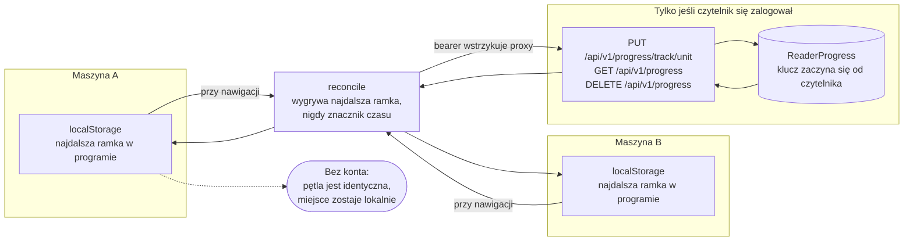
```mermaid
%% Gdzie jest czytelnik: miejsce w lekturze, które nie jest postępem, i kto je trzyma.
%% JEDEN DIAGRAM NA PLIK. UTF-8. Dlaczego nie ASCII: patrz a1-system-context.pl.mmd.

%% POWIERZCHNIA LEKTURY POKAZUJE MIEJSCE, NIGDY POSTĘP (ADR-0041). Procent z książki o
%% czterdziestu siedmiu programach jest liczbą o czytelniku, a ten produkt takich nie
%% produkuje. Pasek nawigacji mówi, która to ramka z ilu, i otwiera mapę programu
%% (ADR-0063).

%% NAJPIERW LOKALNIE, A LOKALNA KOPIA NIE TRZYMA NICZEGO WARTEGO OCENIANIA (ADR-0017). Konto
%% kupuje jedną rzecz: to samo miejsce na drugiej maszynie. Cała reszta pętli jest taka sama
%% niezależnie od tego, czy czytelnik je ma.

%% WYGRYWA NAJDALSZA RAMKA (ADR-0019). Dwie maszyny, które się nie zgadzają, to nie konflikt
%% do rozstrzygnięcia znacznikiem czasu: czytelnik przeczytał do dalszej z dwóch, a
%% uzgodnienie, które cofnęłoby go, straciłoby lekturę, którą odbył.

flowchart LR
  subgraph m1["Maszyna A"]
    LA["localStorage<br/>najdalsza ramka w programie"]
  end

  subgraph m2["Maszyna B"]
    LB["localStorage<br/>najdalsza ramka w programie"]
  end

  subgraph server["Tylko jeśli czytelnik się zalogował"]
    API["PUT /api/v1/progress/track/unit<br/>GET /api/v1/progress<br/>DELETE /api/v1/progress"]
    RP[("ReaderProgress<br/>klucz zaczyna się od czytelnika")]
  end

  RECON["reconcile<br/>wygrywa najdalsza ramka,<br/>nigdy znacznik czasu"]

  LA -->|"przy nawigacji"| RECON
  LB -->|"przy nawigacji"| RECON
  RECON -->|"bearer wstrzykuje proxy"| API
  API --> RP
  RP --> API
  API --> RECON
  RECON --> LA
  RECON --> LB

  NOACC(["Bez konta:<br/>pętla jest identyczna,<br/>miejsce zostaje lokalnie"])
  LA -.-> NOACC
```

### B5. Logowanie — hasło, drugi składnik, sesja, której dokument nie trzyma

Formularz wysyła *poświadczenia* do własnego BFF tej aplikacji, więc tokenów nie ma w
dokumencie w ogóle ([ADR-0018](adr/0018-password-sign-in-happens-server-side.md)). Wyzwanie
jest ciasteczkiem HttpOnly ograniczonym jak ciasteczko sesji i bezużytecznym jako ono
([ADR-0029](adr/0029-the-two-factor-challenge-is-a-cookie-and-the-code-is-the-only-thing-the-reader-supplies.md)).

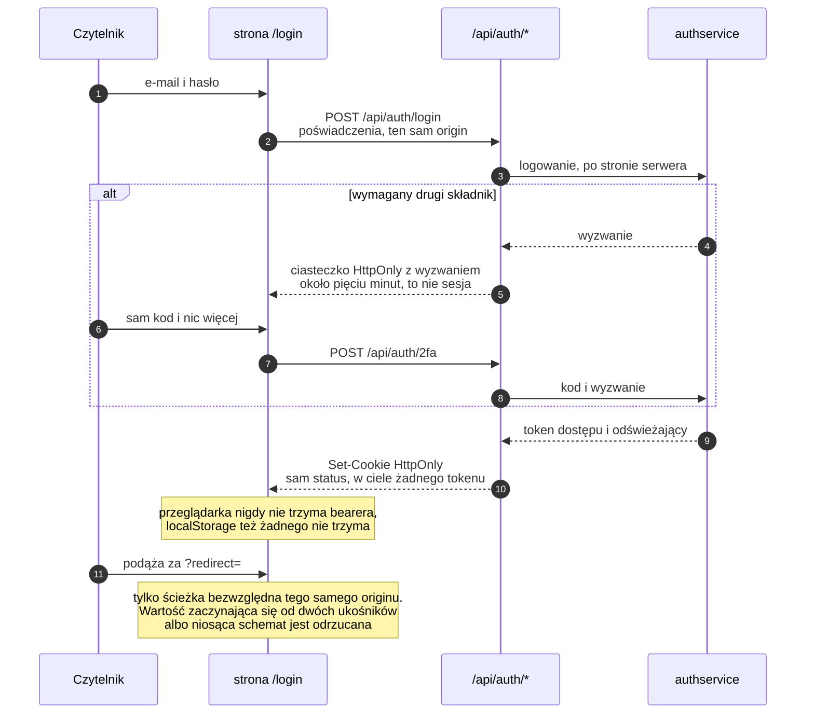
```mermaid
%% Logowanie: hasło, drugi składnik i sesja, której dokument nigdy nie trzyma.
%% JEDEN DIAGRAM NA PLIK. UTF-8. Dlaczego nie ASCII: patrz a1-system-context.pl.mmd.

%% TOKENÓW NIGDY NIE MA W DOKUMENCIE (ADR-0018). Formularz wysyła POŚWIADCZENIA do własnego
%% BFF tej aplikacji, który rozmawia z authservice po stronie serwera i ustawia ciasteczka
%% HttpOnly. Alternatywa - wysłać je do serwisu tożsamości i oddać token stronie - kładzie
%% bearer tam, gdzie czyta go document.cookie i każdy skrypt na stronie.

%% WYZWANIE JEST CIASTECZKIEM, A KOD JEDYNĄ RZECZĄ, KTÓRĄ PODAJE CZYTELNIK (ADR-0029). Jest
%% ograniczone jak ciasteczko sesji i bezużyteczne jako ono: nie uwierzytelni żądania, wygasa
%% po około pięciu minutach, a wylogowanie je czyści. Ukryte pole formularza byłoby
%% poświadczeniem, które przeżywa przywrócenie formularza i zrzuty ekranu.

%% PARAMETR PRZEKIEROWANIA JEST PRZYJMOWANY WYŁĄCZNIE JAKO ŚCIEŻKA BEZWZGLĘDNA TEGO SAMEGO
%% ORIGINU. Wartość zaczynająca się od dwóch ukośników albo niosąca schemat jest odrzucana:
%% ten ciąg wybiera atakujący, a strona logowania, która za nim idzie, jest przekierowaniem
%% phishingowym z nazwą tej witryny.

%% BRAK SKONFIGUROWANEGO SERWISU TOŻSAMOŚCI JEST WSPIERANĄ KONFIGURACJĄ, NIE AWARIĄ (P8).
%% Strona mówi to wprost, zamiast oferować przycisk, który nie może zadziałać.

sequenceDiagram
  autonumber
  participant R as Czytelnik
  participant P as strona /login
  participant BFF as /api/auth/*
  participant AS as authservice

  R->>P: e-mail i hasło
  P->>BFF: POST /api/auth/login<br/>poświadczenia, ten sam origin
  BFF->>AS: logowanie, po stronie serwera

  alt wymagany drugi składnik
    AS-->>BFF: wyzwanie
    BFF-->>P: ciasteczko HttpOnly z wyzwaniem<br/>około pięciu minut, to nie sesja
    R->>P: sam kod i nic więcej
    P->>BFF: POST /api/auth/2fa
    BFF->>AS: kod i wyzwanie
  end

  AS-->>BFF: token dostępu i odświeżający
  BFF-->>P: Set-Cookie HttpOnly<br/>sam status, w ciele żadnego tokenu
  Note over P: przeglądarka nigdy nie trzyma bearera,<br/>localStorage też żadnego nie trzyma

  R->>P: podąża za ?redirect=
  Note over P: tylko ścieżka bezwzględna tego samego originu.<br/>Wartość zaczynająca się od dwóch ukośników<br/>albo niosąca schemat jest odrzucana
```

### B6. Usunięcie konta — co znika, co zostaje, czego nic nie dosięgnie

Wszystko, co ten serwis trzyma o czytelniku, znika pierwsze — miejsce w lekturze i wybrana
edycja, oba pod tym samym podmiotem — a ekran mówi, czego żadne usunięcie nie dosięgnie
([ADR-0021](adr/0021-deletion-removes-the-progress-first-and-says-what-it-cannot-reach.md),
[ADR-0052](adr/0052-one-language-control-remembered-and-english-by-default.md)). Ekran, który
sugerowałby inaczej, deklarowałby możliwość, której schemat celowo nie ma.

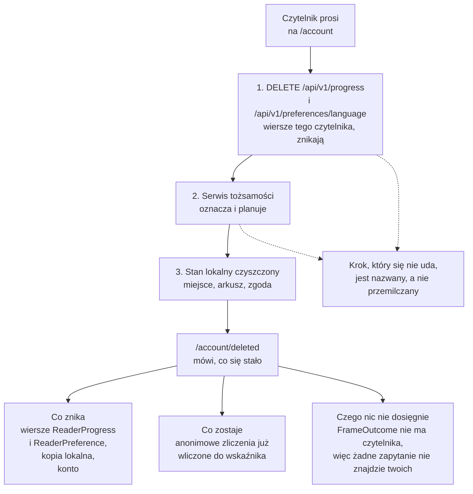
```mermaid
%% Usunięcie konta: co znika, co zostaje i czego żadne usunięcie nie dosięgnie.
%% JEDEN DIAGRAM NA PLIK. UTF-8. Dlaczego nie ASCII: patrz a1-system-context.pl.mmd.

%% KAŻDY WIERSZ ZWIĄZANY Z CZYTELNIKIEM ZNIKA PIERWSZY, A EKRAN MÓWI, CZEGO NIE DOSIĘGNIE
%% (ADR-0021). Kolejność wynika z PODMIOTU: gdy serwis tożsamości oznaczy konto, nikt już nie
%% zaloguje się jako ten podmiot, więc cokolwiek pozostanie pod nim w apidb, jest na zawsze
%% poza zasięgiem czytelnika. Dotyczy to wybranej edycji (ADR-0052) dokładnie tak jak miejsca
%% w lekturze - i dlatego oba znikają przed kontem, a nie po nim.

%% A PONIEWAŻ WYNIK NIE NIESIE CZYTELNIKA, nic nie potrafi znaleźć wierszy, które były twoje
%% - a zatem wkładu wliczonego już do wskaźnika nie da się wycofać. To jest cena
%% strukturalnej nieobecności, dzięki której ocena pojedynczego czytelnika jest nie do
%% zbudowania, i czytelnik ją słyszy, zamiast zakładać coś przeciwnego.

%% SERWIS TOŻSAMOŚCI OZNACZA I PLANUJE, A NIE WYMAZUJE. To repozytorium nie posiada authdb i
%% nie składa deklaracji w jego imieniu; ekran mówi, co robi serwis tożsamości, jego
%% własnymi słowami.

%% EKRAN, KTÓRY SUGEROWAŁBY INACZEJ, DEKLAROWAŁBY MOŻLIWOŚĆ, KTÓREJ SCHEMAT CELOWO NIE MA.

flowchart TD
  ASK["Czytelnik prosi<br/>na /account"]
  P1["1. DELETE /api/v1/progress<br/>i /api/v1/preferences/language<br/>wiersze tego czytelnika, znikają"]
  P2["2. Serwis tożsamości<br/>oznacza i planuje"]
  P3["3. Stan lokalny czyszczony<br/>miejsce, arkusz, zgoda"]
  DONE["/account/deleted<br/>mówi, co się stało"]

  GONE["Co znika<br/>wiersze ReaderProgress<br/>i ReaderPreference,<br/>kopia lokalna,<br/>konto"]
  STAYS["Co zostaje<br/>anonimowe zliczenia już<br/>wliczone do wskaźnika"]
  CANNOT["Czego nic nie dosięgnie<br/>FrameOutcome nie ma czytelnika,<br/>więc żadne zapytanie nie znajdzie twoich"]

  ASK --> P1 --> P2 --> P3 --> DONE
  DONE --> GONE
  DONE --> STAYS
  DONE --> CANNOT

  PROBLEM["Krok, który się nie uda,<br/>jest nazwany, a nie przemilczany"]
  P2 -.-> PROBLEM
  P1 -.-> PROBLEM
```

---

## Część C — Instrument

### C1. Od przebiegu do zliczenia

Droga zapisu instrumentu. Zliczenie jest licznikiem przy ramce, a nie zapisem przebiegu
([ADR-0023](adr/0023-a-tally-is-a-count-against-a-frame-not-a-record-of-a-run.md)): bez
identyfikatora i bez znacznika czasu. Endpoint nie przyjmuje tokenu, więc czytelnik bez konta
wnosi wkład na tych samych zasadach co zalogowany.


```mermaid
%% Od tego, co czytelnik zrobił, do wiersza w rejestrze: droga zapisu instrumentu.
%% JEDEN DIAGRAM NA PLIK. UTF-8. Dlaczego nie ASCII: patrz a1-system-context.pl.mmd.

%% ZLICZENIE JEST LICZNIKIEM PRZY RAMCE, NIE ZAPISEM PRZEBIEGU (ADR-0023). Wiersz niesie
%% wersję paczki, program, krok, sprawdzenie, numer podejścia i werdykt - oraz jedną kolumnę
%% poza tym, Count. Nie ma identyfikatora i nie ma znacznika czasu: kilkadziesiąt wierszy,
%% których czasy biegną po kolei przez jeden program, odtwarza sesję, nikogo nie nazywając.

%% ENDPOINT NIE PRZYJMUJE TOKENU. Czytelnik bez konta wnosi wkład na tych samych zasadach co
%% zalogowany, a serwis nie odróżniłby ich, gdyby chciał. Instrument wymagający tokenu
%% mierzyłby książkę doświadczaną przez posiadaczy kont i nazywał to książką.

%% NUMER PODEJŚCIA JEST WŁASNYM LICZNIKIEM PRZEGLĄDARKI, A SERWIS NIE MOŻE GO ZWERYFIKOWAĆ
%% (ADR-0023 sekcja 3). To drugi powód, by czytać "za pierwszym razem" węziej, niż brzmi.

flowchart LR
  READER["Czytelnik<br/>odpowiada na ramkę<br/>albo uruchamia sprawdzenie"]
  CONSENT{"Czy jest zgoda?<br/>trójwartościowa,<br/>lokalna, wersjonowana"}
  NOTHING(["Nic nie jest wysyłane.<br/>To jest stan domyślny"])
  REPORT["report.ts<br/>werdykty jednego przebiegu"]
  POST["POST /api/v1/outcomes<br/>bez tokenu, z limitem tempa"]
  ROW[("FrameOutcome<br/>BundleTag, Unit, Step,<br/>Check, Attempt, Verdict<br/>+ Count")]
  RATE["GET /api/v1/admin/rates/track/unit<br/>wskaźnik i jego przedział,<br/>jedna wartość na jedną komórkę"]
  VIEW["/instrument/track/unit<br/>widok autora"]

  READER --> CONSENT
  CONSENT -->|"jeszcze nie, albo nie"| NOTHING
  CONSENT -->|"tak"| REPORT
  REPORT --> POST
  POST --> ROW
  ROW --> RATE
  RATE --> VIEW

  NOID(["Bez identyfikatora czytelnika.<br/>Bez znacznika czasu.<br/>Oba nieobecne celowo"])
  ROW -.-> NOID
```

### C2. Ocena dydaktyczna i miara, której nie da się podbić

Jedna ważona mieszanka z dwiema miarami w środku. Ta, którą autor podniesie, rozdając
odpowiedź ramki, ma mniejszy udział; ta, której tak podnieść się nie da, ma większy.
Zamodeluj rozdawanie odpowiedzi, a mieszanka spadnie — i jest to test, nie deklaracja.

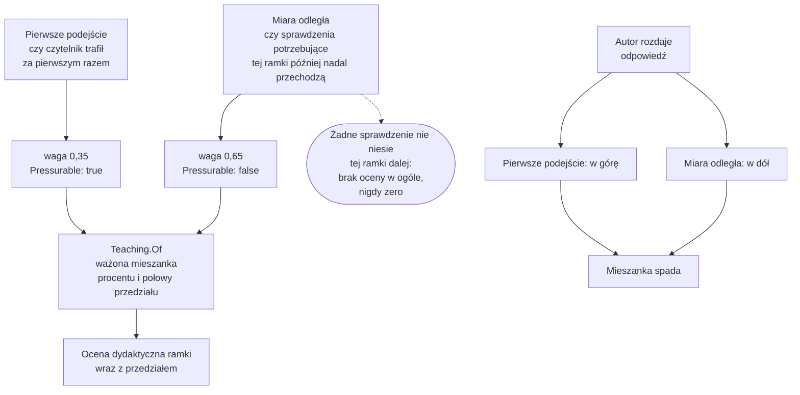
```mermaid
%% Ocena dydaktyczna: jedna ważona mieszanka i dlaczego jednej jej połowy nie da się podbić.
%% JEDEN DIAGRAM NA PLIK. UTF-8. Dlaczego nie ASCII: patrz a1-system-context.pl.mmd.

%% WAGI SĄ W KODZIE I UZASADNIENIE TEŻ: src/AbOvo.Api/Instrument/Weights.cs niesie przy
%% każdej mierze łańcuch Because, a Teaching.cs je miesza. Miara, którą da się naciskać, ma
%% celowo mniejszy udział.

%% ZAMODELUJ ROZDAWANIE ODPOWIEDZI, A MIESZANKA SPADNIE. Rozdaj odpowiedź ramki, a
%% poprawność za pierwszym razem rośnie natychmiast; sprawdzenia opierające się na tej ramce
%% ORAZ na późniejszej nie mogą wzrosnąć tak samo, bo czytelnik musi tę ramkę nadal mieć,
%% gdy do nich dotrze. To jest test, a nie deklaracja, i widziano, jak czerwienieje przy
%% zamienionych wagach.

%% MIARA ODLEGŁA JEST WŁASNĄ STRUKTURĄ KSIĄŻKI, a nie krawędzią wymyśloną przez produkt:
%% docstring sprawdzenia nazywa ramki, na których ono stoi, więc sprawdzenie pojawiające się
%% pod kilkoma ramkami potrzebuje ich wszystkich naraz.

%% RAMKA, KTÓREJ ŻADNE SPRAWDZENIE NIE NIESIE DALEJ, NIE DOSTAJE OCENY W OGÓLE, NIGDY ZERA.
%% Zero czyta się jako "czytelnicy nie potrafili użyć tej ramki później", co jest
%% przeciwieństwem "nikt jeszcze nie pytał", i wysortowałoby ją na szczyt listy, na której
%% ktoś działa.

flowchart TD
  FA["Pierwsze podejście<br/>czy czytelnik trafił<br/>za pierwszym razem"]
  DS["Miara odległa<br/>czy sprawdzenia potrzebujące<br/>tej ramki później nadal przechodzą"]
  W1["waga 0,35<br/>Pressurable: true"]
  W2["waga 0,65<br/>Pressurable: false"]
  BLEND["Teaching.Of<br/>ważona mieszanka<br/>procentu i połowy przedziału"]
  SCORE["Ocena dydaktyczna ramki<br/>wraz z przedziałem"]
  GIVEAWAY["Autor rozdaje<br/>odpowiedź"]
  UP["Pierwsze podejście: w górę"]
  DOWN["Miara odległa: w dół"]
  NET["Mieszanka spada"]
  NONE(["Żadne sprawdzenie nie niesie<br/>tej ramki dalej:<br/>brak oceny w ogóle,<br/>nigdy zero"])

  FA --> W1 --> BLEND
  DS --> W2 --> BLEND
  BLEND --> SCORE
  GIVEAWAY --> UP --> NET
  GIVEAWAY --> DOWN --> NET
  DS -.-> NONE
```

### C3. Ranking i liczba drukowana obok niego

Sortowanie wybiera to oszacowanie, które szum popchnął najdalej, więc ekran mówi, o ile
pierwszy wiersz ma przestrzelić, zanim powie cokolwiek innego. Przy każdym wierszu, którego
przedział nie jest rozłączny z wierszem poniżej, mówi *early, not wrong*, tymi słowami.

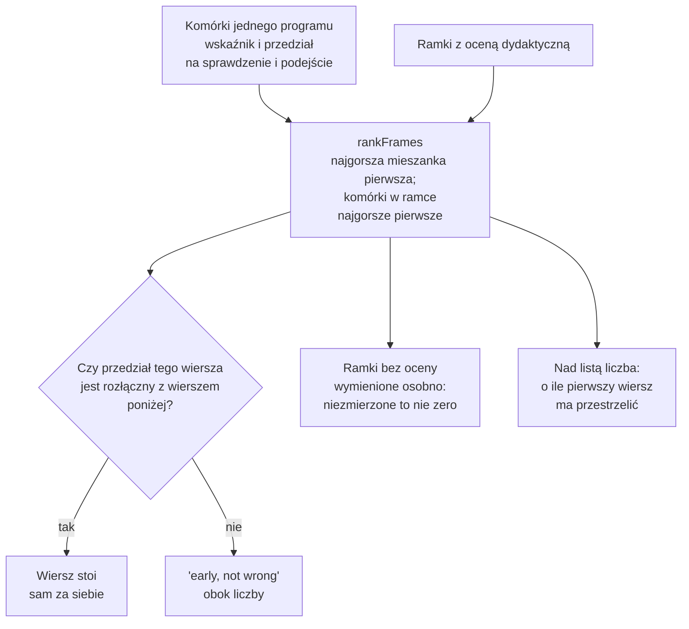
```mermaid
%% Jedyny ekran, który cokolwiek sortuje, i liczba, którą drukuje obok tej listy.
%% JEDEN DIAGRAM NA PLIK. UTF-8. Dlaczego nie ASCII: patrz a1-system-context.pl.mmd.

%% SORTOWANIE WYBIERA TO OSZACOWANIE, KTÓRE SZUM POPCHNĄŁ NAJDALEJ. Skrajna z m jednakowo
%% dobrych komórek leży poza prawdą o oczekiwane maksimum m zmiennych normalnych. To jest
%% arytmetyka samej książki, z programu P27, i potrzebuje funkcji błędu, której .NET nie ma
%% - dlatego src/AbOvo.Api/Instrument/Normal.cs implementuje własną, z Math.Sqrt jako
%% kontrolą w tej samej sondzie.

%% "EARLY, NOT WRONG", TYMI SŁOWAMI. Przy każdym wierszu, którego przedział nie jest
%% rozłączny z wierszem poniżej, ekran to mówi, bo autor czytający wczesną listę jak werdykt
%% przepisze ramkę, która była w porządku, a zostawi tę, która nie była. Na cienkich danych
%% to jest każdy wiersz, co jest poprawne i czym wczesna lista właśnie jest.

%% SŁOWO STOI PRZY WIERSZU, A NIE W LEGENDZIE. Na ten ekran docierają dwa instrumenty -
%% sprawdzenie laboratoryjne pyta, czy kod czytelnika spełnił asercję, a odpowiedź z arkusza
%% pyta, czy liczba zapisana przed odsłonięciem jest liczbą, którą drukuje książka - i nie
%% mierzą tego samego.

flowchart TD
  CELLS["Komórki jednego programu<br/>wskaźnik i przedział<br/>na sprawdzenie i podejście"]
  FRAMES["Ramki z oceną dydaktyczną"]
  SORT["rankFrames<br/>najgorsza mieszanka pierwsza;<br/>komórki w ramce<br/>najgorsze pierwsze"]
  PAIR{"Czy przedział tego wiersza<br/>jest rozłączny z wierszem<br/>poniżej?"}
  QUIET["Wiersz stoi<br/>sam za siebie"]
  EARLY["'early, not wrong'<br/>obok liczby"]
  UNSCORED["Ramki bez oceny<br/>wymienione osobno:<br/>niezmierzone to nie zero"]
  HEAD["Nad listą liczba:<br/>o ile pierwszy wiersz<br/>ma przestrzelić"]

  CELLS --> SORT
  FRAMES --> SORT
  SORT --> PAIR
  PAIR -->|"tak"| QUIET
  PAIR -->|"nie"| EARLY
  SORT --> UNSCORED
  SORT --> HEAD
```

### C4. Dwa zapytania, których odmawia warstwa trwałości

Lustrzane odbicia, a nie ta sama reguła z inną kolumną: jedna odmawia zapytania obejmującego
wielu **czytelników** — po każdej z dwóch tabel kluczowanych czytelnikiem — druga zapytania
obejmującego wiele **tekstów**
([ADR-0024](adr/0024-a-rate-and-its-interval-are-one-value-over-one-cell.md)). Obie odmawiają,
zanim EF skompiluje zapytanie.

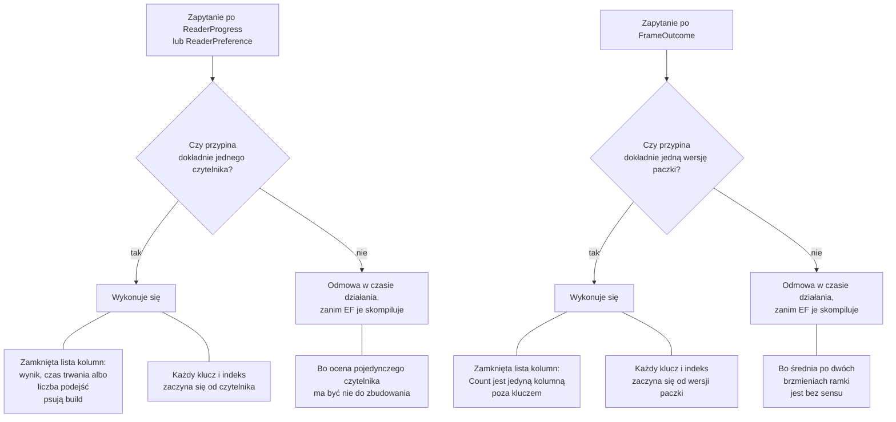
```mermaid
%% Dwa zapytania, których warstwa trwałości odmawia, i inny powód każdego z nich.
%% JEDEN DIAGRAM NA PLIK. UTF-8. Dlaczego nie ASCII: patrz a1-system-context.pl.mmd.

%% SĄ SWOIMI LUSTRZANYMI ODBICIAMI, A NIE TĄ SAMĄ REGUŁĄ Z INNĄ KOLUMNĄ.
%% ReaderScopedQueries odmawia zapytania obejmującego wielu CZYTELNIKÓW - po każdej z dwóch
%% tabel kluczowanych czytelnikiem - bo ocena pojedynczego czytelnika ma być nie do
%% zbudowania (ADR-0009, ADR-0020, ADR-0052).
%% BundlePinnedQueries odmawia zapytania obejmującego wiele TEKSTÓW, bo średnia po dwóch
%% brzmieniach ramki jest bez sensu, a nie zakazana (ADR-0024) - kazałaby rejestrowi kłamać
%% o ramce, którą ktoś już poprawił.

%% KAŻDĄ WIDZIANO, JAK CZEGOŚ ODMAWIA, ZANIM W NIĄ UWIERZONO, a jedna odmówiła czegoś, czego
%% nikt nie podłożył: trzy testy samego magazynu wyników czytały go bez przypiętej wersji.

%% ODMOWA PADA, ZANIM EF SKOMPILUJE ZAPYTANIE, co czyni ją regułą, a nie uwagą z przeglądu.

flowchart TD
  Q1["Zapytanie po ReaderProgress<br/>lub ReaderPreference"]
  G1{"Czy przypina<br/>dokładnie jednego czytelnika?"}
  R1["Wykonuje się"]
  X1["Odmowa w czasie działania,<br/>zanim EF je skompiluje"]

  Q2["Zapytanie po FrameOutcome"]
  G2{"Czy przypina<br/>dokładnie jedną wersję paczki?"}
  R2["Wykonuje się"]
  X2["Odmowa w czasie działania,<br/>zanim EF je skompiluje"]

  Q1 --> G1
  G1 -->|"tak"| R1
  G1 -->|"nie"| X1
  Q2 --> G2
  G2 -->|"tak"| R2
  G2 -->|"nie"| X2

  W1["Bo ocena pojedynczego czytelnika<br/>ma być nie do zbudowania"]
  W2["Bo średnia po dwóch<br/>brzmieniach ramki<br/>jest bez sensu"]
  X1 --- W1
  X2 --- W2

  K1["Zamknięta lista kolumn:<br/>wynik, czas trwania albo<br/>liczba podejść<br/>psują build"]
  K2["Zamknięta lista kolumn:<br/>Count jest jedyną kolumną<br/>poza kluczem"]
  I1["Każdy klucz i indeks<br/>zaczyna się od czytelnika"]
  I2["Każdy klucz i indeks<br/>zaczyna się od wersji paczki"]
  R1 --- K1
  R1 --- I1
  R2 --- K2
  R2 --- I2
```

### C5. Czego w pętli celowo nie ma

Żadnego modelu językowego, nigdzie
([ADR-0010](adr/0010-no-language-model-in-the-loop.md)). Nic nie ocenia porównania. Każda
bursztynowa strzałka to antycel wypowiedziany jako twierdzenie o kodzie, a każdy staje się
fałszywy w chwili, gdy ktoś dowiezie to, czego zaprzecza.

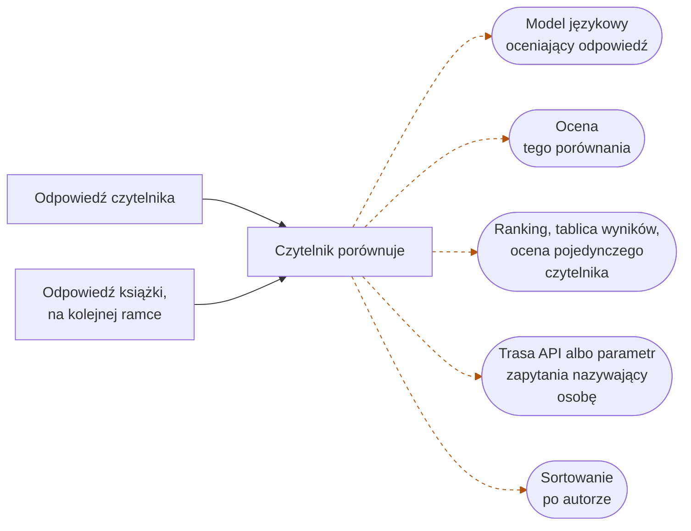
```mermaid
%% Czego w pętli celowo nie ma: modelu językowego, oceniania, widoku pojedynczego czytelnika.
%% JEDEN DIAGRAM NA PLIK. UTF-8. Dlaczego nie ASCII: patrz a1-system-context.pl.mmd.

%% ŻADEN MODEL JĘZYKOWY NIE JEST WOŁANY NIGDZIE (ADR-0010). Ani do oceny odpowiedzi, ani do
%% objaśnienia ramki, ani do wygenerowania podpowiedzi. Książka nauczania programowanego
%% działa, bo ramka przed twoją przygotowała cię na tę; wygenerowana parafraza jest inną
%% książką, a oceniający, który czasem myli się w sposób niefalsyfikowalny, jest gorszy niż
%% taki, który nie mówi nic.

%% NIC NIE OCENIA TEGO PORÓWNANIA. Kolejna ramka otwiera się odpowiedzią i czytelnik
%% porównuje. Tam, gdzie cała odpowiedź książki to jedna liczba, maszyna może powiedzieć
%% "zgadza się z książką" i nie mówi nigdy nic innego - nigdy "źle" (ADR-0039).

%% ANTYCELE SĄ TWIERDZENIAMI O KODZIE, NIE INTENCJAMI. Każdy staje się fałszywy w chwili,
%% gdy ktoś dowiezie to, czego zaprzecza - i to czyni je wartymi spisania.

flowchart LR
  ANSWER["Odpowiedź czytelnika"]
  BOOK["Odpowiedź książki,<br/>na kolejnej ramce"]
  READER["Czytelnik porównuje"]

  ANSWER --> READER
  BOOK --> READER

  LLM(["Model językowy<br/>oceniający odpowiedź"])
  GRADE(["Ocena<br/>tego porównania"])
  LEADER(["Ranking, tablica wyników,<br/>ocena pojedynczego<br/>czytelnika"])
  ROUTE(["Trasa API albo parametr<br/>zapytania nazywający<br/>osobę"])
  SORT(["Sortowanie<br/>po autorze"])

  READER -.-> LLM
  READER -.-> GRADE
  READER -.-> LEADER
  READER -.-> ROUTE
  READER -.-> SORT

  linkStyle 2,3,4,5,6 stroke:#b45309,stroke-dasharray: 4 4;
```

---

## Część D — Build i dostarczanie

### D1. Bramki CI

Przez co przechodzi zmiana, zanim da się ją scalić. Narysowane z
[`../.github/workflows/`](../.github/workflows/), a nie z konfiguracji linterów, bo
sprawdzenie nie istnieje tylko dlatego, że istnieje plik konfiguracyjny.

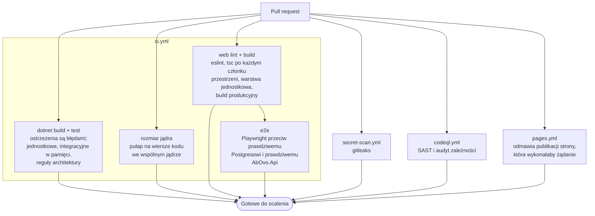
```mermaid
%% Bramki, przez które przechodzi zmiana, zanim da się ją scalić, i czego każda odmawia.
%% JEDEN DIAGRAM NA PLIK. UTF-8. Dlaczego nie ASCII: patrz a1-system-context.pl.mmd.

%% SPRAWDZENIE NIE ISTNIEJE DLATEGO, ŻE ISTNIEJE PLIK KONFIGURACYJNY. Konfiguracja lintera w
%% drzewie nie dowodzi, że jakikolwiek job ją uruchamia; odpowiedzią jest .github/workflows/,
%% i z tych plików narysowano ten diagram.

%% JOB AKCEPTACYJNY CZERWIENIEJE, GDY ZABRAKNIE PAKIETU TESTÓW, ZAMIAST GO POMINĄĆ
%% (E2E-ACCEPTANCE-TESTING.md sekcja 2). Zielony przebieg, który niczego nie sprawdził, jest
%% dokładnie tą awarią, której ten pakiet ma zapobiegać - dlatego czerwonej bramki nigdy nie
%% "naprawia się", czyniąc ją warunkową.

%% KSIĄŻKA JEST POBIERANA PRZED WARSTWĄ JEDNOSTKOWĄ, w każdym jobie, który jej potrzebuje.
%% web/content/ jest wyprowadzone, a nie commitowane, i testy sprawdzające wszystkie 47
%% programów inaczej pominęłyby się po cichu - zielony ptaszek nad asercją, której nikt nie
%% postawił.

flowchart TD
  PR["Pull request"]

  subgraph ci["ci.yml"]
    DOTNET["dotnet build + test<br/>ostrzeżenia są błędami;<br/>jednostkowe, integracyjne w pamięci,<br/>reguły architektury"]
    KERNEL["rozmiar jądra<br/>pułap na wiersze kodu<br/>we wspólnym jądrze"]
    WEB["web lint + build<br/>eslint, tsc po każdym członku<br/>przestrzeni, warstwa jednostkowa,<br/>build produkcyjny"]
    E2E["e2e<br/>Playwright przeciw prawdziwemu<br/>Postgresowi i prawdziwemu<br/>AbOvo.Api"]
  end

  SCAN["secret-scan.yml<br/>gitleaks"]
  CODEQL["codeql.yml<br/>SAST i audyt zależności"]
  PAGES["pages.yml<br/>odmawia publikacji strony,<br/>która wykonałaby żądanie"]

  MERGE(["Gotowe do scalenia"])

  PR --> DOTNET
  PR --> KERNEL
  PR --> WEB
  PR --> SCAN
  PR --> CODEQL
  PR --> PAGES
  WEB --> E2E

  DOTNET --> MERGE
  KERNEL --> MERGE
  WEB --> MERGE
  E2E --> MERGE
  SCAN --> MERGE
  CODEQL --> MERGE
  PAGES --> MERGE
```

### D2. Wdrożona topologia, która nie istnieje

Cztery aplikacje Fly opisane przez [`../flyio/`](../flyio/) i nigdy niezastosowane. Aplikacja
stanowa nie ma publicznego nasłuchu (P7) i go nie dostanie. Wnioskowanie o tym, co jest
wdrożone, z `src/AbOvo.AppHost/AppHost.cs` czyta nie ten plik.

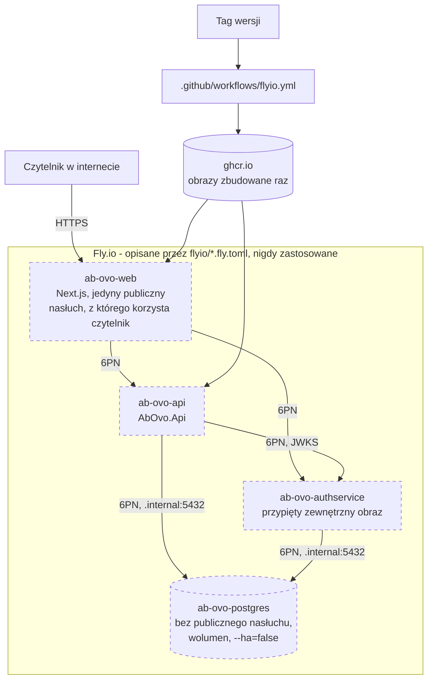
```mermaid
%% Wdrożona topologia, która nie istnieje: cztery aplikacje Fly opisane i nigdy zastosowane.
%% JEDEN DIAGRAM NA PLIK. UTF-8. Dlaczego nie ASCII: patrz a1-system-context.pl.mmd.

%% NIC NIE JEST WDROŻONE. Żadna aplikacja Fly nie istnieje, żaden obraz nie został
%% opublikowany, żaden sekret nie został ustawiony. Każde pole poniżej jest z tego powodu
%% przerywane, i to jest pierwsza rzecz, o której AGENTS.md prosi, by nie pisać zdania
%% przeciwnego.

%% APLIKACJA STANOWA NIE MA PUBLICZNEGO NASŁUCHU (P7) i nie dostanie go. Postgres jest
%% osiągalny przez sieć prywatną Fly, z laptopa przez tunel, gdy w ogóle trzeba go osiągnąć.

%% ZBUDUJ RAZ, WDRAŻAJ WIELE RAZY (P12). Obraz nie niesie żadnego adresu: aplikacja webowa
%% czyta je w czasie działania z /api/config, i dlatego jest jeden obraz, a nie jeden na
%% środowisko.

%% APPHOST TO NIE JEST TEN OBRAZEK. Daje authservice port na hoście i wydawcę po zwykłym
%% HTTP, czego wdrożona instancja mieć nie może. Wnioskowanie o tym, co jest wdrożone, z
%% src/AbOvo.AppHost/AppHost.cs czyta nie ten plik.

flowchart TD
  READER["Czytelnik w internecie"]

  subgraph fly["Fly.io - opisane przez flyio/*.fly.toml, nigdy zastosowane"]
    WEB["ab-ovo-web<br/>Next.js, jedyny publiczny<br/>nasłuch, z którego korzysta czytelnik"]
    API["ab-ovo-api<br/>AbOvo.Api"]
    AUTH["ab-ovo-authservice<br/>przypięty zewnętrzny obraz"]
    PG[("ab-ovo-postgres<br/>bez publicznego nasłuchu,<br/>wolumen, --ha=false")]
  end

  GHCR[("ghcr.io<br/>obrazy zbudowane raz")]
  TAG["Tag wersji"]
  DEPLOY[".github/workflows/flyio.yml"]

  READER -->|"HTTPS"| WEB
  WEB -->|"6PN"| API
  WEB -->|"6PN"| AUTH
  API -->|"6PN, JWKS"| AUTH
  API -->|"6PN, .internal:5432"| PG
  AUTH -->|"6PN, .internal:5432"| PG

  TAG --> DEPLOY
  DEPLOY --> GHCR
  GHCR --> WEB
  GHCR --> API

  classDef notdeployed stroke-dasharray: 5 5;
  class WEB,API,AUTH,PG notdeployed;
```

### D3. Jak ta dokumentacja jest sprawdzana i budowana

Sprawdzenia biegną na każdym pull requeście; build biegnie, gdy ktoś o niego poprosi. Polecenia
są w [`how-to/build-the-documentation.pl.md`](how-to/build-the-documentation.pl.md).

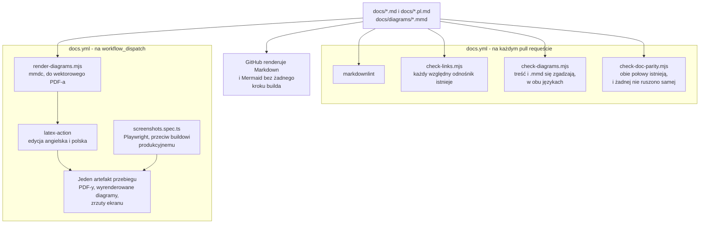
```mermaid
%% Jak ta dokumentacja jest sprawdzana i jak jest budowana.
%% JEDEN DIAGRAM NA PLIK. UTF-8. Dlaczego nie ASCII: patrz a1-system-context.pl.mmd.

%% SPRAWDZENIA BIEGNĄ NA KAŻDYM PULL REQUEŚCIE; BUILD BIEGNIE, GDY KTOŚ O NIEGO POPROSI.
%% Dokument bez własnego rytmu wydań nie powinien udawać, że go ma, więc job z PDF-ami jest
%% workflow_dispatch i niczym więcej - podczas gdy job lintujący, który potrafi powiedzieć
%% autorowi o zepsutym odnośniku przed recenzentem, biegnie na tym pull requeście, który go
%% zepsuł.

%% KAŻDY DIAGRAM ŻYJE DWA RAZY CELOWO: w treści docs/DIAGRAMS.md i docs/DIAGRAMS.pl.md, bo
%% tylko tę formę renderuje GitHub, oraz jako samodzielny .mmd, bo to ta forma renderuje się
%% do PDF-a i daje się otworzyć osobno. Dwie kopie czegokolwiek to powierzchnia rozjazdu,
%% więc trzyma je co do bajtu sprawdzenie, a nie konwencja prosząca ludzi o pamięć.

%% NIC WYGENEROWANEGO NIE JEST COMMITOWANE poza zrzutami ekranu, a te są commitowane z
%% jednego powodu: dokument na GitHubie nie wyrenderuje obrazka, który jest tylko artefaktem
%% builda.

flowchart TD
  SRC["docs/*.md i docs/*.pl.md<br/>docs/diagrams/*.mmd"]

  subgraph lint["docs.yml - na każdym pull requeście"]
    MD["markdownlint"]
    LINKS["check-links.mjs<br/>każdy względny odnośnik istnieje"]
    DIAG["check-diagrams.mjs<br/>treść i .mmd się zgadzają,<br/>w obu językach"]
    PARITY["check-doc-parity.mjs<br/>obie połowy istnieją,<br/>i żadnej nie ruszono samej"]
  end

  subgraph build["docs.yml - na workflow_dispatch"]
    RENDER["render-diagrams.mjs<br/>mmdc, do wektorowego PDF-a"]
    TEX["latex-action<br/>edycja angielska i polska"]
    SHOTS["screenshots.spec.ts<br/>Playwright, przeciw buildowi<br/>produkcyjnemu"]
    ART["Jeden artefakt przebiegu<br/>PDF-y, wyrenderowane diagramy,<br/>zrzuty ekranu"]
  end

  GH["GitHub renderuje Markdown<br/>i Mermaid bez żadnego<br/>kroku builda"]

  SRC --> MD
  SRC --> LINKS
  SRC --> DIAG
  SRC --> PARITY
  SRC --> GH
  SRC --> RENDER
  RENDER --> TEX
  TEX --> ART
  SHOTS --> ART
```
