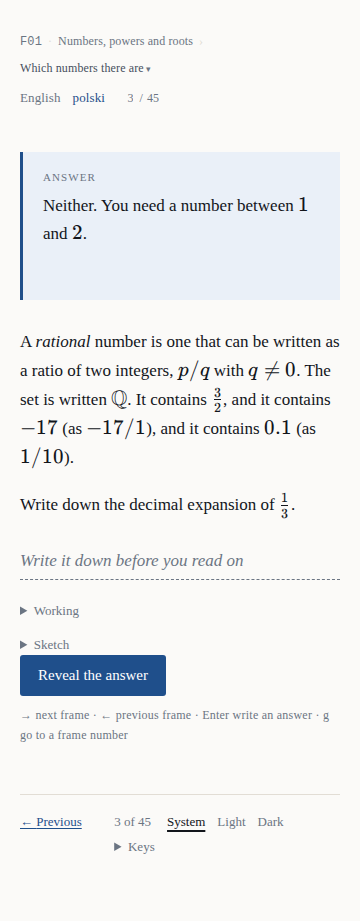
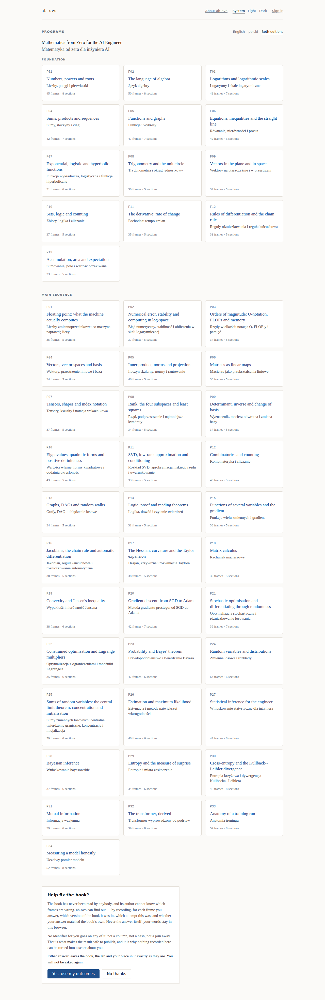

# Produkt w obrazkach

Jak ab-ovo wygląda dla czytelnika, ekran po ekranie, uchwycone z prawdziwego buildu
produkcyjnego.

> **Edycja angielska:** [`SCREENSHOTS.md`](SCREENSHOTS.md)

Każdy obrazek poniżej zrobił
[`../tests/e2e/specs/screenshots.spec.ts`](../tests/e2e/specs/screenshots.spec.ts), sterując
aplikacją dokładnie tak, jak steruje nią pakiet akceptacyjny — build produkcyjny, prawdziwa
przeglądarka, ta sama paczka treści, którą dostałby czytelnik. Nic tu nie jest makietą i nic
nie było retuszowane. Jak zrobić je od nowa, mówi
[`how-to/capture-the-screenshots.pl.md`](how-to/capture-the-screenshots.pl.md).

**To jedyny wygenerowany artefakt, który to repozytorium commituje.** Wszędzie indziej
obowiązuje reguła, że nic wygenerowanego nie jest commitowane — żaden PDF, żaden
wyrenderowany diagram, żadne `web/content/`. Wyjątek jest wymuszony, a nie wybrany: dokument
Markdown na GitHubie nie wyrenderuje obrazka, który istnieje tylko wewnątrz artefaktu
przebiegu workflow, więc wycieczka zilustrowana wyjściem builda nie pokazałaby czytelnikowi
niczego.

---

## Mechanizm, w dwóch obrazkach

To jest cały produkt i jedna rzecz, którą warto zrozumieć przed wszystkimi innymi. Ramka
Strouda prosi cię o coś **zanim** cokolwiek ci powie, a kolejna ramka otwiera się
odpowiedzią, którą miałeś już zapisać.

### Ramka 3 pyta

Pytanie brzmi: *zapisz rozwinięcie dziesiętne ⅓*. Odpowiedzi na nie **nie ma na tej stronie**:
ani w elemencie, ani w atrybucie, ani w skrypcie, ani w prefetchu. Czytelnik, który otworzy
inspektor, nie znajdzie nic, bo nie ma czego znaleźć
([ADR-0014](adr/0014-the-content-schema-is-json-schema-and-knows-nothing-about-frames.md)).

### Ramka 4 odpowiada

Odsłonięcie jest **nawigacją**, a nie przełącznikiem. Otwarcie ramki 4 *jest* odpowiedzią
ramki 3 i przyjechało razem z HTML-em ramki 4. To właśnie czyni tę własność strukturalną,
zamiast dyscypliną, którą ktoś musi utrzymywać: nie ma widżetu do obejścia, bo odpowiedzi
nigdy nie wysłano.

Obie połowy sprawdza pakiet akceptacyjny i obie widziano, jak czerwienieją, zanim w nie
uwierzono.

---

## Powierzchnia lektury

### Wiersz miejsca jest jedyną obudową

Wiersz nad ramką niesie identyfikator programu, tytuł programu, sekcję, w której jesteś,
przełącznik edycji i to, gdzie jesteś — `3 / 45`. Ten numer ramki jest skokiem: naciśnij `g` i
wpisz numer. **Pokazuje miejsce, nigdy postęp**
([ADR-0041](adr/0041-the-reading-surface-shows-position-and-never-progress.md)) — procent z
książki o czterdziestu siedmiu programach byłby liczbą o czytelniku, a ten produkt takich nie
produkuje.

### Ta sama ramka, po polsku

Książka jest złożona po angielsku i po polsku, a edycja jest wyborem czytelnika, a nie czymś
zgadniętym z nagłówka ([ADR-0015](adr/0015-the-reading-index-has-no-default-language.md)).
Przełączenie to odnośnik w wierszu miejsca; zachowuje twój numer ramki.

### Arkusz

`Working` otwiera notatnik, który liczy arytmetykę — kalkulator, celowo nie system algebry
komputerowej ([ADR-0042](adr/0042-the-evaluator-is-a-calculator-not-a-cas.md)). `Sketch`
otwiera płótno, które przyjmuje pociągnięcia i nigdy nie otwiera się samo
([ADR-0043](adr/0043-a-sketch-is-strokes-and-the-pane-never-opens-itself.md)). Oba są
opcjonalne, oba są lokalne, a nic, co czytelnik pisze na ramce, nie opuszcza jego przeglądarki
([ADR-0039](adr/0039-a-frame-accepts-the-readers-answer-as-a-commitment.md)).

### Na szerokości telefonu

360 px jest sprawdzane przy płótnie w `specs/narrow-screen.spec.ts`, więc to własność
weryfikowana, a nie zrzut, który ktoś kiedyś zrobił.

### W trybie ciemnym

Tryb ciemny to pełna zamiana tokenów, a nie doczepka — czytelnik pracujący nad programem w
nocy jest przypadkiem normalnym. Tak samo jak ten, który pracuje przy biurku pod lampą, i
dlatego stópka każdego ekranu do czytania nosi trójpozycyjny przełącznik: **Systemowy**,
**Jasny**, **Ciemny**. Pierwsza pozycja jest domyślną i jest `prefers-color-scheme`, dokładnie
tak jak przed powstaniem przełącznika — to pozycja, do której czytelnik może wrócić, a nie brak
wyboru, i jedyna, która nie potrzebuje JavaScriptu
([ADR-0048](adr/0048-the-theme-is-a-choice-and-the-system-is-a-position.md)).

---

## Znaleźć coś do czytania

### Strona startowa jest indeksem

Pierwszy ekran jest tym, po co czytelnik przyszedł, o jedną nawigację od ramki zamiast o dwie
([ADR-0036](adr/0036-the-landing-page-is-the-index-and-the-argument-is-a-page.md)). To
komponent serwerowy, który nie robi żadnego zapytania, nie czyta ciasteczka i nie potrzebuje
backendu.

Karta u dołu to **zaproszenie do zgody** i stoi na końcu celowo: czytelnik, który przyszedł
czytać, dociera najpierw do programów, a do pytania potem. Jest zaproszeniem, a nie bramką,
jest trójwartościowa — udzielona, odmówiona, jeszcze niezadana — i mieszka w przeglądarce
([ADR-0022](adr/0022-consent-is-local-versioned-and-three-valued.md)).

### Bez wybranej edycji i z wybraną

*Both editions* to widok czytelnika, który nie wybrał niczego. Wybór to `/?lang=<edycja>`:
widoczny, linkowalny, opuszczalny i nigdy niezgadywany.

### Spis treści programu

### I jego podsumowanie

*Summary* i *Can you?* to własne sekcje zamykające książki, a nie coś, co ta aplikacja
wymyśliła.

---

## Części, do których czytelnik może nigdy nie dotrzeć

### Argument

Kolejność **jest** argumentem. Antycel — *instrument mierzy książkę, nigdy czytelnika* — stoi
nad wszystkim innym na stronie, bo presja, by nadużyć liczby, zawsze przychodzi od kogoś, kto
nie doczytał do końca.

Panel u dołu to jedyna żywa rzecz na stronie i jedyny komponent w aplikacji, który czyta
`/api/config`. Ciekawy jest jego trzeci stan: **nieosiągalny** nie jest błędem, bo "żadne API
nie odpowiedziało" jest wspieraną konfiguracją tego produktu (P8).

### Logowanie

Formularz wysyła **poświadczenia** do `/api/auth/login`, który rozmawia z serwisem tożsamości
po stronie serwera, więc tokenu nie ma w dokumencie w ogóle
([ADR-0018](adr/0018-password-sign-in-happens-server-side.md)). Na ścieżce szczęśliwej nie ma
JavaScriptu. Tam, gdzie nie skonfigurowano serwisu tożsamości, strona mówi to wprost, zamiast
oferować przycisk, który nie może zadziałać.

Konto kupuje dokładnie jedną rzecz: to samo miejsce w książce na drugiej maszynie. Bez niego
pętla czytelnika jest identyczna.

### Ćwiczenia

Własne ćwiczenia komputerowe książki, działające pod Pyodide **w przeglądarce czytelnika** —
bez konta, bez backendu, bez Pythona na jakimkolwiek serwerze i bez kodu opuszczającego
maszynę ([ADR-0007](adr/0007-exercise-checks-are-python-in-the-browser.md)). Wzorcowe
rozwiązania są pobierane, żeby build mógł dowieść, że ćwiczenia są rozwiązywalne, i nigdy nie
są serwowane do przeglądarki
([ADR-0012](adr/0012-solutions-are-never-served-to-the-browser.md)).

**Nie ma ich już w pętli czytelnika**
([ADR-0040](adr/0040-the-python-lab-leaves-the-reader-loop.md)): czytelnik książki
matematycznej nie powinien musieć pisać Pythona, żeby odpowiedzieć na ramkę. Dociera się tu z
jednego wiersza na podsumowaniu P01 i znikąd indziej.

---

## Czego tu nie ma na obrazku i dlaczego

- **`/account` i `/instrument/<track>/<unit>`** potrzebują konta, a konto potrzebuje serwisu
  tożsamości. Pakiet akceptacyjny taki ma — atrapę, którą sam uruchamia — ale sfotografowanie
  ekranu, którego każda liczba pochodzi z fikstury, ilustrowałoby fiksturę, a nie produkt. Co
  robią te ekrany, opisuje [`ux/UI-UX.md`](ux/UI-UX.md), a rysuje
  [`DIAGRAMS.pl.md`](DIAGRAMS.pl.md) §B6 i §C3.
- **Wdrożona instancja.** Nie ma żadnej, pod żadnym adresem, dla nikogo. Każdy ekran powyżej
  podał lokalny build produkcyjny.
