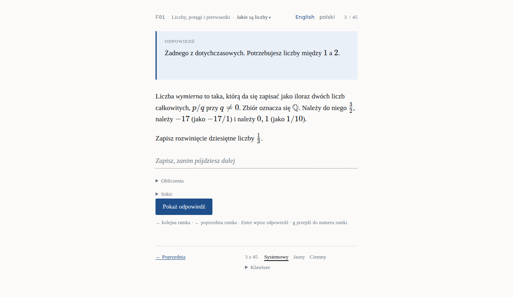
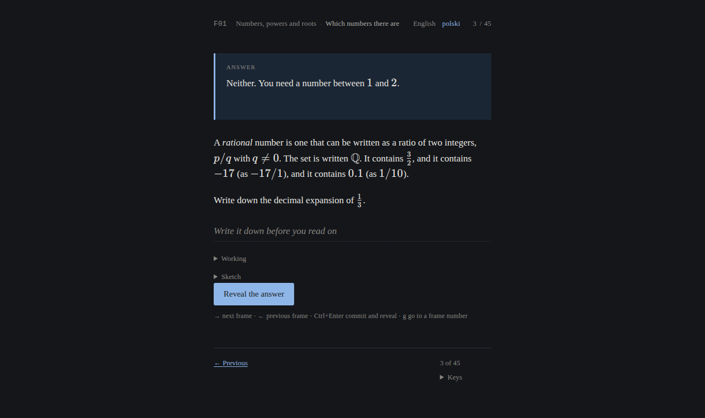
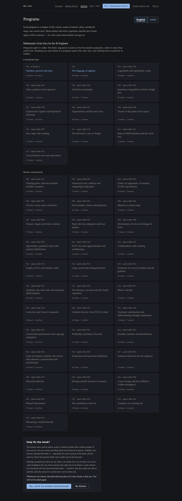
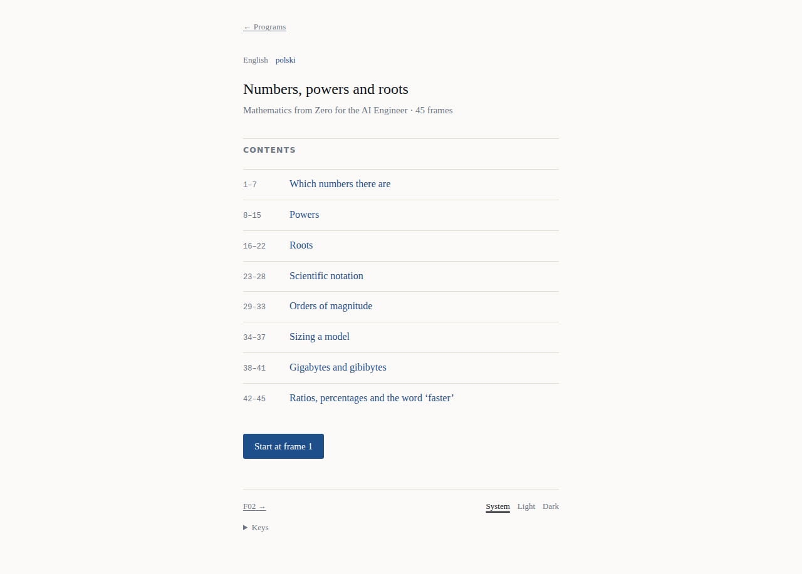
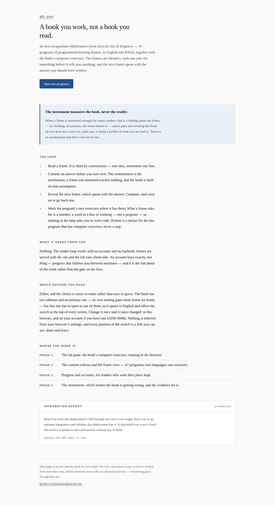
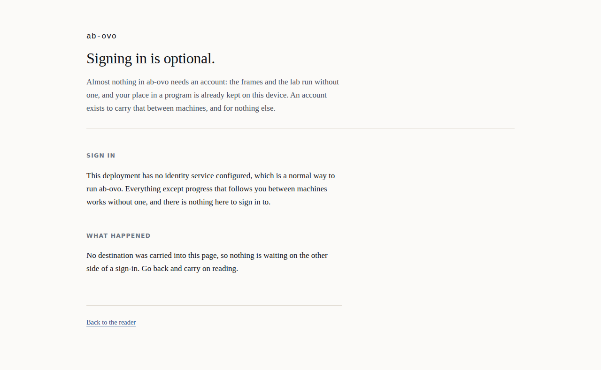
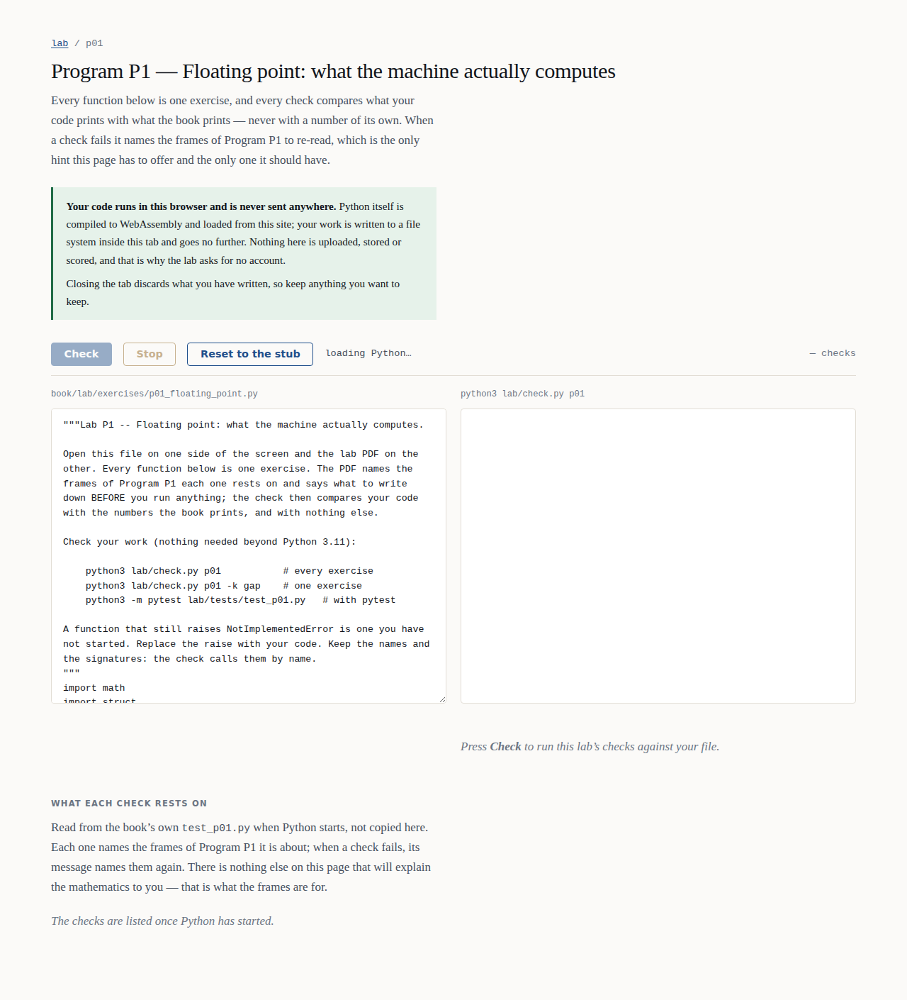

# Produkt w obrazkach

Jak ab-ovo wygląda dla czytelnika, ekran po ekranie, uchwycone z prawdziwego buildu
produkcyjnego.

> **Edycja angielska:** [`SCREENSHOTS.md`](SCREENSHOTS.md)

Każdy obrazek poniżej zrobił
[`../tests/e2e/specs/screenshots.spec.ts`](../tests/e2e/specs/screenshots.spec.ts), sterując
aplikacją dokładnie tak, jak steruje nią pakiet akceptacyjny — build produkcyjny, prawdziwa
przeglądarka, ta sama paczka treści, którą dostałby czytelnik. Nic tu nie jest makietą i nic
nie było retuszowane. Jak zrobić je od nowa, mówi
[`how-to/capture-the-screenshots.pl.md`](how-to/capture-the-screenshots.pl.md).

**To jedyny wygenerowany artefakt, który to repozytorium commituje.** Wszędzie indziej
obowiązuje reguła, że nic wygenerowanego nie jest commitowane — żaden PDF, żaden
wyrenderowany diagram, żadne `web/content/`. Wyjątek jest wymuszony, a nie wybrany: dokument
Markdown na GitHubie nie wyrenderuje obrazka, który istnieje tylko wewnątrz artefaktu
przebiegu workflow, więc wycieczka zilustrowana wyjściem builda nie pokazałaby czytelnikowi
niczego.

---

## Mechanizm, w dwóch obrazkach

To jest cały produkt i jedna rzecz, którą warto zrozumieć przed wszystkimi innymi. Ramka
Strouda prosi cię o coś **zanim** cokolwiek ci powie, a kolejna ramka otwiera się
odpowiedzią, którą miałeś już zapisać.

### Ramka 3 pyta

![Ramka programu F01. U góry pasek: znak ab-ovo, "F01 Numbers, powers and roots", wybór języka i przycisk "Reading settings". Pod nim nagłówek, pod którym jest ramka, a dalej odpowiedź z poprzedniej ramki w podbarwionym pudełku podpisanym "Answer to frame 2"; ramka wyjaśnia, czym jest liczba wymierna, i prosi czytelnika o zapisanie rozwinięcia dziesiętnego jednej trzeciej. Pod pytaniem: linia odpowiedzi podpisana "Your answer", z napisem "Write it down before you read on", i dwa obrysowane przyciski obok siebie — "Work it out" i "Draw it". Przypięte do dołu ekranu: obrysowany przycisk "← Previous", pozycja "3 of 45" i wypełniony przycisk "Next →".](assets/screenshots/frame-asks-english.png)

Pytanie brzmi: *zapisz rozwinięcie dziesiętne ⅓*. Odpowiedzi na nie **nie ma na tej stronie**:
ani w elemencie, ani w atrybucie, ani w skrypcie, ani w prefetchu. Czytelnik, który otworzy
inspektor, nie znajdzie nic, bo nie ma czego znaleźć
([ADR-0014](adr/0014-the-content-schema-is-json-schema-and-knows-nothing-about-frames.md)).

### Ramka 4 odpowiada

Odsłonięcie jest **przewróceniem strony**, a nie przełącznikiem: `Next` podnosi miejsce
czytelnika na serwerze i prosi o ramkę 4, której otwarcie *jest* odpowiedzią ramki 3 i
przyjechało razem z HTML-em ramki 4. To właśnie czyni tę własność strukturalną, zamiast
dyscypliną, którą ktoś musi utrzymywać: nie ma widżetu do obejścia, bo odpowiedzi nigdy nie
wysłano.

Obie połowy sprawdza pakiet akceptacyjny i obie widziano, jak czerwienieją, zanim w nie
uwierzono.

---

## Powierzchnia lektury

### Pasek u góry, a `Previous` i `Next` przypięte na dole

Pasek nad ramką niesie znak, który jest drogą do wszystkich programów; identyfikator i tytuł
programu, które prowadzą do jego spisu treści; wybór języka; i *Reading settings*. Pasek
nawigacji przy dolnej krawędzi niesie **Previous**, to, gdzie jesteś — `3 of 45` — i
**Next**, w tym samym miejscu na każdej ramce i na ekranie, gdy ramka przewija się pod nim
([ADR-0063](adr/0063-a-frame-is-one-screen-and-its-pager-is-pinned.md)). Klawisze też działają
(`→`, `←`, `g`), a nic na ramce ich nie reklamuje. **Pozycja pokazuje, gdzie jesteś, nigdy
postęp** ([ADR-0041](adr/0041-the-reading-surface-shows-position-and-never-progress.md)) —
procent z książki o czterdziestu siedmiu programach byłby liczbą o czytelniku, a ten produkt
takich nie produkuje.

### Mapa programu

![Ta sama ramka z panelem otwartym nad nią, tuż nad paskiem nawigacji: "F01 Numbers, powers and roots" z przyciskiem zamknięcia, pole "Go to frame [3] of 45 [Go]", a dalej "Contents" i każdy nagłówek programu z zakresem ramek — "Which numbers there are 1–7" podbarwiony jako bieżący, a "Powers", "Roots", "Scientific notation" i reszta pokazane z kłódką i napisem "not reached yet". Przycisk pozycji w pasku jest wciśnięty.](assets/screenshots/frame-program-map-english.png)

Naciśnięcie pozycji otwiera wszystkie nagłówki programu, każdy o jedno kliknięcie od dowolnej
ramki, i pole, w którym wpiszesz numer ramki. To, czego bramka odsłonięć by odmówiła, nie
jest oferowane: nagłówek za najdalszą ramką, do której czytelnik dotarł, jest pokazany jako
zablokowany, z powodem, a numer za nią dostaje odpowiedź na miejscu, z drogą do najdalszej
ramki — zamiast odnośnika, który prowadzi tylko do *Not there yet*.

### Ta sama ramka, po polsku

Książka jest złożona po angielsku i po polsku, a edycja jest wyborem czytelnika, a nie czymś
zgadniętym z nagłówka
([ADR-0052](adr/0052-one-language-control-remembered-and-english-by-default.md)).
Przełączenie to odnośnik w pasku u góry; zachowuje twój numer ramki — i zostaje
zapamiętane, więc pytanie pada raz, a nie na każdym ekranie. Pasek nawigacji też mówi
językiem edycji: `Wstecz`, `3 z 45`, `Dalej`.

### Arkusz

`Policz to` otwiera notatnik, który liczy arytmetykę — kalkulator, celowo nie system algebry
komputerowej ([ADR-0042](adr/0042-the-evaluator-is-a-calculator-not-a-cas.md)). `Narysuj to`
otwiera płótno, które przyjmuje pociągnięcia i nigdy nie otwiera się samo
([ADR-0043](adr/0043-a-sketch-is-strokes-and-the-pane-never-opens-itself.md)); kiedy ramka już
nosi rysunek, ten przycisk mówi `Pokaż mój szkic`. Oba są opcjonalne, oba są lokalne, a nic,
co czytelnik pisze na ramce, nie opuszcza jego przeglądarki
([ADR-0039](adr/0039-a-frame-accepts-the-readers-answer-as-a-commitment.md)).

Nazwane są czynnością i wielkości palca — po 44 px obrysowanego przycisku, obok siebie, a
otwarty zajmuje cały wiersz
([ADR-0059](adr/0059-a-worksheet-pane-opens-from-a-button-and-says-when-it-holds-a-drawing.md)).

### Na szerokości telefonu

360 px jest sprawdzane w `specs/narrow-screen.spec.ts` i `specs/pager.spec.ts` — nic nie
przewija się w bok, trzy komórki paska mieszczą się ze swoimi słowami, a `Previous` i `Next`
są na ekranie na najdłuższych ramkach programu — więc to własność weryfikowana, a nie zrzut,
który ktoś kiedyś zrobił.

### W trybie ciemnym

Tryb ciemny to pełna zamiana tokenów, a nie doczepka — czytelnik pracujący nad programem w
nocy jest przypadkiem normalnym. Tak samo jak ten, który pracuje przy biurku pod lampą, i
dlatego każdy ekran do czytania nosi trójpozycyjny przełącznik: **Systemowy**, **Jasny**,
**Ciemny**. Leży w panelu `Ustawienia czytania`, otwieranym z paska u góry, razem z mapą
klawiszy — poza paskiem nawigacji, w którym czytelnik szuka drogi dalej
([ADR-0058](adr/0058-the-reading-foot-is-one-pager-and-the-settings-leave-it.md),
[ADR-0063](adr/0063-a-frame-is-one-screen-and-its-pager-is-pinned.md)). Pierwsza pozycja jest domyślną i jest `prefers-color-scheme`, dokładnie
tak jak przed powstaniem przełącznika — to pozycja, do której czytelnik może wrócić, a nie brak
wyboru, i jedyna, która nie potrzebuje JavaScriptu
([ADR-0048](adr/0048-the-theme-is-a-choice-and-the-system-is-a-position.md)).

---

## Znaleźć coś do czytania

### Strona startowa jest indeksem

![Strona startowa. Znak słowny; odnośniki do Courses i About, trójpozycyjny przełącznik trybu z opcjami System, Light i Dark oraz odnośnik do Sign in; dalej nagłówek Programs z wyborem języka na końcu jego wiersza — English i polski jako dwa obramowane pola, English wypełnione. Pod nagłówkiem akapit mówiący, czym są program i ramka; dalej tytuł kursu, a pod nim wiersz mówiący, że programy otwierają się po kolei, że część główna opiera się na programach z Podstaw i że jedna ramka programu otwiera następny. Niżej siatka kafelków — po jednym na program, każdy z identyfikatorem, programem, po którym się otworzy, tytułem i liczbą ramek i sekcji. U dołu strony karta zatytułowana "Help fix the book?" z dwoma przyciskami.](assets/screenshots/landing-english.png)

Pierwszy ekran jest tym, po co czytelnik przyszedł, o jedną nawigację od ramki zamiast o dwie
([ADR-0036](adr/0036-the-landing-page-is-the-index-and-the-argument-is-a-page.md)). To
komponent serwerowy, który czyta paczkę treści wkompilowaną w aplikację webową i nie woła API
podczas renderowania — wciąż, choć
[ADR-0060](adr/0060-content-is-served-live-by-the-api-and-the-reader-stays-anonymous.md)
przeniósł ramki do API, a to, czy tak zostanie, rozstrzyga 580 w
[kolejności](ux/UI-UX.md#the-order). Czyta jedno ciasteczko, własne tego origin, w którym
trzymana jest wybrana przez czytelnika edycja — dzięki temu pierwsze malowanie jest już w niej
([ADR-0052](adr/0052-one-language-control-remembered-and-english-by-default.md)).

Nad siatką mówi, czym są program i ramka, i dlaczego większość kafelków jest zamknięta:
programy otwierają się po kolei, część główna opiera się na programach z Podstaw, a jedna
ramka programu otwiera następny (#163,
[ADR-0065](adr/0065-the-foundation-programs-stay-in-the-reading-order-and-the-index-says-why.md)).
Mówi to tekstem na pierwszym ekranie, a nie podpowiedzią, do której palec nigdy nie sięga.

Karta u dołu to **zaproszenie do zgody** i stoi na końcu celowo: czytelnik, który przyszedł
czytać, dociera najpierw do programów, a do pytania potem. Jest zaproszeniem, a nie bramką,
jest trójwartościowa — udzielona, odmówiona, jeszcze niezadana — i mieszka w przeglądarce
([ADR-0022](adr/0022-consent-is-local-versioned-and-three-valued.md)).

### W każdej edycji

Czytelnik, który nie wybrał niczego, czyta po angielsku. Jedynym sposobem, by to zmienić, jest
kontrolka na górze każdego ekranu; wybór to `/?lang=<edycja>` — widoczny, linkowalny,
opuszczalny i nigdy niezgadywany z `Accept-Language` — **i jest zapamiętywany**: w tej
przeglądarce, a na koncie czytelnika, jeśli je ma. Pytanie pada więc raz, a nie na każdym
ekranie (ADR-0052).

### Spis treści programu

### I jego podsumowanie

*Summary* i *Can you?* to własne sekcje zamykające książki, a nie coś, co ta aplikacja
wymyśliła.

---

## Części, do których czytelnik może nigdy nie dotrzeć

### Argument

Kolejność **jest** argumentem. Antycel — *instrument mierzy książkę, nigdy czytelnika* — stoi
nad wszystkim innym na stronie, bo presja, by nadużyć liczby, zawsze przychodzi od kogoś, kto
nie doczytał do końca.

Panel u dołu to jedyna żywa rzecz na stronie i jedyny komponent w aplikacji, który czyta
`/api/config`. Ciekawy jest jego trzeci stan: **nieosiągalny** nie jest błędem strony, która
renderuje się w całości bez API — ale od ADR-0060 oznacza, że nie da się tu przeczytać żadnej
ramki, bo każda ramka to żywe wywołanie API.

### Logowanie

Formularz wysyła **poświadczenia** do `/api/auth/login`, który rozmawia z serwisem tożsamości
po stronie serwera, więc tokenu nie ma w dokumencie w ogóle
([ADR-0018](adr/0018-password-sign-in-happens-server-side.md)). Na ścieżce szczęśliwej nie ma
JavaScriptu. Tam, gdzie nie skonfigurowano serwisu tożsamości, strona mówi to wprost, zamiast
oferować przycisk, który nie może zadziałać.

Konto kupuje dokładnie jedną rzecz: to samo miejsce w książce na drugiej maszynie. Bez niego
pętla czytelnika jest identyczna.

### Ćwiczenia

Własne ćwiczenia komputerowe książki, działające pod Pyodide **w przeglądarce czytelnika** —
bez konta, bez backendu, bez Pythona na jakimkolwiek serwerze i bez kodu opuszczającego
maszynę ([ADR-0007](adr/0007-exercise-checks-are-python-in-the-browser.md)). Wzorcowe
rozwiązania są pobierane, żeby build mógł dowieść, że ćwiczenia są rozwiązywalne, i nigdy nie
są serwowane do przeglądarki
([ADR-0012](adr/0012-solutions-are-never-served-to-the-browser.md)).

**Nie ma ich już w pętli czytelnika**
([ADR-0040](adr/0040-the-python-lab-leaves-the-reader-loop.md)): czytelnik książki
matematycznej nie powinien musieć pisać Pythona, żeby odpowiedzieć na ramkę. Dociera się tu z
jednego wiersza na podsumowaniu P01 i znikąd indziej.

---

## Czego tu nie ma na obrazku i dlaczego

- **`/account` i `/instrument/<track>/<unit>`** potrzebują konta, a konto potrzebuje serwisu
  tożsamości. Pakiet akceptacyjny taki ma — atrapę, którą sam uruchamia — ale sfotografowanie
  ekranu, którego każda liczba pochodzi z fikstury, ilustrowałoby fiksturę, a nie produkt. Co
  robią te ekrany, opisuje [`ux/UI-UX.md`](ux/UI-UX.md), a rysuje
  [`DIAGRAMS.pl.md`](DIAGRAMS.pl.md) §B6 i §C3.
- **Wdrożona instancja.** Nie ma żadnej, pod żadnym adresem, dla nikogo. Każdy ekran powyżej
  podał lokalny build produkcyjny.
