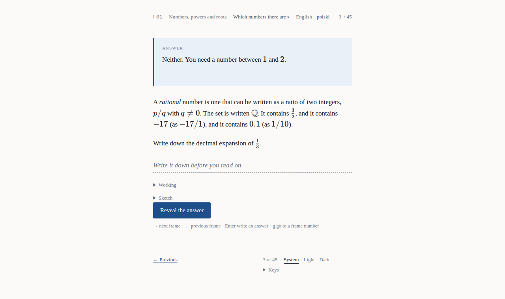
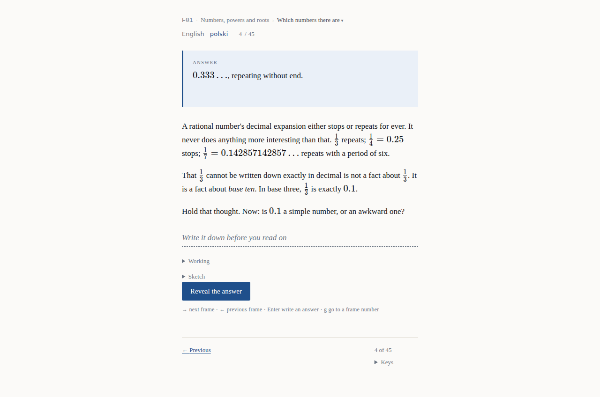

# Tutorial 1 — your first run

**What you will have at the end:** ab-ovo running on your own machine, with the index of the
whole book in front of you. Steps 4 and 5 go on to a frame that asks you a question and
refuses to answer it, and that frame needs the book inside the API — which, on a fresh
AppHost, nothing puts there yet. Step 3 says why.

**How long:** about twenty minutes, most of it waiting for a build.

**What you need:** a clone of this repository, and nothing else. No account, no credential,
no key. Reading needs no account — that is not a convenience, it is a property of the
product — and steps 4 and 5 show it, along with the one thing reading does need.

> **Wersja polska:** [`01-first-run.pl.md`](01-first-run.pl.md)

---

## Step 1 — find out what your machine is missing

```bash
bash scripts/setup.sh --check
```

This changes nothing. It reports what is absent and where to get it. Read the output before
installing anything: it names each prerequisite with an install pointer, so you do not have to
guess a version.

Then run the real thing:

```bash
bash scripts/setup.sh
```

Four numbered steps: check the prerequisites, initialise the **local** secret store, generate
the one mandatory secret, then offer each optional integration as a labelled step you may
skip. Skipping every optional step is a supported outcome — the mandatory steps are enough for
everything below.

**No secret ever lands in the working tree.** Step 2 initialises `dotnet user-secrets`;
`secrets.env.example` names every variable and contains no values.

## Step 2 — fetch the book

```bash
bash scripts/fetch-book-content.sh
```

This is the step people miss, and the failure it produces does not look like a missing step
(#75). `web/content/` is **derived, not committed** — the book is a separate repository,
pinned by commit, and this script fetches its lab engine file by file, verifying a digest on
each one, then compiles the book's 47 programs into a content bundle using the book's own
compiler ([ADR-0008](../adr/0008-content-is-a-versioned-bundle.md),
[ADR-0038](../adr/0038-the-bundle-is-compiled-at-a-pinned-revision.md)).

You will see a line per file ending in `ok`, then a compile summary. Run it again any time to
re-verify what is on disk; it is idempotent.

> **If a digest does not match**, somebody hand-edited a fetched file. That is what the digest
> is for. Delete `web/content/` and run the script again.

## Step 3 — run it

```bash
dotnet run --project src/AbOvo.AppHost
```

The AppHost is the **development** composition root (P1): it brings up Postgres, the identity
service container, the API and the web app together, and prints a dashboard URL. It is not the
deployed topology and it never will be — see [tutorial 3](03-contribute-a-change.md) and
[`../DIAGRAMS.md`](../DIAGRAMS.md) §D2.

Open <http://localhost:3000>.

**The web app on its own is not enough to read.** `pnpm --dir web build` and
`pnpm --dir web start` serve the index, `/courses` and `/about` with nothing behind them, but
not a frame: every frame is a live call to `AbOvo.Api`
([ADR-0060](../adr/0060-content-is-served-live-by-the-api-and-the-reader-stays-anonymous.md)),
which is why this step runs the AppHost.

**And the API has to hold the book.** It serves the compiled bundle it was given through an
admin-only endpoint, `POST /api/v1/admin/content/bundles`, and a fresh database holds none.
Nothing in the AppHost ingests it today. The acceptance suite does, in
`tests/e2e/fixtures/ingest-content.mts`, but it signs in against the suite's own identity stub
rather than the AppHost's identity service. Until the book is in, the index lists every
program and a frame answers *not found*.

**Nor can you post it by hand yet.** The obvious route is to sign in as `admin@ab-ovo.test`,
the SuperAdmin the AppHost's `authservice` seeds itself, and post
`web/content/bundle/bundle.json` with that bearer. `AbOvo.Api` refuses it with `401`.
`authservice` builds the `jwks_uri` in its discovery document from `Jwt:PublicBaseUrl`, which
defaults to an empty string and which `AppHost.cs` does not set, so the address it publishes
is a bare path and the API finds no key to check the token with. That was measured on
2026-09-25 against `authservice` v0.3.1 configured as `AppHost.cs` configures it; with the
base URL set, the same two requests ingest the book. Both gaps are the AppHost's, and closing
them is a change to it rather than to this tutorial.

## Step 4 — watch the product refuse to tell you something

> **On a fresh AppHost you cannot follow this step or the next one yet.** Both need a frame,
> and a frame needs the book inside the API, which step 3 explains the AppHost cannot put
> there today. Read them as what the AppHost shows once it can; the index and `/about` are
> what a fresh clone shows now.

You are looking at the index of programs. Pick **F01 — Numbers, powers and roots**, and read
to frame 3.



Frame 3 tells you what a rational number is and then asks you to write down the decimal
expansion of ⅓. Below the question is a line labelled *Your answer* that says *write it down
before you read on*.

Now do the thing you would do with any other web page: open your browser's inspector and
search the document for the answer.

**It is not there.** Not in an element, not in an attribute, not in a script tag, not in a
prefetch. There is nothing to find, because the answer to the frame you are on is rendered by
the request for the *next* frame and by nothing before it. The reveal is a form, not a toggle:
it asks `AbOvo.Api` to move your place on, and the API serves the next frame only after that
([ADR-0014](../adr/0014-the-content-schema-is-json-schema-and-knows-nothing-about-frames.md),
[ADR-0060](../adr/0060-content-is-served-live-by-the-api-and-the-reader-stays-anonymous.md)).

Click **Next** at the bottom of the screen, or press <kbd>→</kbd>.



Frame 4 opens with the answer you were supposed to have written. That is the book's own
mechanism, and making it structural rather than a hidden element is the reason this product
exists at all.

## Step 5 — stop the API, and see what reading needs

Stop the `api` resource from the Aspire dashboard, and reload the frame.

**The frame is gone, and the page says whose fault that is.** Every frame and every reveal is a
live, gated call to `AbOvo.Api`; with it down, the frame answers with the error page, which says
the fault is on this side rather than in the address you asked for. That is deliberate: content
is the one integration this product does not treat as optional, and a frame rendered from
anywhere else would be a defect rather than a fallback.

Open the index at <http://localhost:3000>. **It is still there** — it reads the compiled bundle
built into the web app and calls no API while rendering — and so is `/about`, whose integration
panel now reports that no API answered.

Start the `api` resource again and reload the frame. You are back on it, and you never signed
in: your place is held by the API under an opaque cookie this origin set on your first visit —
not an account, and not a token
([ADR-0061](../adr/0061-an-anonymous-readers-cursor-is-an-opaque-cookie-not-a-token.md)). Stop
`authservice` instead, and nothing about reading changes at all.

Try the rest of the frame while you are here. The pad and the canvas need nothing behind them,
and everything you write on a frame stays in your browser
([ADR-0039](../adr/0039-a-frame-accepts-the-readers-answer-as-a-commitment.md)):

- Open `Work it out` under the answer line — a pad that evaluates arithmetic. A calculator,
  deliberately not a computer algebra system
  ([ADR-0042](../adr/0042-the-evaluator-is-a-calculator-not-a-cas.md)).
- Open `Draw it` — a canvas that takes strokes and never opens itself
  ([ADR-0043](../adr/0043-a-sketch-is-strokes-and-the-pane-never-opens-itself.md)).
- Switch the edition in the bar at the top. The same frame, in Polish, keeping your frame
  number.
- Click the position between **Previous** and **Next** — `3 of 45` — and type a frame number,
  or press <kbd>g</kbd>.

## What you have seen

The rows that point at steps 4 and 5 wait on the same thing those steps do.

| Claim | Where you saw it |
| --- | --- |
| The answer is absent rather than hidden | Step 4, in the inspector |
| Reading needs no account, and every frame needs the API | Step 5, with the API stopped and started again |
| The book is content, not source, and is pinned | Step 2, one digest per file |
| The edition is the reader's choice, never guessed | Step 5, the top bar |

## Where to go next

- [**Tutorial 2 — read a program the way it was meant to be read**](02-read-a-program.md), if
  you want to understand the product rather than the repository.
- [**Tutorial 3 — contribute a change**](03-contribute-a-change.md), if you want to make one.
- [`../START-HERE.md`](../START-HERE.md) routes you to everything else.
