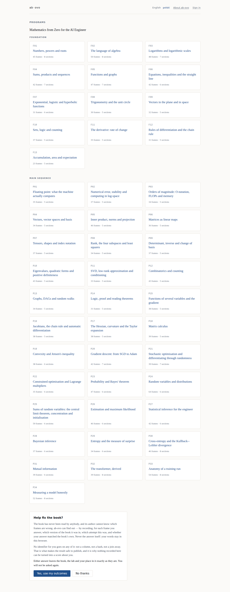
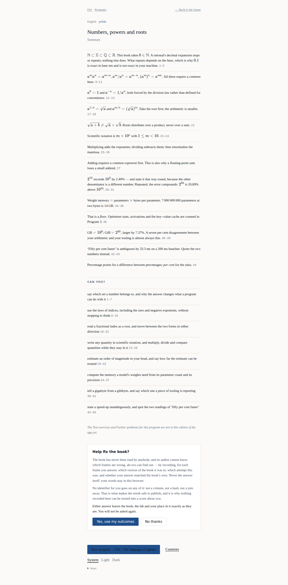

# Tutorial 2 — read a program the way it was meant to be read

**What you will have at the end:** one program of the book worked through properly, and a
clear idea of why this application exists instead of a PDF.

**How long:** about forty minutes for program F01. You are reading a mathematics book; that is
the time it takes.

**What you need:** ab-ovo running — [tutorial 1](01-first-run.md) — and a pen and paper, or
the worksheet on the screen. Either is fine. Nothing is fine.

> **Wersja polska:** [`02-read-a-program.pl.md`](02-read-a-program.pl.md)

---

## The one rule

**Write your answer down before you turn the frame.** Not think it — write it.

That is the whole method, and it is not a suggestion this application added. Stroud's
programmed learning works because the frame asks you to commit before it tells you anything,
and the commitment is what makes the next frame's opening land. A reader who skims and nods
along gets nothing, and paper has no way to notice.

This application cannot notice either, and it does not try. What it does is make skimming
*cost* something: the answer is not on the page, so there is nothing to glance at.

## Step 1 — choose an edition, once

The control is at the top of every screen in the product, and there is exactly one of it.
The site opens in **English** and says so plainly rather than guessing: nothing reads your
`Accept-Language` header and decides for you
([ADR-0052](../adr/0052-one-language-control-remembered-and-english-by-default.md)).

Press *polski* and you are reading Polish — on this screen, on the contents page, in every
frame, and the next time you come back. The choice is kept in your browser, and on your
account too if you sign in, so this is the only time this tutorial asks you about it. A
choice is also a URL — `/?lang=pl` — so it stays visible, linkable and leaveable.

Pick **F01 — Numbers, powers and roots**. Every reader starts there.

## Step 2 — read one frame

A frame is one idea, sometimes one line. Read it, and stop at the question.

Most frames ask for something. When one does, the line below it — labelled *Your answer* —
says *Write it down before you read on*. Use it, or use paper — the line is local to your
browser and nothing reads it
([ADR-0039](../adr/0039-a-frame-accepts-the-readers-answer-as-a-commitment.md)).

Two things sit beside it, both optional:

- **Working** — a pad that evaluates a line of arithmetic. It is a calculator, and it is
  deliberately not a computer algebra system: a tool that could do the algebra for you would
  be answering the frame
  ([ADR-0042](../adr/0042-the-evaluator-is-a-calculator-not-a-cas.md)).
- **Sketch** — a canvas. It never opens itself, because a pane that opened on every frame
  would be telling you to draw
  ([ADR-0043](../adr/0043-a-sketch-is-strokes-and-the-pane-never-opens-itself.md)).

**A blank is a wrong answer, not a skipped one**
([ADR-0045](../adr/0045-a-worksheet-answer-is-one-cell-and-a-blank-fails-it.md)). If you did
not commit, you did not read the frame.

## Step 3 — turn it, and compare

Click **Next** — the filled button at the bottom right of the screen, in the same place on
every frame — or press <kbd>→</kbd>.

The next frame opens with the answer to the one you just left. **Compare what you wrote with
what the book says. That comparison is the teaching** — nothing grades it, no score is kept,
and no language model is consulted
([ADR-0010](../adr/0010-no-language-model-in-the-loop.md)).

Where the book's whole answer is a single number, the application may say *matches the book*.
It never says anything else. In particular it never says *wrong*: it does not know what you
meant, and a machine that guessed would be worse than one that stays quiet.

If you did not get it, click **Previous** beside it (or press <kbd>←</kbd>) and read the
frame again. Going back one frame is the intended move, not a failure state.

## Step 4 — keep your place, without being measured

Between **Previous** and **Next** the pager says `3 of 45`. That is **where you are**, not how
far along you are
([ADR-0041](../adr/0041-the-reading-surface-shows-position-and-never-progress.md)). There is
no percentage, no streak, no badge and no estimate of when you will finish, because those are
numbers about a reader and this product does not make them.

Click it — or press <kbd>g</kbd> — for every heading of the program and a box to jump to a
frame by its number. A heading that starts past the furthest frame you have reached is shown
locked, with the reason, rather than offered: that is the book's order, and a link that would
only be refused is not a way anywhere. Your position is remembered in this browser. If
you sign in it follows you to another machine, and **furthest frame wins** — two machines that
disagree are not a conflict, because you have read up to the further of the two
([ADR-0019](../adr/0019-furthest-frame-wins.md)).

## Step 5 — finish the program

At the end of F01 is the program's **Summary** and its **Can you?** checklist — the book's own
closing sections.

Read *Can you?* honestly. Each line is something the program set out to teach you; if one of
them is not true yet, the section it came from is named and you can go back to it. That is what
the checklist is for, and it is the only assessment in the product.

## Step 6 — decide about the invitation

At the foot of the landing page is a card headed **Help fix the book?**

Here is exactly what saying yes — **Yes, count my answers anonymously** — does, and it is
worth reading rather than skipping:

- It records, for each frame you answer: **which version of the book it was in**, **which
  attempt this was**, and **whether your answer matched the book's**.
- It records **your answer nowhere**. Your words stay in your browser.
- It records **no identifier for you** — not a column, not a hash, not a join key. There is no
  reader on an outcome row, by design
  ([ADR-0023](../adr/0023-a-tally-is-a-count-against-a-frame-not-a-record-of-a-run.md)).

The consequence of that last point is stated on the deletion screen rather than buried: because
nothing knows which rows were yours, **withdrawing stops the next one and cannot retract the
ones already counted**
([ADR-0021](../adr/0021-deletion-removes-the-progress-first-and-says-what-it-cannot-reach.md)).

Whichever you choose, the book and your place in it stay exactly as they are, and you will not
be asked again. The card becomes one line saying what you chose, with the way to change it
beside it.

## What the measurements are for

> The useful question this instrument answers is **where is this book wasting the reader's
> time** — not *which reader is worst*.

When many readers answer a frame wrongly, that is evidence about **the frame**: its wording,
its position, the frame before it. It goes into revising the book. It is not evidence about
the people who answered, and the schema is built so that it could not become evidence about
them even if somebody wanted it to — see [`../DIAGRAMS.md`](../DIAGRAMS.md) §A5 and §C4.

## Where to go next

- [**Tutorial 3 — contribute a change**](03-contribute-a-change.md).
- [`../SCREENSHOTS.md`](../SCREENSHOTS.md) — the rest of the surface, including the screens
  this tutorial did not reach.
- [`../ux/UI-UX.md`](../ux/UI-UX.md) — every screen, what it needs, and what is planned.
