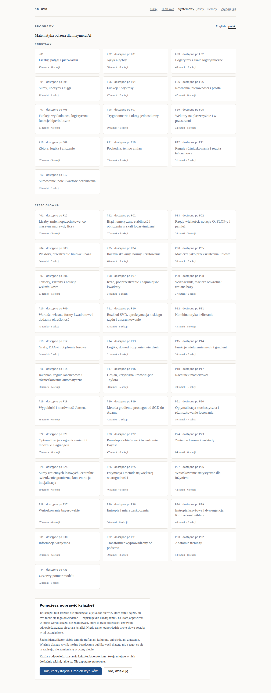

# Samouczek 2 — przeczytaj program tak, jak miał być czytany

**Co będziesz mieć na końcu:** jeden program książki przerobiony porządnie i jasne pojęcie, po
co ta aplikacja istnieje zamiast PDF-a.

**Ile to potrwa:** około czterdziestu minut na program F01. Czytasz książkę matematyczną; tyle
to zajmuje.

**Czego potrzebujesz:** działającego ab-ovo — [samouczek 1](01-first-run.pl.md) — oraz długopisu
i kartki, albo arkusza na ekranie. Jedno i drugie jest w porządku. Nic nie jest w porządku.

> **English version:** [`02-read-a-program.md`](02-read-a-program.md)

---

## Jedyna reguła

**Zapisz odpowiedź, zanim odwrócisz ramkę.** Nie pomyśl ją — zapisz.

To cała metoda i nie jest sugestią, którą dodała ta aplikacja. Nauczanie programowane Strouda
działa, bo ramka prosi cię o zobowiązanie, zanim cokolwiek ci powie, a to zobowiązanie sprawia,
że otwarcie kolejnej ramki trafia. Czytelnik, który przelatuje wzrokiem i przytakuje, nie
dostaje nic, a papier nie ma jak tego zauważyć.

Ta aplikacja też nie ma jak i nawet nie próbuje. Robi za to coś innego: sprawia, że przelatywanie
wzrokiem *kosztuje* — odpowiedzi nie ma na stronie, więc nie ma na co zerknąć.

## Krok 1 — wybierz edycję, raz

Kontrolka stoi na górze każdego ekranu w produkcie i jest dokładnie jedna. Strona otwiera się
po **angielsku** i mówi to wprost, zamiast zgadywać: nic nie czyta twojego nagłówka
`Accept-Language` i nie decyduje za ciebie
([ADR-0052](../adr/0052-one-language-control-remembered-and-english-by-default.md)).

Naciśnij *polski* i czytasz po polsku — na tym ekranie, na stronie spisu treści, w każdej
ramce i następnym razem, gdy wrócisz. Wybór zostaje zapamiętany w przeglądarce, a po
zalogowaniu także na koncie, więc ten samouczek pyta o to tylko teraz. Wybór to również URL —
`/?lang=pl` — więc pozostaje widoczny, linkowalny i opuszczalny.

Wybierz **F01 — Liczby, potęgi i pierwiastki**. Każdy czytelnik zaczyna tam.

## Krok 2 — przeczytaj jedną ramkę

Ramka to jedna myśl, czasem jeden wiersz. Przeczytaj ją i zatrzymaj się na pytaniu.

Większość ramek o coś prosi. Gdy któraś prosi, linia pod nią — podpisana *Twoja odpowiedź* —
mówi *Zapisz, zanim pójdziesz dalej*. Użyj jej albo kartki — linia jest lokalna dla twojej
przeglądarki i nic jej nie czyta ([ADR-0039](../adr/0039-a-frame-accepts-the-readers-answer-as-a-commitment.md)).

Obok stoją dwie rzeczy, obie opcjonalne:

- **Working** — notatnik, który oblicza wiersz arytmetyki. To kalkulator i celowo nie system
  algebry komputerowej: narzędzie, które potrafiłoby zrobić za ciebie algebrę, odpowiadałoby na
  ramkę ([ADR-0042](../adr/0042-the-evaluator-is-a-calculator-not-a-cas.md)).
- **Sketch** — płótno. Nigdy nie otwiera się samo, bo panel otwierający się na każdej ramce
  mówiłby ci, żebyś rysował
  ([ADR-0043](../adr/0043-a-sketch-is-strokes-and-the-pane-never-opens-itself.md)).

**Puste pole to zła odpowiedź, a nie pominięta**
([ADR-0045](../adr/0045-a-worksheet-answer-is-one-cell-and-a-blank-fails-it.md)). Jeśli się nie
zobowiązałeś, nie przeczytałeś ramki.

## Krok 3 — odwróć ją i porównaj

Kliknij **Dalej** — wypełniony przycisk w prawym dolnym rogu ekranu, w tym samym miejscu na
każdej ramce — albo naciśnij <kbd>→</kbd>.

Kolejna ramka otwiera się odpowiedzią na tę, którą właśnie zostawiłeś. **Porównaj to, co
napisałeś, z tym, co mówi książka. To porównanie jest nauczaniem** — nic go nie ocenia, żaden
wynik nie jest zapamiętywany i nie jest wołany żaden model językowy
([ADR-0010](../adr/0010-no-language-model-in-the-loop.md)).

Tam, gdzie cała odpowiedź książki to jedna liczba, aplikacja może powiedzieć *zgadza się z
książką*. Nie mówi nigdy nic innego. W szczególności nigdy nie mówi *źle*: nie wie, co miałeś
na myśli, a maszyna, która by zgadywała, byłaby gorsza od takiej, która milczy.

Jeśli nie trafiłeś, kliknij obok **Wstecz** (albo naciśnij <kbd>←</kbd>) i przeczytaj ramkę
jeszcze raz. Cofnięcie się o jedną ramkę jest zamierzonym ruchem, a nie stanem porażki.

## Krok 4 — trzymaj swoje miejsce, nie będąc mierzonym

Między **Wstecz** a **Dalej** pasek mówi `3 z 45`. To **gdzie jesteś**, a nie jak daleko
zaszedłeś ([ADR-0041](../adr/0041-the-reading-surface-shows-position-and-never-progress.md)).
Nie ma procentu, nie ma serii, nie ma odznaki i nie ma szacunku, kiedy skończysz, bo to są
liczby o czytelniku, a ten produkt takich nie produkuje.

Kliknij go — albo naciśnij <kbd>g</kbd> — a zobaczysz wszystkie nagłówki programu i pole, w
które wpiszesz numer ramki, żeby do niej skoczyć. Nagłówek, który zaczyna się za najdalszą
ramką, do jakiej dotarłeś, jest pokazany jako zablokowany, z powodem, zamiast podany jako
link: to kolejność książki, a link, który zostałby tylko odrzucony, nigdzie nie prowadzi.
Twoje miejsce jest pamiętane w tej
przeglądarce. Jeśli się zalogujesz, pójdzie za tobą na inną maszynę, a **wygrywa najdalsza
ramka** — dwie maszyny, które się nie zgadzają, to nie konflikt, bo przeczytałeś do dalszej z
nich ([ADR-0019](../adr/0019-furthest-frame-wins.md)).

## Krok 5 — skończ program

Na końcu F01 jest **Podsumowanie** programu i jego lista **Czy potrafisz?** — własne sekcje
zamykające książki.

Przeczytaj *Czy potrafisz?* uczciwie. Każdy wiersz to coś, czego program miał cię nauczyć;
jeśli któryś nie jest jeszcze prawdą, sekcja, z której pochodzi, jest nazwana i możesz do niej
wrócić. Po to jest ta lista i jest to jedyna ocena w produkcie.

## Krok 6 — zdecyduj w sprawie zaproszenia

U dołu strony startowej jest karta zatytułowana **Pomożesz poprawić książkę?**

Oto dokładnie, co robi zgoda, i warto to przeczytać, a nie pominąć:

- Zapisuje dla każdej ramki, na którą odpowiesz: **w której wersji książki się znajdowała**,
  **które to było podejście** i **czy twoja odpowiedź zgadza się z tą z książki**.
- Nie zapisuje **twojej odpowiedzi nigdzie**. Twoje słowa zostają w twojej przeglądarce.
- Nie zapisuje **żadnego identyfikatora ciebie** — ani kolumny, ani skrótu, ani złączenia.
  Wiersz wyniku nie niesie czytelnika, z projektu
  ([ADR-0023](../adr/0023-a-tally-is-a-count-against-a-frame-not-a-record-of-a-run.md)).

Konsekwencja ostatniego punktu jest powiedziana na ekranie usuwania, a nie zakopana: ponieważ
nic nie wie, które wiersze były twoje, **rezygnacja zatrzymuje kolejny i nie cofnie tych już
policzonych**
([ADR-0021](../adr/0021-deletion-removes-the-progress-first-and-says-what-it-cannot-reach.md)).

Każda z odpowiedzi zostawia książkę, ćwiczenia i twoje miejsce dokładnie takimi, jakie są. Nie
zapytamy ponownie.

## Po co są te pomiary

> Użyteczne pytanie, na które odpowiada ten przyrząd, brzmi: **gdzie ta książka marnuje czas
> czytelnika** — a nie *który czytelnik jest najgorszy*.

Gdy wielu czytelników odpowiada na ramkę źle, jest to dowód o **ramce**: o jej brzmieniu, o jej
położeniu, o ramce przed nią. Idzie do poprawiania książki. Nie jest dowodem o ludziach, którzy
odpowiedzieli, a schemat jest zbudowany tak, że nie mógłby stać się dowodem o nich, nawet
gdyby ktoś tego chciał — patrz [`../DIAGRAMS.pl.md`](../DIAGRAMS.pl.md) §A5 i §C4.

## Dokąd dalej

- [**Samouczek 3 — wnieś zmianę**](03-contribute-a-change.pl.md).
- [`../SCREENSHOTS.pl.md`](../SCREENSHOTS.pl.md) — reszta powierzchni, w tym ekrany, do których
  ten samouczek nie dotarł.
- [`../ux/UI-UX.md`](../ux/UI-UX.md) — każdy ekran, czego potrzebuje i co jest planowane
  (po angielsku).
